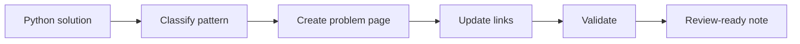

# AI Ingestion Workflow

## Input
- HackerRank problem statement
- User Python solution
- Notes about mistakes or confusion

## Output
- Problem page
- Pattern updates
- Mistake updates
- Related problems
- Interview notes
- Cross-links

## Workflow
1. Parse the problem, constraints, and solution.
2. Detect canonical patterns, algorithms, data structures, and mistakes.
3. Create or update exactly one problem page.
4. Add representative links to canonical pages without duplicating knowledge.
5. Validate metadata, links, naming, and template adherence.

## Conflict Handling
Prefer existing canonical pages. If two pages claim the same concept, keep the older canonical page and merge links into it.

## Duplicate Detection
Search by problem title, platform slug, pattern, and distinctive constraints before creating a new page.

