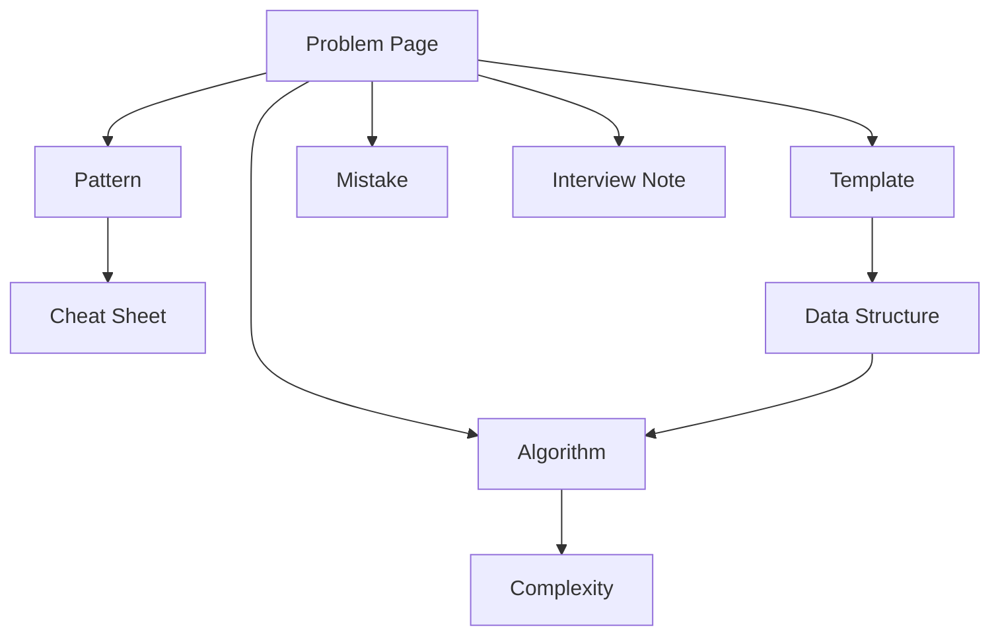

# Repository Linking Architecture

Every concept has exactly one canonical home. Problems link to patterns, algorithms, templates, mistakes, interview notes, and cheat sheets without copying their full content.

## Canonical Homes
- Problems: [[Problem Index]] and `DSA/04_Problems/`
- Patterns: [[Pattern Index]] and `DSA/01_Patterns/`
- Algorithms: [[Algorithm Index]] and `DSA/02_Algorithms/`
- Templates: [[Template Index]] and `DSA/05_Templates/`
- Interview Notes: [[Interview Roadmap]] and `DSA/07_Interview/`
- Cheat Sheets: `DSA/09_CheatSheets/`
- Mistakes: `DSA/08_Mistakes/`
- Projects and Technologies: existing Forge project and technology sections

## Duplicate Avoidance
A page may summarize a linked concept in one or two sentences, then link to its canonical source.

