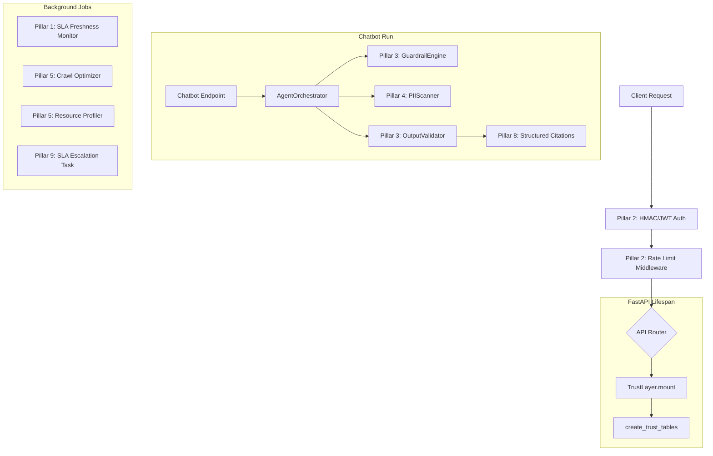

# Architecture

## Mental Model

Two orthogonal systems compose this platform: a **data pipeline**
(Bronze → Silver → Gold, batch/scheduled) that turns raw external
sources into trusted, embedded, queryable records, and an **agent
runtime** (request-driven, real-time) that reasons over Gold-layer data
using tools and returns cited, verified answers. The Trust Framework
(see [Trust Framework](./05-trust-framework.md)) wraps both — it
instruments the pipeline's data-quality decisions and the agent's
output-safety decisions under one governance umbrella.

## Full System Diagram (from `trustworthy_ai_framework_summary.md`)



**Single integration hook:** `TrustLayer.mount(app)` inside
`src/api/main.py` registers all trust-framework middleware and mounts
22 governance routers in one call. At startup, `create_trust_tables()`
runs idempotent migrations for the trust schema — meaning the entire
governance layer can be added to (or stripped from) the FastAPI app via
one mount call plus one migration call, rather than being woven
throughout individual route handlers.

## Multi-Tenant Security Core

- **JWT-based auth with RBAC**: Admin, Analyst, Viewer roles (the trust
  framework's rate limiter adds two more tiers — `EXTERNAL_BUSINESS` and
  `DATA_GOVERNANCE` — see [Trust Framework](./05-trust-framework.md)).
- **Row-level tenant isolation**: every data table, chat history, and
  audit log carries a `tenant_id`, with isolation enforced at the
  database level rather than only in application logic — the stronger
  of the two common approaches, since it doesn't rely on every query
  path remembering to filter correctly.

## Tech Stack

| Layer | Technology |
|---|---|
| Backend API | FastAPI |
| Orchestration | Dagster (medallion pipeline jobs/assets/schedules) |
| Frontend | Streamlit (multi-page app) |
| Database | PostgreSQL 15+ with pgvector |
| Embeddings | Jina AI / Gemini |
| LLMs | Groq / Gemini / OpenRouter |
| Forecasting | Prophet |
| Web crawling | Playwright (browser automation for LLM-augmented crawlers) |
| Data sources | World Bank, IMF, FRED APIs |

## Repo Structure

```
├── src/
│   ├── agents/          # Agent framework (orchestrator, chatbot, tools)
│   │   └── runtime/     # Orchestrator, registry, verifier, tracer, citations
│   ├── api/             # FastAPI REST endpoints & routers
│   ├── orchestration/   # Dagster jobs, assets, resources
│   ├── ui/              # Streamlit frontend, pages, static assets
│   └── utils/           # DQ explain, auth, reporting helpers
├── trust/               # The nine-pillar governance framework (see 05)
├── migrations/          # SQL migration scripts
├── eval/                # RAG evaluation harness (ground truth + scoring)
└── tests/                # Unit + integration tests
```

## Common Mistakes to Avoid When Extending This

- **Adding a new data table without a `tenant_id` column** — breaks
  the row-level isolation guarantee the entire multi-tenant model
  depends on; this should be a non-negotiable schema review item.
- **Bypassing `AgentOrchestrator` for a "quick" direct LLM call** —
  skips the `ResponseVerifier` grounding check and citation enforcement
  that exist specifically to prevent hallucinated financial claims; any
  new agent-like feature should route through the orchestrator, not
  call an LLM client directly.

## Related Docs

[Agent Framework](./03-agent-framework.md) for the orchestrator/tool
runtime in depth. [Data Pipeline](./04-data-pipeline.md) for the Bronze/
Silver/Gold Dagster implementation. [Trust Framework](./05-trust-framework.md)
for the full nine-pillar governance system this diagram summarizes.
