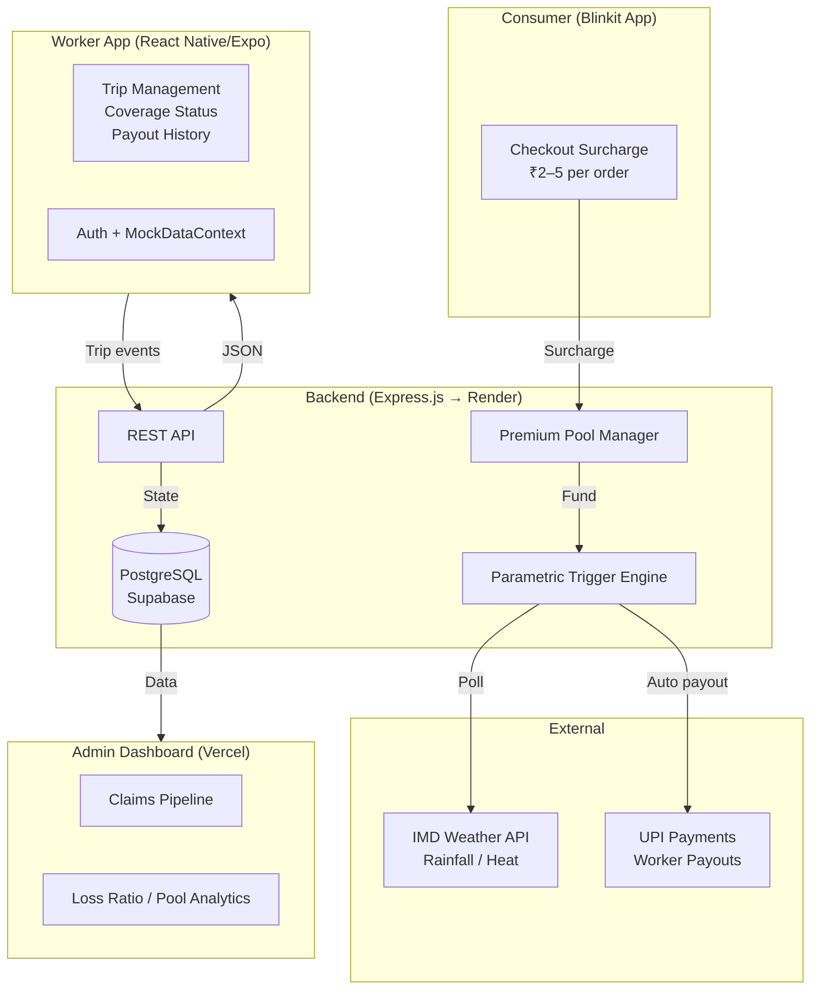

# Architecture

## System Diagram (from README)



## Key Design Principles

| Principle | Implementation |
|---|---|
| **Zero cost to driver** | 100% consumer-funded via per-order surcharge |
| **Trip-level granularity** | Coverage is per-trip, not monthly — no coverage gaps, no over-insurance |
| **Parametric payouts** | No manual claims adjustment — objective, verifiable data triggers the payout decision |
| **AI variable pricing** | Surcharge is never flat; an XGBoost model ingests live external API data (weather, traffic, pool liquidity) to price every single order individually |
| **Fraud prevention** | GPS cross-referencing + trip log validation + Isolation Forest anomaly scoring |

## Why Mobile-First, Not Web

This is a deliberate, well-argued product decision worth preserving in
full — it's a strong example of designing for the *actual* user rather
than the easiest platform to build on:

| Factor | Why Mobile Wins |
|---|---|
| **Device reality** | 97% of Blinkit/Zepto delivery partners use Android smartphones as their only computing device — a web app serves a user who doesn't exist for this cohort. |
| **On-trip context** | Workers need to file a claim standing in rain, mid-disruption, one-handed — native camera/GPS/push access without browser permission dialogs. |
| **Offline resilience** | React Native + AsyncStorage caches trip state and queues claim submissions locally — critical exactly when network drops during a storm, the moment a claim is most likely to be filed. A web app loses state on refresh. |
| **Push notifications** | Claim status updates (Under Review → Approved → Paid) via native push — a web app would require the worker to actively check a browser tab, which is near-zero adoption for this cohort. |
| **Platform integration** | Future Blinkit/Zepto driver-app integration requires native SDK/deep-link patterns, not a web redirect loop. |

**The one-line justification the README uses:** *"A delivery worker in
a monsoon doesn't open a browser. Mobile is not a preference — it is
the only interface that works."*

## Repo Structure

```
QuickCover/
├── mobile/           # React Native (Expo) — worker-facing app
├── mock-backend/     # Express.js API server
├── admin-frontend/   # Vite + React admin dashboard
├── FINANCIAL_MODEL.md   # Full financial model & research
├── PHASE2_CHANGES.md    # Phase 2 implementation log
└── README.md
```

**Note the naming:** `mock-backend/` is the actual production backend
(deployed live on Render) — the "mock" prefix refers to the project's
hackathon origins (dual SQLite/Postgres mode, seeded demo data) rather
than indicating non-functional code. Several integrations inside it are
genuinely live (Razorpay payouts with real transaction IDs, OpenWeatherMap
triggers) — see [Deployment](./07-deployment.md)'s live-vs-mocked table
before assuming "mock" means "stub."

## Tech Stack

| Layer | Technology |
|---|---|
| Mobile (Worker) | React Native / Expo |
| Web (Admin) | React + Vite / Vercel |
| Backend | Node.js / Express → Render |
| Database | PostgreSQL / Supabase (dual-mode with SQLite for local dev) |
| Trigger APIs | OpenWeatherMap (live), IMD (planned, limited programmatic access) |
| Generative AI | Gemini 1.5 Flash (vision adjudication) |
| Payments | Razorpay (live UPI payouts) |

## Related Docs

[AI/ML Models](./04-ai-ml-models.md) covers the trigger engine and fraud
scoring in depth. [Backend & Admin](./06-backend-and-admin.md) covers the
REST API surface implementing this architecture.
