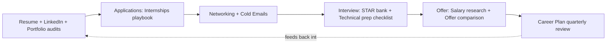

# Career

*Actionable trackers and checklists for the recurring work of managing a
career — not generic advice essays. Every file here is something you fill
in, check off, or run against real material (your actual resume, your
actual offer letters), covering resume, LinkedIn, portfolio, internships,
networking, cold emails, behavioral interviews, technical interviews,
STAR stories, salary research, offer comparison, and career planning.*

## Components

| File | Use it for |
|---|---|
| [`resume-audit-checklist.md`](resume-audit-checklist.md) | Auditing your actual resume before sending it |
| [`linkedin-optimization-checklist.md`](linkedin-optimization-checklist.md) | Auditing your live LinkedIn profile |
| [`portfolio-checklist.md`](portfolio-checklist.md) | Auditing your portfolio site/repos |
| [`networking-outreach-tracker.md`](networking-outreach-tracker.md) | Tracking outreach and follow-up |
| [`cold-email-templates.md`](cold-email-templates.md) | Starting structures for informational/referral/follow-up emails |
| [`star-story-bank.md`](star-story-bank.md) | Your personal inventory of behavioral interview stories |
| [`technical-interview-prep-checklist.md`](technical-interview-prep-checklist.md) | Prepping for a specific scheduled technical interview |
| [`salary-research-worksheet.md`](salary-research-worksheet.md) | Gathering real comp data before a negotiation |
| [`offer-comparison-matrix.md`](offer-comparison-matrix.md) | Comparing real offers against each other and your baseline |
| [`career-plan.md`](career-plan.md) | A living, quarterly-reviewed direction plan |

**Internships** are covered by
[`Systems/Playbooks/internship-applications.md`](../Playbooks/internship-applications.md)
(the workflow) and [`Systems/Templates/internship-tracker.md`](../Templates/internship-tracker.md)
(the tracker) — not duplicated here.

## AI prompts for this module

In [`Systems/Prompt-Library/Career/`](../Prompt-Library/Career):

- `resume-bullet-impact-rewrite.md` — rewrite bullets for impact, never inventing a number
- `promotion-case-builder.md` — build a promotion case against real next-level expectations
- `linkedin-profile-rewrite.md` — tighten headline/about for search and skim
- `portfolio-narrative-review.md` — review project write-ups for reviewer credibility
- `networking-message-crafting.md` — draft a specific, non-generic outreach message
- `cold-email-crafting.md` — draft a cold email with one clear, small ask
- `salary-research-prompt.md` — structure and sanity-check gathered comp data
- `offer-comparison-prompt.md` — reason through a real offer decision
- `career-plan-prompt.md` — pressure-test a career direction against real evidence

Behavioral and technical interview *prompts* live in
[`Systems/Prompt-Library/Interview/`](../Prompt-Library/Interview) and
[`Systems/Prompt-Library/System-Design/`](../Prompt-Library/System-Design)
— linked from `star-story-bank.md` and `technical-interview-prep-checklist.md`
rather than duplicated here.

## How the pieces fit together

## Adding to this module

Only add a new file here for something you'll reuse across multiple
cycles (multiple job searches, multiple negotiations) — a one-off note
about a specific application belongs in that application's own tracker
row, not as a new file here.
