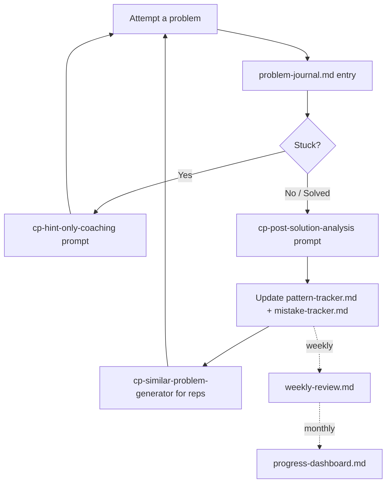

# Competitive Programming

*This module makes you a better problem solver — it is deliberately not
an algorithm reference. You won't find explanations of how segment trees
or DP work here; that's one search away whenever you need it. What's rare
and worth version-controlling is a record of YOUR problem-solving
process: what you actually try, where you actually get stuck, and
whether that's changing over time.*

## The loop

## Components

| File | Purpose |
|---|---|
| [`problem-journal.md`](problem-journal.md) | Per-problem entry: your reasoning process, not the solution |
| [`mistake-tracker.md`](mistake-tracker.md) | Recurring failure patterns, tracked until retired |
| [`pattern-tracker.md`](pattern-tracker.md) | Your personal fluency with patterns you've actually encountered |
| [`complexity-cheatsheet.md`](complexity-cheatsheet.md) | Constraint → target complexity lookup, plus your own blind spots |
| [`ai-coach.md`](ai-coach.md) | How to use AI here without it solving problems for you |
| [`weekly-review.md`](weekly-review.md) | Short weekly skill-signal check-in |
| [`progress-dashboard.md`](progress-dashboard.md) | Monthly glance-able trend view |
| [`contest-reflection.md`](contest-reflection.md) | Post-contest reflection, filled in same-day |

## AI prompts for this module

All in [`Systems/Prompt-Library/Competitive-Programming/`](../Prompt-Library/Competitive-Programming):

- `cp-hint-only-coaching.md` — smallest-possible nudge when stuck
- `cp-post-solution-analysis.md` — extract the transferable lesson after solving
- `cp-complexity-review.md` — understand your solution's real complexity, guided not told
- `cp-weakness-finder.md` — find real weaknesses from your own journal/mistake evidence
- `cp-similar-problem-generator.md` — graduated reps on a pattern you just learned
- `cp-interview-variant.md` — reframe a CP pattern into interview-style presentation
- `cp-code-review.md` — quality review of accepted code
- `cp-better-approach-suggestion.md` — guided exploration toward a cleaner approach
- `cp-problem-pattern-recognition.md` — identify the pattern before coding
- `cp-implementation-checklist.md` — pre-submit bug sweep

Every one of these is built around the same rule: **the AI gives the next
smallest nudge, then stops.** See `ai-coach.md` for the full discipline.

## Getting started

1. Copy `problem-journal.md` and fill in an entry for your next attempt,
   before you know if you'll solve it.
2. When stuck, use `cp-hint-only-coaching.md`. When done, use
   `cp-post-solution-analysis.md` — every time, win or lose.
3. Once a week, do a `weekly-review.md`. Once a month, update
   `progress-dashboard.md`.
