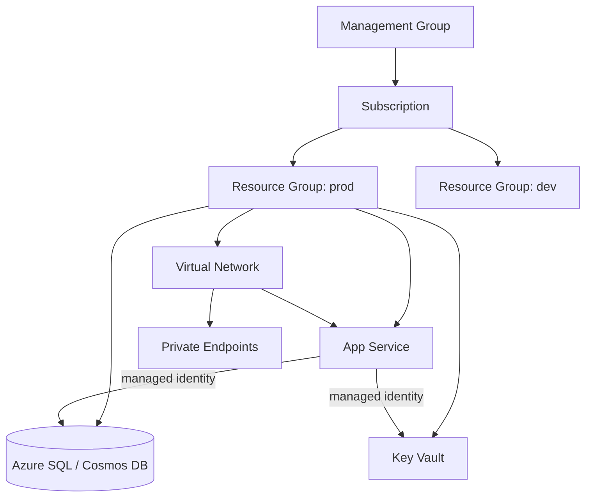
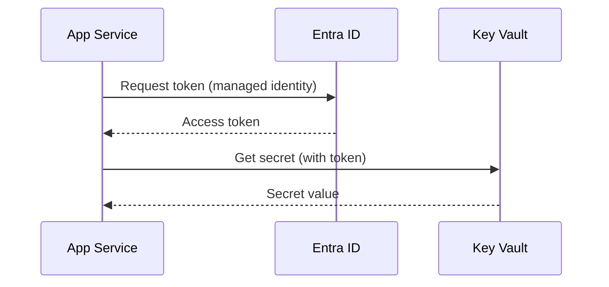

# Azure

*One authoritative reference. This is not a note collection — new
learnings get merged into the relevant section below, not appended as a
new file.*

## Overview

Azure is Microsoft's cloud platform: compute, storage, networking, data,
and identity services organized under subscriptions, resource groups, and
management groups. Its distinguishing strengths versus other clouds are
deep enterprise identity integration (Entra ID, formerly Azure AD), a
strong hybrid/on-prem story (Arc, ExpressRoute), and first-class support
for .NET and Windows workloads — though it's a full general-purpose cloud
for any stack.

## Mental model

Everything in Azure is a **resource**, and every resource lives in
exactly one **resource group** — a logical container used for lifecycle
management (delete the group, delete everything in it) and access
control scoping, not a technical/networking boundary. Resource groups
live in a **subscription** (the billing and access-control boundary),
and subscriptions can be organized under **management groups** for
org-wide policy.

Identity flows through **Entra ID** (formerly Azure AD): every resource
that needs to authenticate to another Azure resource should use a
**managed identity** rather than a stored credential — this is the single
most important Azure-specific mental model shift from "store an API key"
architectures.

## Architecture



**Identity flow for a typical app:**


## Common workflows

**Provisioning with the CLI**
```bash
az login
az group create --name rg-prod --location eastus
az appservice plan create --name plan-prod --resource-group rg-prod --sku B1
az webapp create --name myapp --plan plan-prod --resource-group rg-prod
```

**Assigning a managed identity and granting Key Vault access**
```bash
az webapp identity assign --name myapp --resource-group rg-prod
az keyvault set-policy --name mykv --object-id <identity-object-id> --secret-permissions get list
```

**Infrastructure as code (Bicep)**
```bash
az deployment group create --resource-group rg-prod --template-file main.bicep
```

**Checking costs**
```bash
az consumption usage list --start-date 2026-07-01 --end-date 2026-07-31
```

**Viewing logs**
```bash
az webapp log tail --name myapp --resource-group rg-prod
```

## Common mistakes

- **Storing credentials in App Settings/environment variables** instead
  of using a managed identity + Key Vault reference — this is the
  single most common Azure security gap.
- **Granting Owner/Contributor at the subscription level** when a
  scoped, resource-group-level or even resource-level role would do —
  violates least privilege and widens blast radius of a compromised
  identity.
- **No VNet integration / private endpoints** for resources holding
  sensitive data, leaving them reachable from the public internet by
  default.
- **Treating resource groups as environments** without a clear naming/
  tagging convention, making it hard to reason about cost or ownership
  at scale.
- **No budget alerts**, discovering cost overruns only at month-end
  billing.
- **Confusing ARM/Bicep deployment modes** — `Incremental` (default)
  only adds/updates resources in the template; `Complete` also deletes
  resources not in the template. Using `Complete` without understanding
  this can delete unrelated resources in the resource group.
- **Not setting diagnostic settings**, leaving Application Insights/Log
  Analytics disconnected from a resource that's actively having
  problems.

## Best practices

- Use managed identities for all service-to-service auth; reserve
  service principals with client secrets only for scenarios managed
  identity genuinely can't cover.
- Scope RBAC role assignments to the narrowest level that works
  (resource > resource group > subscription > management group).
- Use Bicep (or Terraform) for anything beyond a single throwaway
  resource — click-ops config drifts and isn't reproducible.
- Tag every resource with owner, environment, and cost-center at
  creation time — retrofitting tags at scale is painful.
- Set budget alerts on every subscription before it's used for anything
  beyond a quick experiment.
- Use Azure Policy to enforce org-wide guardrails (allowed regions,
  required tags, disallowed public IP on storage) rather than relying on
  manual review.
- Prefer Private Endpoints over service-endpoint/firewall-rule-based
  network restriction for anything handling sensitive data.

## Cheatsheet

| Task | Command |
|---|---|
| Login | `az login` |
| List subscriptions | `az account list -o table` |
| Set active subscription | `az account set --subscription <id>` |
| Create resource group | `az group create --name X --location Y` |
| List resources in a group | `az resource list --resource-group X` |
| Deploy Bicep/ARM | `az deployment group create --resource-group X --template-file f.bicep` |
| Assign managed identity | `az webapp identity assign --name X --resource-group Y` |
| Assign RBAC role | `az role assignment create --assignee <id> --role "Reader" --scope <resource-id>` |
| Tail app logs | `az webapp log tail --name X --resource-group Y` |
| List costs | `az consumption usage list` |
| Delete resource group (and everything in it) | `az group delete --name X` |

## Interview questions

1. What's the difference between a resource group and a subscription?
   *(Resource group: logical lifecycle/access container, no billing
   role of its own; subscription: the billing and top-level access
   boundary — every resource group belongs to exactly one subscription.)*
2. Why prefer a managed identity over a service principal with a stored
   secret? *(No credential to store, rotate, or leak; Entra ID manages
   the identity's lifecycle tied to the resource itself.)*
3. What's the difference between Azure RBAC and Azure Policy?
   *(RBAC controls WHO can do WHAT on a resource; Policy enforces WHAT
   configurations are allowed to exist, regardless of who's making the
   change — e.g. Policy can block creating a storage account without
   encryption, independent of the creator's RBAC permissions.)*
4. How would you secure a web app's connection to a database without
   storing a connection string with embedded credentials?
   *(Managed identity + Azure AD authentication to the database, or at
   minimum a Key Vault reference for the connection string, never a
   plaintext secret in App Settings.)*
5. What's the difference between `Incremental` and `Complete` ARM/Bicep
   deployment modes? *(Incremental only adds/modifies resources present
   in the template; Complete also deletes resources in the target scope
   that aren't in the template — a common source of accidental deletion
   if misunderstood.)*

## Useful links

- [Azure documentation](https://learn.microsoft.com/en-us/azure/)
- [Azure CLI reference](https://learn.microsoft.com/en-us/cli/azure/)
- [Bicep documentation](https://learn.microsoft.com/en-us/azure/azure-resource-manager/bicep/)
- [Azure Architecture Center](https://learn.microsoft.com/en-us/azure/architecture/)

## Further reading

- Azure Architecture Center's Well-Architected Framework — the
  canonical source for the reliability/security/cost tradeoffs touched
  on above.
- Microsoft Learn's Entra ID identity fundamentals module, if the
  managed-identity mental model needs deeper grounding.
