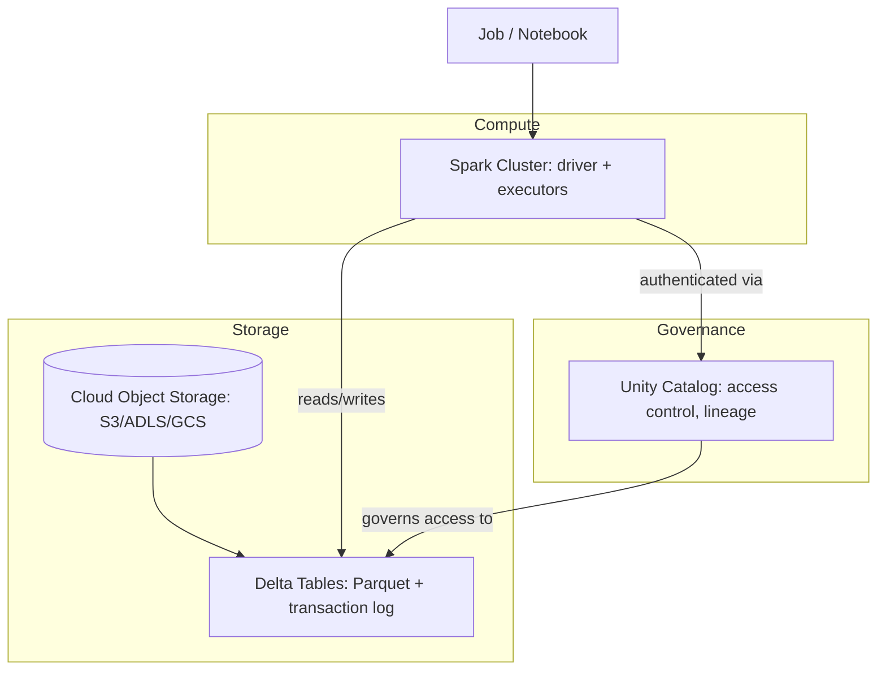
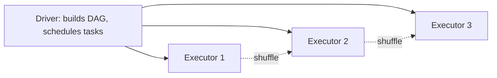

# Databricks

*One authoritative reference. This is not a note collection — new
learnings get merged into the relevant section below, not appended as a
new file.*

## Overview

Databricks is a managed platform built around Apache Spark, unifying
data engineering, analytics, and ML on top of a cloud object store
(commonly via **Delta Lake** as the storage/table format). Its core pitch
is separating storage from compute: data lives cheaply in cloud storage
as Delta tables, and clusters spin up/down on demand to process it,
instead of a permanently-running data warehouse.

## Mental model

Think of Databricks as three layers stacked on cloud object storage:
**Delta Lake** (a transactional table format on top of Parquet files,
giving ACID guarantees, time travel, and schema enforcement to what would
otherwise be a folder of files), **Spark** (the distributed compute
engine that reads/writes Delta tables and runs your transformations),
and the **workspace** (notebooks, jobs, clusters, and the Unity Catalog
governance layer tying access control to the data itself, not just the
compute).

The critical mental shift from a traditional database: a "table" is not
a service you connect to — it's a directory of Parquet files plus a
transaction log, and any compatible engine (a Databricks cluster, or
increasingly others) can read it directly from storage.

## Architecture



**Spark execution model:**


## Common workflows

**Reading and writing Delta tables (PySpark)**
```python
df = spark.read.format("delta").load("/mnt/data/orders")
df.filter(df.status == "completed").write.format("delta").mode("overwrite").save("/mnt/data/orders_completed")
```

**Creating a managed table via Unity Catalog**
```sql
CREATE TABLE catalog.schema.orders (
  id BIGINT, customer_id BIGINT, amount DECIMAL(10,2), created_at TIMESTAMP
) USING DELTA;
```

**Optimizing a table (compaction + data skipping)**
```sql
OPTIMIZE catalog.schema.orders ZORDER BY (customer_id);
VACUUM catalog.schema.orders RETAIN 168 HOURS;  -- 7 days, default safety window
```

**Time travel**
```sql
SELECT * FROM catalog.schema.orders VERSION AS OF 12;
SELECT * FROM catalog.schema.orders TIMESTAMP AS OF '2026-07-01';
```

**Scheduling a job**
```bash
databricks jobs create --json '{
  "name": "daily-etl",
  "tasks": [{"task_key": "etl", "notebook_task": {"notebook_path": "/Repos/etl"}}],
  "schedule": {"quartz_cron_expression": "0 0 6 * * ?", "timezone_id": "UTC"}
}'
```

## Common mistakes

- **Not repartitioning before a wide operation**, causing severe data
  skew — one task takes 10x longer than others, and adding cluster nodes
  doesn't help since the skewed task still bottlenecks the stage.
- **Small file accumulation** from frequent small writes (especially
  streaming), degrading both storage cost and query planning — mitigate
  with `OPTIMIZE` / auto-compaction, not just more compute.
- **Partitioning by a high-cardinality or rarely-filtered column**,
  producing either too many tiny partitions or partitions queries never
  actually prune on. Z-ORDER/liquid clustering is usually the better fit
  for high-cardinality columns.
- **Running everything on an all-purpose (interactive) cluster** instead
  of job clusters for scheduled workloads — job clusters are billed
  lower and spin down automatically, all-purpose clusters left running
  idle burn cost silently.
- **Ignoring the Spark UI** when diagnosing slowness — jumping straight
  to "add more nodes" without checking for shuffle volume, spill to disk,
  or skew in the actual stage metrics.
- **Not using Unity Catalog for governance**, relying on legacy
  workspace-level table ACLs that don't provide cross-workspace lineage
  or fine-grained column/row-level security.
- **Treating `VACUUM` casually** — it permanently deletes files needed
  for time travel beyond the retention window; running it with a short
  retention on a table others depend on for historical queries breaks
  those queries silently.

## Best practices

- Partition by low-to-medium cardinality columns that are actually
  filtered on in real queries; use Z-ORDER or liquid clustering for
  high-cardinality filter columns instead of partitioning by them.
- Use job clusters (not all-purpose clusters) for scheduled/production
  workloads.
- Enable auto-compaction and optimized writes on frequently-written
  tables to avoid small-file accumulation.
- Use Unity Catalog for all new workspaces — table-level, column-level,
  and row-level governance, plus cross-workspace data lineage.
- Check the Spark UI's stage/task metrics (skew, shuffle, spill) before
  assuming a performance problem needs more hardware.
- Use `MERGE INTO` for upserts rather than delete-then-insert patterns,
  which aren't atomic and can leave a table in an inconsistent
  intermediate state if interrupted.
- Set a deliberate `VACUUM` retention policy based on how far back time
  travel/audit needs to reach, not the default blindly.

## Cheatsheet

| Task | Syntax |
|---|---|
| Read Delta table | `spark.read.format("delta").load(path)` |
| Write Delta table | `df.write.format("delta").mode("overwrite").save(path)` |
| Upsert | `MERGE INTO target USING source ON ... WHEN MATCHED ... WHEN NOT MATCHED ...` |
| Compact + index | `OPTIMIZE table ZORDER BY (col)` |
| Clean old files | `VACUUM table RETAIN 168 HOURS` |
| Time travel by version | `SELECT * FROM table VERSION AS OF n` |
| Time travel by timestamp | `SELECT * FROM table TIMESTAMP AS OF 'date'` |
| Show table history | `DESCRIBE HISTORY table` |
| Restore a prior version | `RESTORE TABLE table TO VERSION AS OF n` |
| Check current partitions | `DESCRIBE DETAIL table` |

## Interview questions

1. What does Delta Lake add on top of plain Parquet files?
   *(ACID transactions via a transaction log, schema enforcement/
   evolution, time travel, and efficient upserts/deletes — plain Parquet
   has none of these; a folder of Parquet files with no transaction log
   can't safely support concurrent writers.)*
2. How would you diagnose a Spark job that's slower than expected?
   *(Check the Spark UI for data skew across tasks in a stage, spill to
   disk, and shuffle volume before assuming it's under-provisioned —
   scaling up a cluster doesn't fix a skewed single task.)*
3. When would you choose partitioning vs. Z-ORDER/liquid clustering for
   a column? *(Partitioning suits low-to-medium cardinality columns
   that are frequently filtered on and where partition pruning
   meaningfully reduces scanned data; high-cardinality columns produce
   too many small partitions and are better served by Z-ORDER/liquid
   clustering, which co-locates related data within files instead.)*
4. What's the difference between a job cluster and an all-purpose
   cluster? *(Job clusters are created for a specific job run and
   terminate automatically after, billed at a lower rate; all-purpose
   clusters are meant for interactive use and stay up until manually or
   auto-terminated after idle time — using all-purpose for scheduled
   production jobs wastes cost.)*
5. How does `MERGE INTO` help with idempotent upserts compared to a
   naive delete-then-insert? *(It's a single atomic operation — a
   delete-then-insert can leave the table in an inconsistent state if
   interrupted partway; MERGE also allows matched/unmatched conditional
   logic in one pass.)*

## Useful links

- [Databricks documentation](https://docs.databricks.com/)
- [Delta Lake documentation](https://docs.delta.io/)
- [Apache Spark documentation](https://spark.apache.org/docs/latest/)

## Further reading

- Databricks' own "Big Book of Data Engineering" — practical patterns
  for the OPTIMIZE/Z-ORDER/partitioning tradeoffs above.
- The Delta Lake transaction log protocol spec, if you need to
  understand exactly how ACID guarantees are implemented on top of
  object storage.
