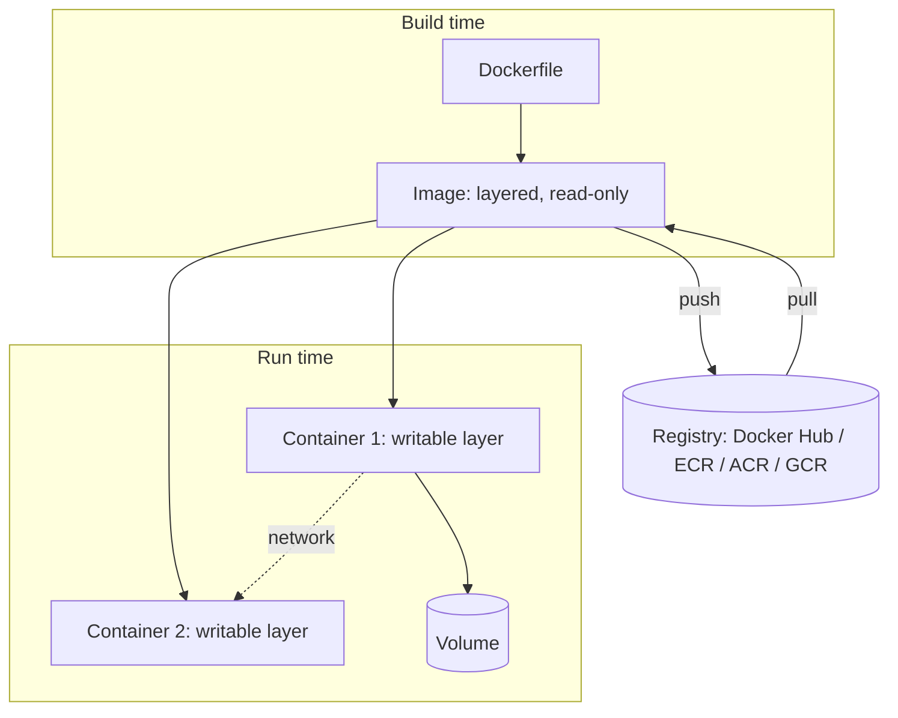

# Docker

*One authoritative reference. This is not a note collection — if you
learn something new about Docker worth keeping, it gets merged into the
relevant section below, not appended as a new file.*

## Overview

Docker packages an application with its filesystem, dependencies, and
runtime configuration into a portable, isolated unit (a container) that
runs consistently across environments. It solves "works on my machine"
by shipping the machine's relevant parts along with the code.

Core objects: **images** (immutable, layered filesystem snapshots),
**containers** (running instances of an image), **volumes** (persistent
data outside the container's writable layer), and **networks**
(how containers reach each other and the outside world).

## Mental model

A Docker image is a stack of read-only layers, each a diff from the one
below it (a `RUN`, `COPY`, or `ADD` instruction in the Dockerfile
produces one layer). A container adds one thin writable layer on top and
starts a process. Stopping a container doesn't delete the image; deleting
the container discards its writable layer (and hence any unpersisted
state) unless that state lives in a volume or bind mount.

Think of an image as a class and a container as an instance — you can run
many containers from one image, each with independent state in its
writable layer, sharing the same underlying read-only layers on disk
(which is why spinning up many containers from the same image is cheap).

## Architecture



**Daemon model:** the Docker CLI talks to `dockerd` (a background daemon)
over a socket; `dockerd` manages images, containers, networks, and
volumes, and talks to the OS's container primitives (namespaces, cgroups)
directly — containers are not VMs, they share the host kernel.

## Common workflows

**Building and running locally**
```bash
docker build -t myapp:latest .
docker run -d --name myapp -p 8080:80 -v myapp-data:/data myapp:latest
docker logs -f myapp
docker exec -it myapp sh
```

**Multi-container local dev (Compose)**
```bash
docker compose up -d
docker compose logs -f api
docker compose down -v   # -v also removes named volumes
```

**Debugging a running container**
```bash
docker inspect myapp                # full metadata: mounts, network, env
docker stats                        # live CPU/mem per container
docker exec -it myapp sh -c "ps aux"
```

**Cleaning up disk space**
```bash
docker system df                    # what's actually taking space
docker image prune -a               # remove unused images
docker volume prune                 # remove unused volumes — check first, this deletes data
```

**Pushing to a registry**
```bash
docker tag myapp:latest myregistry.azurecr.io/myapp:1.0.0
docker push myregistry.azurecr.io/myapp:1.0.0
```

## Common mistakes

- **Using `latest` as the only tag in production.** It's not guaranteed
  stable or reproducible — pin explicit version tags for anything
  deployed.
- **Not leveraging layer caching.** Putting `COPY . .` before
  `RUN npm install` invalidates the dependency-install layer on every
  code change, making every build reinstall dependencies. Copy dependency
  manifests first, install, then copy the rest.
- **Running as root inside the container.** The default user is root
  unless a Dockerfile sets `USER`; a container compromise then has root
  inside the container (and, depending on config, a larger blast radius).
- **Storing state in the container's writable layer** instead of a
  volume, then losing data on `docker rm`.
- **Baking secrets into the image** (via `ENV`, `ARG`, or a `COPY`'d
  file) — they persist in image layers and are extractable even if
  later "removed" in a subsequent layer.
- **Not setting resource limits**, letting one container starve the host
  or its neighbors of CPU/memory.
- **Confusing `CMD` and `ENTRYPOINT`** — `ENTRYPOINT` sets the fixed
  executable, `CMD` supplies default arguments to it (or the whole
  command if `ENTRYPOINT` isn't set); mixing them up produces containers
  that ignore runtime command overrides unexpectedly.

## Best practices

- Use multi-stage builds to keep the final image small — build with a
  full SDK image, copy only the compiled artifact into a minimal runtime
  base image.
- Pin base image versions (`node:20.11-slim`, not `node:latest`).
- Set a non-root `USER` in the Dockerfile.
- Use `.dockerignore` to keep build context small and avoid leaking
  local files (`.env`, `.git`) into the build.
- Add a `HEALTHCHECK` so orchestrators (Compose, Kubernetes) can detect
  a container that's running but not actually healthy.
- Prefer named volumes over bind mounts for production data — bind mounts
  couple the container to host filesystem paths.
- Keep one process per container; use an orchestrator (Compose, k8s) to
  compose multiple containers rather than supervisord-in-a-container
  patterns.

## Cheatsheet

| Task | Command |
|---|---|
| Build image | `docker build -t name:tag .` |
| Run container | `docker run -d --name x -p host:container image` |
| List running containers | `docker ps` |
| List all containers | `docker ps -a` |
| Stop / remove | `docker stop x` / `docker rm x` |
| Shell into container | `docker exec -it x sh` |
| View logs | `docker logs -f x` |
| List images | `docker images` |
| Remove image | `docker rmi image:tag` |
| Inspect object | `docker inspect x` |
| Copy file in/out | `docker cp local.txt x:/path` |
| Compose up/down | `docker compose up -d` / `docker compose down` |
| Prune unused | `docker system prune -a` |

## Interview questions

1. What's the difference between a container and a virtual machine?
   *(Containers share the host kernel and isolate via namespaces/cgroups;
   VMs virtualize hardware and run a full separate kernel — containers
   are lighter weight, VMs offer stronger isolation.)*
2. Why does layer ordering in a Dockerfile matter for build speed?
   *(Docker caches each layer; a layer is rebuilt if its instruction or
   any earlier layer changed — ordering rarely-changing steps first
   maximizes cache hits.)*
3. How would you reduce a production image's size?
   *(Multi-stage builds, minimal base images (alpine/distroless), remove
   build-time-only dependencies, combine RUN steps to reduce layer
   count, use `.dockerignore`.)*
4. How does container networking work by default, and how would two
   containers on the same host communicate?
   *(Default bridge network with NAT; user-defined bridge networks give
   containers DNS-based service discovery by container/service name —
   this is what Compose sets up automatically.)*
5. What happens to data in a container's writable layer when the
   container is removed, and how do you avoid losing it?
   *(It's deleted; persist real data in a volume or bind mount instead.)*

## Useful links

- [Official Docker documentation](https://docs.docker.com/)
- [Dockerfile reference](https://docs.docker.com/reference/dockerfile/)
- [Docker Compose file reference](https://docs.docker.com/reference/compose-file/)

## Further reading

- Official docs' "Build best practices" guide — the canonical source for
  layer-caching and image-size guidance above.
- The OCI (Open Container Initiative) image spec, if you need to
  understand image portability across runtimes (Docker, containerd,
  Podman) at a deeper level.
