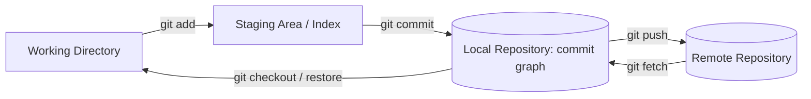
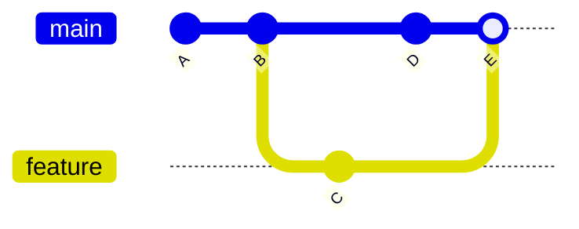

# Git

*One authoritative reference. This is not a note collection — new
learnings get merged into the relevant section below, not appended as a
new file.*

## Overview

Git is a distributed version control system: every clone is a full
repository with complete history, not a thin checkout from a central
server. Commits form a content-addressed, immutable graph — a commit's
hash is derived from its content and parent(s), so history can't be
silently altered without the hash changing.

## Mental model

Think of Git as a graph of snapshots, not diffs. Each commit points to a
full snapshot of the tree (internally stored efficiently via shared blobs
across commits, but conceptually: a full state), plus a pointer to its
parent commit(s). A branch is just a movable label pointing at a commit.
`HEAD` is a pointer to "where you currently are" — usually pointing at a
branch, which points at a commit.

Three areas matter for daily use: the **working directory** (your actual
files), the **staging area / index** (what will go into the next commit),
and the **repository** (committed history). `git add` moves changes from
working directory to staging; `git commit` moves staged changes into the
repository as a new commit.

## Architecture





## Common workflows

**Starting work on a feature**
```bash
git fetch origin
git checkout -b feature/x origin/main
# ...make changes...
git add -p                 # stage hunks selectively, review before committing
git commit -m "Add x"
git push -u origin feature/x
```

**Keeping a branch current with main**
```bash
git fetch origin
git rebase origin/main      # linear history; rewrites your branch's commits
# or: git merge origin/main # preserves both histories, adds a merge commit
```

**Fixing the last commit**
```bash
git commit --amend          # only if not yet pushed/shared
```

**Undoing changes (know which one you need)**
```bash
git restore file.txt              # discard uncommitted changes to a file
git restore --staged file.txt     # unstage, keep working directory changes
git reset --soft HEAD~1           # undo last commit, keep changes staged
git revert <commit>               # new commit that undoes a prior commit — safe on shared history
```

**Finding when/why a line changed**
```bash
git blame file.txt
git log -p --follow file.txt      # full history of a file, including renames
git bisect start                  # binary search for the commit that introduced a bug
```

**Interactively cleaning up commits before sharing**
```bash
git rebase -i HEAD~5               # squash/reorder/reword local, unpushed commits
```

## Common mistakes

- **`git push --force` on a shared branch**, overwriting a teammate's
  commits. Use `--force-with-lease` if a force push is genuinely needed
  — it fails if the remote has commits you haven't seen.
- **Rebasing commits that have already been pushed and shared.**
  Rebasing rewrites history (new commit hashes); anyone with the old
  history now has a diverged, conflicting view. Rebase local work only.
- **Committing secrets**, then "removing" them in a later commit —
  they remain in history and are recoverable. Requires `git filter-repo`
  or BFG to actually purge, plus rotating the leaked secret regardless.
- **Using `git add .` habitually**, staging unintended files (build
  artifacts, `.env`) that a narrower `git add <path>` or `git add -p`
  would have caught.
- **Confusing `reset` and `revert`.** `reset` moves history (destructive
  to commits after the target on that branch); `revert` adds a new
  commit undoing changes, safe for shared history.
- **Merge conflict panic-resolution** — accepting "theirs" or "ours"
  wholesale without reading the actual conflicting logic, silently
  reintroducing a bug one side had fixed.
- **Not understanding detached HEAD** — checking out a commit directly
  (not a branch) and then committing, producing commits with no branch
  pointing at them, easily lost once you check out something else.

## Best practices

- Write commit messages in imperative mood, stating why not just what
  ("Fix race condition in job scheduler," not "Fixed bug").
- Keep commits atomic — one logical change per commit, so `git bisect`
  and `git revert` stay meaningful.
- Rebase local, unpushed branches to keep history clean; merge (not
  rebase) once a branch is shared/pushed and others may have built on it.
- Use `git add -p` regularly instead of `git add .` — it forces a review
  of every hunk before it's staged.
- Tag releases (`git tag -a v1.2.0 -m "..."`) rather than relying on
  commit hashes or branch names to identify a release point.
- Set up a `.gitignore` before the first commit, not after secrets/build
  artifacts have already been committed.
- Use `git fetch` + review before `git pull` (which is fetch+merge in one
  step) when you want to inspect incoming changes first.

## Cheatsheet

| Task | Command |
|---|---|
| New branch from current | `git checkout -b name` |
| Switch branch | `git switch name` (or `git checkout name`) |
| Stage a hunk interactively | `git add -p` |
| Commit | `git commit -m "message"` |
| Amend last commit | `git commit --amend` |
| Push new branch | `git push -u origin name` |
| Update from remote | `git fetch origin` |
| Rebase onto main | `git rebase origin/main` |
| Merge main in | `git merge origin/main` |
| Discard uncommitted change | `git restore path` |
| Unstage | `git restore --staged path` |
| Undo last commit, keep changes | `git reset --soft HEAD~1` |
| Safely undo a pushed commit | `git revert <hash>` |
| View history graph | `git log --oneline --graph --all` |
| Stash work in progress | `git stash` / `git stash pop` |
| Find bug-introducing commit | `git bisect start` |
| Show file at a past commit | `git show <hash>:path/to/file` |

## Interview questions

1. What's the difference between `git merge` and `git rebase`, and when
   would you use each? *(Merge preserves both histories and adds a merge
   commit, safe for shared branches; rebase rewrites commits onto a new
   base for a linear history, safe only for local/unshared work.)*
2. What's the difference between `git reset` and `git revert`?
   *(Reset moves the branch pointer/history, destructive if already
   shared; revert adds a new commit undoing changes, safe for shared
   history.)*
3. How do you recover a commit that seems to have been lost (e.g. after
   a hard reset)? *(`git reflog` tracks where HEAD has been, even for
   commits no branch currently points to, and can restore access to
   them within the retention window.)*
4. Why shouldn't you rebase a branch other people have already pulled?
   *(It rewrites commit hashes; anyone with the old commits now has a
   diverged view and will hit confusing conflicts reconciling the two
   histories.)*
5. How does Git store data internally — is it diffs or snapshots?
   *(Snapshots of the full tree per commit, with unchanged files stored
   as shared blob references rather than actual diffs — diffs are
   computed on demand for display, not stored as the underlying model.)*

## Useful links

- [Official Git documentation](https://git-scm.com/doc)
- [Pro Git book (free, official)](https://git-scm.com/book)
- [git-scm.com reference for every command](https://git-scm.com/docs)

## Further reading

- Pro Git's chapter on Git internals (objects, refs, packfiles) for a
  deeper mental model than "it's like a save-game system."
- GitHub's / GitLab's own workflow guides for team-specific conventions
  (trunk-based vs. Git Flow) — the right branching strategy is a team
  decision, not a Git feature.
