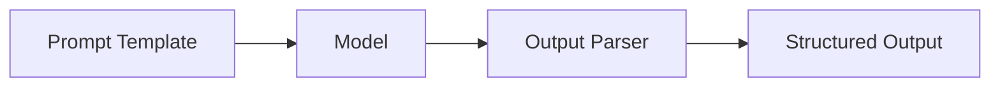
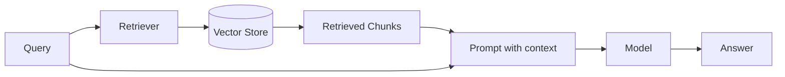
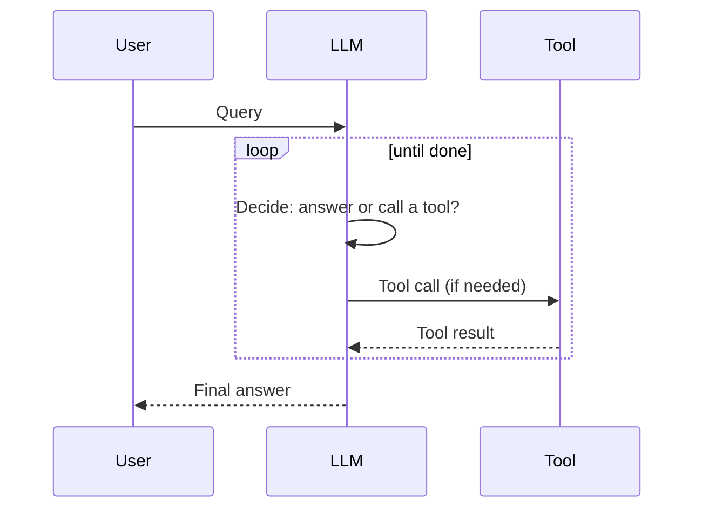

# LangChain

*One authoritative reference. This is not a note collection — new
learnings get merged into the relevant section below, not appended as a
new file.*

## Overview

LangChain is a framework for building applications on top of LLMs by
composing standardized building blocks — prompts, models, retrievers,
tools, and memory — into chains and agents. Its value is interoperability
(swap one model/vector store for another with minimal code change) and
pre-built integrations, not a capability the underlying LLM API doesn't
already have. It's a composition layer, not a replacement for
understanding what the underlying model call is actually doing.

## Mental model

Everything in modern LangChain is a **Runnable** — a unit with a
consistent `invoke`/`batch`/`stream` interface. Chains are built by
piping Runnables together with `|` (LCEL, the LangChain Expression
Language): `prompt | model | output_parser` is a chain where each
stage's output becomes the next stage's input, and the whole pipeline
inherits batching/streaming/async for free from the underlying pieces.

An **agent** is a loop, not a special component: an LLM call that decides
which tool to invoke, a tool execution step, and the result fed back to
the LLM — repeated until the LLM decides it's done. Understanding an
agent means understanding this loop, not memorizing a specific agent
class name (these have changed across LangChain versions; the loop
concept hasn't).

## Architecture



**A RAG chain:**


**Agent loop:**


## Common workflows

**A basic LCEL chain**
```python
from langchain_core.prompts import ChatPromptTemplate
from langchain_core.output_parsers import StrOutputParser
from langchain_openai import ChatOpenAI

prompt = ChatPromptTemplate.from_template("Summarize: {text}")
model = ChatOpenAI(model="gpt-4o-mini")
chain = prompt | model | StrOutputParser()

result = chain.invoke({"text": "..."})
```

**A RAG chain**
```python
from langchain_core.runnables import RunnablePassthrough

retriever = vectorstore.as_retriever(search_kwargs={"k": 4})
rag_chain = (
    {"context": retriever, "question": RunnablePassthrough()}
    | prompt
    | model
    | StrOutputParser()
)
```

**A tool-calling agent**
```python
from langchain.agents import create_tool_calling_agent, AgentExecutor

agent = create_tool_calling_agent(model, tools, prompt)
executor = AgentExecutor(agent=agent, tools=tools)
executor.invoke({"input": "..."})
```

**Streaming**
```python
for chunk in chain.stream({"text": "..."}):
    print(chunk, end="", flush=True)
```

## Common mistakes

- **Treating LangChain as adding capability the raw API lacks.** It's a
  composition/integration layer; if a simple direct API call would do,
  adding LangChain's abstraction on top adds indirection without benefit.
- **Not pinning versions.** LangChain's API surface has changed
  significantly across versions (legacy chains vs. LCEL, agent class
  renames) — an unpinned dependency can break on an unrelated `pip
  install` elsewhere.
- **Ignoring token/cost limits in RAG context assembly** — concatenating
  every retrieved chunk without checking the total token count against
  the model's context window and your cost budget.
- **No fallback/error handling around tool calls in an agent loop** —
  a tool that throws an exception can silently break the whole agent run
  if not caught and fed back to the LLM as a recoverable error.
- **Using an agent when a fixed chain would do.** Agents introduce
  non-determinism and extra LLM calls (tool-selection reasoning); if the
  workflow is actually a fixed sequence of steps, a plain LCEL chain is
  more predictable, cheaper, and easier to debug.
- **Not setting a max iteration/step limit on agents**, risking runaway
  loops that burn cost or never terminate on an ambiguous task.
- **Skipping LangSmith/tracing during development**, debugging complex
  chains by print-statement guessing instead of inspecting the actual
  prompt/response at each step.

## Best practices

- Prefer LCEL (`|` composition) over legacy chain classes for new code
  — it's the actively maintained pattern with consistent streaming/
  batching/async support.
- Use an agent only when the task genuinely requires the LLM to decide
  which action to take next; use a fixed chain for anything with a known
  sequence of steps.
- Set explicit `max_iterations`/timeout on any agent executor.
- Use tracing (LangSmith or equivalent) from early in development, not
  only when something's already broken in production.
- Keep prompts as explicit template objects, version-controlled, rather
  than inline strings scattered through code — treat prompt changes like
  code changes, with review.
- Validate/parse LLM output with a structured output parser (Pydantic
  model, JSON schema) rather than string-matching raw text for anything
  downstream code depends on.
- Test retrieval and generation quality separately (see
  `Systems/Docs/rag.md`) — a RAG chain failure could be either stage.

## Cheatsheet

| Task | Pattern |
|---|---|
| Basic chain | `prompt \| model \| output_parser` |
| Invoke | `chain.invoke({...})` |
| Stream | `for chunk in chain.stream({...}): ...` |
| Batch | `chain.batch([{...}, {...}])` |
| Async | `await chain.ainvoke({...})` |
| RAG retriever step | `vectorstore.as_retriever(search_kwargs={"k": n})` |
| Structured output | `model.with_structured_output(PydanticModel)` |
| Tool-calling agent | `create_tool_calling_agent(model, tools, prompt)` |
| Add memory to a chain | `RunnableWithMessageHistory(chain, get_session_history)` |
| Parallel steps | `RunnableParallel({"a": chain_a, "b": chain_b})` |

## Interview questions

1. What is LCEL and why was it introduced? *(LangChain Expression
   Language — a `|`-based composition syntax where every component
   implements a common Runnable interface, giving consistent streaming/
   batching/async across arbitrary chain compositions, replacing a
   proliferation of bespoke legacy chain classes.)*
2. When would you use an agent instead of a fixed chain?
   *(When the sequence of steps/tools needed genuinely depends on
   runtime information the LLM must reason about — not for a fixed,
   known pipeline, where a plain chain is more predictable and cheaper.)*
3. How would you debug a RAG pipeline producing wrong answers?
   *(Isolate whether retrieval or generation is failing — inspect the
   actual retrieved chunks for the failing query; see
   `Systems/Prompt-Library/RAG/rag-architecture-review.md`.)*
4. What's a risk specific to agent loops that doesn't apply to fixed
   chains? *(Unbounded iteration/cost if the LLM doesn't converge on a
   final answer, and non-determinism in which tools get called — mitigate
   with max iteration limits and tracing.)*
5. Why might pinning your LangChain version matter more than for most
   Python dependencies? *(The API surface has changed substantially
   across versions — chain classes, agent constructors, and import paths
   have been renamed/restructured — so an unpinned upgrade elsewhere in
   the dependency tree can silently break existing chains.)*

## Useful links

- [LangChain documentation](https://python.langchain.com/docs/)
- [LangChain Expression Language (LCEL) guide](https://python.langchain.com/docs/concepts/lcel/)
- [LangSmith (tracing/observability)](https://docs.smith.langchain.com/)

## Further reading

- LangChain's own conceptual docs on Runnables and LCEL — the primary
  source for the composition model described above.
- `Systems/Docs/rag.md` for the retrieval-side concepts a LangChain RAG
  chain depends on.
