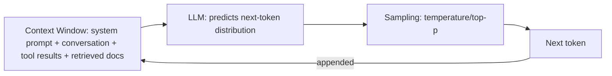
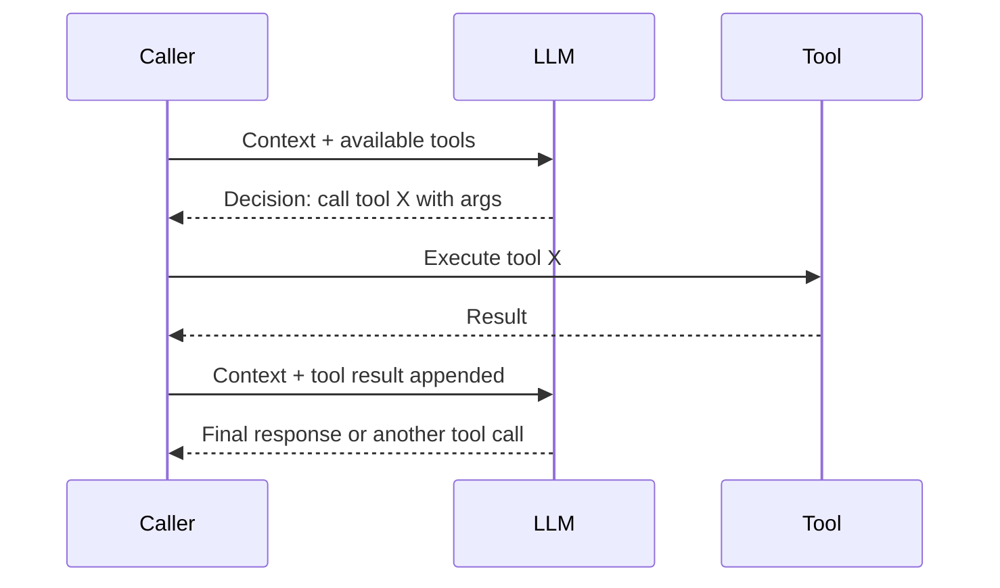

# LLMs (Large Language Models)

*One authoritative reference. This is not a note collection — new
learnings get merged into the relevant section below, not appended as a
new file.*

## Overview

An LLM is a next-token-prediction model trained on huge text (and
increasingly multimodal) corpora, then fine-tuned to follow instructions
and, often, further aligned via human/AI feedback. Practically, it's a
function from (context) → (a probability distribution over the next
token), sampled repeatedly to generate text. Everything about how to use
one well — prompting, context management, tool use — follows from taking
that mental model seriously rather than treating the model as a
general-purpose oracle.

## Mental model

The model has no persistent memory or state between calls — every
behavior is a function of what's in the context window for that specific
call, full stop. "It remembers our earlier conversation" is really "the
earlier conversation is still present in the context being sent." This
single fact explains most surprising behavior: it forgets things once
they scroll out of context, it can be inconsistent across separate calls
because each is independent, and it can be redirected by anything present
in context — including untrusted content, which is why prompt injection
is a structural risk, not a bug.

Sampling matters as much as the model weights: temperature, top-p, and
similar parameters control how much randomness is injected when
selecting the next token from the predicted distribution — low
temperature for consistent/deterministic-feeling output, higher for
creative variation.

## Architecture



**A tool-calling round trip:**


## Core concepts

- **Context window**: the maximum tokens (input + output combined, for
  most APIs) the model can attend to in one call — a hard resource
  constraint, not a soft guideline.
- **Tokens**: the actual unit the model operates on — not words;
  pricing, context limits, and truncation all operate in tokens.
- **System prompt vs. user/assistant turns**: the system prompt sets
  persistent behavior/persona; user/assistant turns are the actual
  conversation — most APIs weight the system prompt as higher-priority
  instruction, though it's still just text in the context.
- **Grounding**: whether the model's output is tied to provided context
  (retrieved documents, tool results) vs. relying on parametric
  (memorized, potentially stale or hallucinated) knowledge.
- **Fine-tuning vs. prompting vs. RAG**: three different ways to make a
  model behave well for your use case, at increasing setup cost and
  decreasing per-call flexibility — prompting is cheapest and most
  flexible, RAG adds external knowledge without retraining, fine-tuning
  reshapes the model's behavior itself and is usually the last resort.

## Typical workflows

**Basic API call (conceptual, provider-agnostic)**
```python
response = client.messages.create(
    model="model-name",
    system="You are a...",
    messages=[{"role": "user", "content": "..."}],
    max_tokens=1024,
    temperature=0.3,
)
```

**Tool use / function calling**
```python
response = client.messages.create(
    model="model-name",
    messages=[...],
    tools=[{"name": "get_weather", "input_schema": {...}}],
)
# If response requests a tool call: execute it, append the result as a
# new message, call the model again.
```

**Structured output**
```python
response = client.messages.create(
    model="model-name",
    messages=[...],
    # Provider-specific: a response schema, or a tool call whose
    # "arguments" are the structured output you actually want.
)
```

## Best practices

- Treat the context window as a real resource budget — don't dump
  everything "just in case"; irrelevant content in context can degrade
  attention to what matters (see `Systems/Docs/rag.md` on retrieval
  dilution).
- Set temperature low (near 0) for tasks needing consistency (extraction,
  classification, code generation) and higher only for genuinely creative
  tasks.
- Never trust the model to keep a secret placed in its own context —
  anything in context can, in principle, be surfaced or influence output,
  including to an adversarial user probing for it.
- Validate structured output programmatically (schema validation)
  instead of trusting the model always returns well-formed output.
- Pin model versions in production — providers deprecate and change
  default model behavior over time.

## Common mistakes

- Assuming the model "remembers" something from a previous, separate API
  call with no shared context — each call is independent unless you
  explicitly pass prior context.
- Treating parametric knowledge as reliably current — models have a
  training cutoff and no innate way to know what's changed since.
- Ignoring prompt injection risk when untrusted content (documents,
  emails, web pages) enters the context — see
  `Systems/Prompt-Library/Prompt-Engineering/prompt-injection-hardening.md`.
- Over-stuffing context "to be safe," diluting the model's attention on
  what's actually relevant to the current task.
- Treating a confident-sounding answer as evidence of correctness —
  fluency and accuracy are not the same axis for these models.

## Cheatsheet

| Concept | Notes |
|---|---|
| Context window | Hard limit on input+output tokens per call |
| Temperature | Lower = more deterministic; higher = more varied/creative |
| System prompt | Persistent instruction/persona, highest-priority text in context |
| Tool calling | Model requests a function call; caller executes and returns result |
| Grounding | Output tied to provided context vs. parametric memory |
| Parametric knowledge | What the model "knows" from training — can be stale or wrong |
| Fine-tuning | Reshaping model weights for a use case — highest cost, lowest flexibility |

## Interview questions

1. Why can't an LLM "remember" a fact from an earlier, separate
   conversation unless it's explicitly re-provided? *(No persistent
   state between calls — behavior is entirely a function of the current
   context window; anything not in it doesn't exist to the model for
   that call.)*
2. What's the practical difference between prompting, RAG, and
   fine-tuning as ways to adapt a model to a task? *(Prompting: cheapest,
   most flexible, no setup; RAG: adds external/current knowledge via
   retrieval without retraining; fine-tuning: reshapes the model's
   weights/behavior directly, most expensive and least flexible
   per-change.)*
3. Why is prompt injection a structural risk rather than a bug to be
   patched? *(The model has no built-in way to distinguish trusted
   instructions from untrusted content once both are in the same
   context — any text present can, in principle, influence output.)*
4. How would you make an LLM's output more consistent across repeated
   calls with the same input? *(Lower the temperature/sampling
   randomness; note that even at temperature 0, exact determinism isn't
   always guaranteed depending on the provider's infrastructure.)*
5. Why might a fluent, confident-sounding answer still be wrong?
   *(The model is optimizing for plausible next-token continuation, not
   verified truth — fluency is a property of the generation process, not
   evidence of grounding in fact.)*

## Useful links

- [Anthropic's Claude documentation](https://docs.claude.com/)
- [OpenAI API documentation](https://platform.openai.com/docs/)

## Further reading

- `Systems/Docs/prompt-engineering.md` for how to work effectively within
  this mental model.
- `Systems/Docs/rag.md` for grounding an LLM in external knowledge.
- `Systems/Prompt-Library/AI/` and `Systems/Prompt-Library/Prompt-Engineering/`
  for the operational prompts built on top of these concepts.
