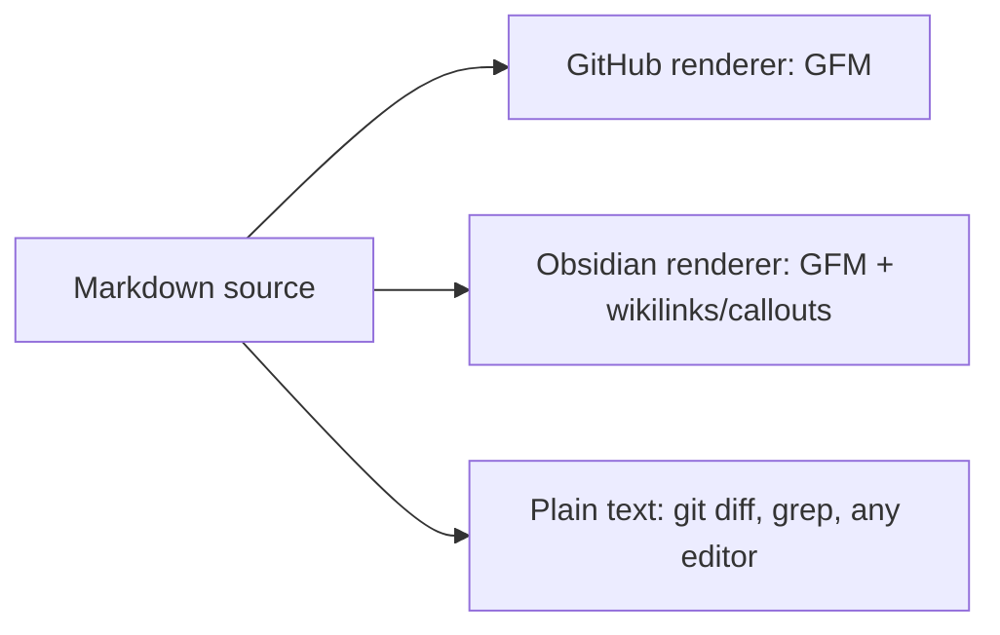
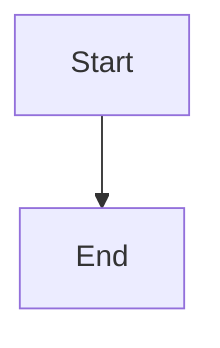

# Markdown

*One authoritative reference. This is not a note collection — new
learnings get merged into the relevant section below, not appended as a
new file.*

## Overview

Markdown is a lightweight markup syntax that converts to HTML (or
renders directly in tools like Obsidian and GitHub), designed to be
readable as plain text even before rendering. Forge is built entirely on
it deliberately: it's portable, diffable in Git, has zero vendor
lock-in, and degrades gracefully — a Markdown file is still fully useful
opened in a plain text editor.

## Mental model

Markdown has two coexisting audiences for every file: the renderer
(GitHub, Obsidian, a static site generator) and a human reading the raw
text (in `git diff`, `grep`, or a terminal). Good Markdown reads cleanly
in both — this is why Forge's own conventions
(`CONVENTIONS.md`) favor plain structure (headers, lists, tables) over
things that only make sense rendered. The moment a file only "works" in
one specific renderer, it's stopped being genuinely portable Markdown.

Flavors matter: CommonMark is the base spec, but GitHub-Flavored
Markdown (GFM, adds tables, task lists, strikethrough, autolinking) and
Obsidian's flavor (adds wikilinks, callouts, embeds) each extend it
differently. Content meant to be read in multiple places (like most of
Forge) should stick to the common subset, or explicitly note where it
relies on a flavor-specific feature.

## Architecture



## Core concepts

- **CommonMark**: the standardized base syntax (headers, emphasis,
  lists, links, code blocks, blockquotes) — supported essentially
  everywhere.
- **GFM extensions**: tables, task lists (`- [ ]`), strikethrough,
  automatic URL linking, fenced code blocks with syntax highlighting.
- **Obsidian extensions**: `[[wikilinks]]` (resolve within the vault,
  render as plain bracketed text elsewhere), callout blocks, embeds
  (`![[file]]`) — features that degrade to visible-but-inert text outside
  Obsidian, which is why Forge's conventions require every file to
  remain useful even when these don't render.
- **Frontmatter**: YAML metadata at the top of a file between `---`
  fences — used by Obsidian, static site generators, and various tools
  for structured metadata without cluttering the visible content.
- **Mermaid**: a diagramming syntax embedded in fenced code blocks
  (` ```mermaid `), rendered natively by GitHub, Obsidian (with a
  plugin), and this repo's own Artifact tooling — Forge's standard for
  diagrams because it's still just text in the source file.

## Typical workflows

**A cross-tool-safe internal link**
```markdown
[Feature Proposal template](../Templates/feature-proposal.md)
```
Works identically on GitHub and in a plain editor; only wikilinks
(`[[feature-proposal]]`) are Obsidian-exclusive — Forge's own convention
is to use wikilinks within `Prompt-Library/` for the graph-view benefit,
and relative Markdown links when a link must also work on GitHub's web
viewer (see `CONVENTIONS.md`).

**A table**
```markdown
| Column A | Column B |
|---|---|
| value | value |
```

**A task list**
```markdown
- [ ] Not done yet
- [x] Done
```

**A Mermaid diagram**
````markdown

````

## Best practices

- Write for both audiences — rendered and raw-text — every time; if a
  raw `.md` file is confusing to read in a terminal, it's not good
  Markdown regardless of how it renders.
- Use one H1 per file matching the file's title (Forge's own
  convention, see `CONVENTIONS.md`).
- Prefer tables and checklists over long prose paragraphs for anything
  structured — faster to scan, easier to diff meaningfully in Git.
- Always give code blocks a language hint (` ```python `, not ` ``` `)
  for correct syntax highlighting.
- Use relative links for anything that must work on GitHub; reserve
  wikilinks for content whose primary consumption is inside Obsidian.
- Keep frontmatter minimal — only fields something actually reads or
  filters on (see `CONVENTIONS.md`'s frontmatter guidance).

## Common mistakes

- Writing a file that only makes sense rendered (relying entirely on
  Obsidian callouts/embeds with no fallback), breaking the "useful as
  plain Markdown anywhere" principle.
- Using wikilinks for links that need to work on GitHub's web viewer —
  they render as plain bracketed text there, not as clickable links.
- Skipping the language hint on code blocks, losing syntax highlighting
  for no reason.
- Nesting lists or tables so deeply that the raw text becomes hard to
  read even though it renders fine — optimizing only for the rendered
  view.
- Inconsistent heading levels (skipping from H2 to H4), which breaks
  both visual hierarchy and any tool that generates a table of contents
  from headings.

## Cheatsheet

| Syntax | Result |
|---|---|
| `# H1` … `###### H6` | Headings |
| `**bold**` / `*italic*` | Emphasis |
| `` `code` `` | Inline code |
| ` ```lang ... ``` ` | Fenced code block with syntax highlighting |
| `[text](url)` | Link |
| `[[note-name]]` | Wikilink (Obsidian only) |
| `` | Image |
| `- item` / `1. item` | Unordered / ordered list |
| `- [ ]` / `- [x]` | Task list (GFM) |
| `\| a \| b \|` | Table (GFM) |
| `> quote` | Blockquote |
| `---` | Horizontal rule (also YAML frontmatter fence) |
| ` ```mermaid ` | Diagram block |

## Interview questions

*(Less commonly asked in technical interviews directly, but relevant for
documentation/tooling discussions.)*

1. Why might a team choose Markdown over a rich-text/proprietary format
   for engineering documentation? *(Diffable and mergeable in Git,
   portable across tools with no vendor lock-in, readable even
   unrendered — properties a binary or proprietary format lacks.)*
2. What's the practical risk of relying on a specific flavor's extension
   (e.g. Obsidian wikilinks) in documentation meant to be read elsewhere?
   *(It degrades to plain, non-functional text outside that tool — a
   reader on GitHub sees literal `[[brackets]]` instead of a working
   link.)*
3. How does Mermaid fit into a "Markdown-only" documentation strategy?
   *(Diagrams stay as version-controllable, diffable text within a
   fenced code block rather than an external binary image file, and
   render natively in most modern Markdown viewers.)*

## Useful links

- [CommonMark spec](https://commonmark.org/)
- [GitHub Flavored Markdown spec](https://github.github.com/gfm/)
- [Mermaid documentation](https://mermaid.js.org/)

## Further reading

- `CONVENTIONS.md` for Forge's own specific Markdown, naming, and
  tagging conventions built on top of this general reference.
