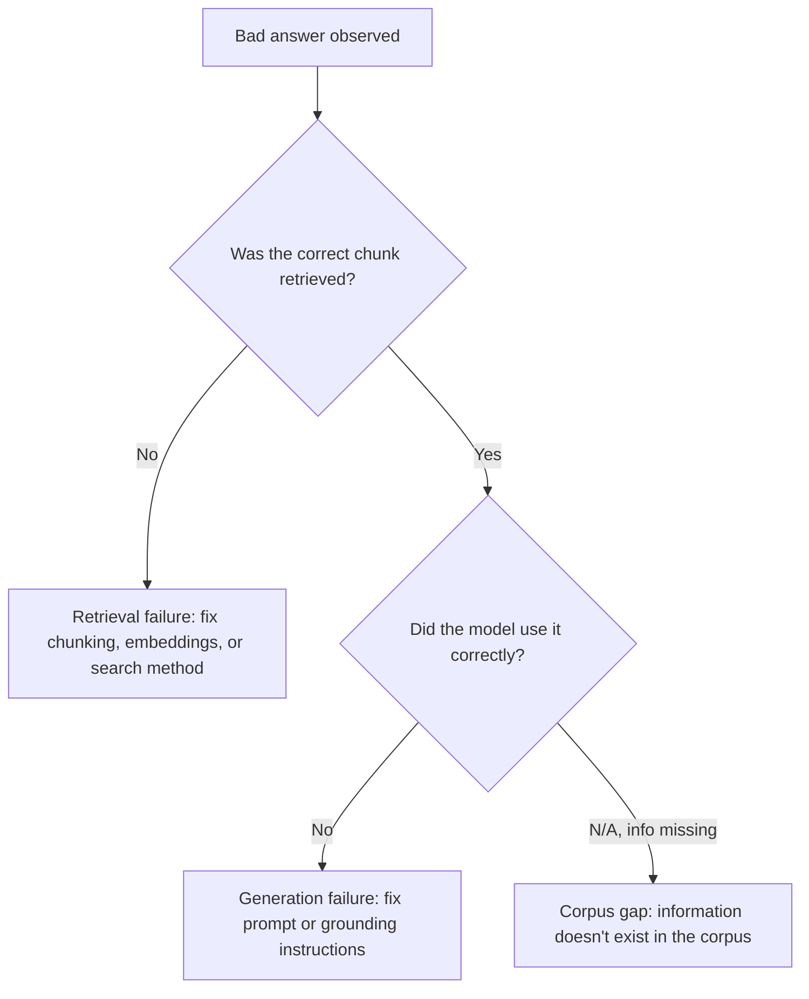

# RAG (Retrieval-Augmented Generation)

*One authoritative reference. This is not a note collection — new
learnings get merged into the relevant section below, not appended as a
new file.*

## Overview

RAG grounds an LLM's output in retrieved external content instead of
relying solely on what the model memorized during training. A query
retrieves relevant chunks from a corpus (typically via vector similarity
search), and those chunks are inserted into the prompt as context before
generation. It's the standard pattern for making an LLM answer
accurately about content it wasn't trained on, or that's changed since
training.

## Mental model

RAG has exactly two stages, and diagnosing a bad output always starts by
figuring out which stage failed: **retrieval** (did the system find the
right information in the corpus) and **generation** (given the right
information, did the model use it correctly). These are independent
failure modes with different fixes — no amount of prompt engineering
fixes a retrieval failure, and no amount of retrieval tuning fixes a
model that ignores correct context.

Think of the corpus as being pre-processed into a searchable index once
(chunking + embedding), and every query as a two-step round trip against
that index: embed the query, find the nearest chunks, then hand them to
the model alongside the original question.

## Architecture

```mermaid
flowchart TD
    subgraph Ingestion (offline, once per corpus update)
        DOCS[Source Documents] --> CHUNK[Chunking]
        CHUNK --> EMBED1[Embedding Model]
        EMBED1 --> VDB[(Vector Database)]
    end
    subgraph Query time
        Q[User Query] --> EMBED2[Embedding Model]
        EMBED2 --> SEARCH[Similarity Search]
        VDB --> SEARCH
        SEARCH --> CHUNKS[Retrieved Chunks]
        CHUNKS --> PROMPT[Prompt: Query + Context]
        Q --> PROMPT
        PROMPT --> LLM[Generation Model]
        LLM --> ANSWER[Answer]
    end
```

**Failure isolation flow:**


## Common workflows

**Basic retrieval + generation (conceptual, framework-agnostic)**
```python
query_embedding = embed(query)
chunks = vector_db.search(query_embedding, top_k=5)
context = "\n\n".join(c.text for c in chunks)
prompt = f"Answer using only the context below.\n\nContext:\n{context}\n\nQuestion: {query}"
answer = llm.generate(prompt)
```

**Hybrid search (keyword + vector)**
```python
vector_hits = vector_db.search(query_embedding, top_k=10)
keyword_hits = bm25_index.search(query, top_k=10)
merged = reciprocal_rank_fusion(vector_hits, keyword_hits)[:5]
```

**Adding a reranker after initial retrieval**
```python
candidates = vector_db.search(query_embedding, top_k=20)
reranked = reranker_model.rerank(query, candidates)[:5]
```

**Evaluating retrieval quality**
```python
# For a labeled eval set of (query, correct_chunk_id) pairs:
recall_at_k = fraction_where(correct_chunk_id in retrieved_ids[:k])
```

## Common mistakes

- **Diagnosing every bad answer as a prompt problem.** Most RAG failures
  are retrieval failures (the right chunk was never fetched) — always
  check what was actually retrieved before touching the generation
  prompt. See `Systems/Prompt-Library/RAG/rag-architecture-review.md`.
- **Fixed-size chunking on structured documents**, splitting tables,
  code blocks, or a single semantic unit across chunk boundaries.
- **No metadata attached to chunks** (source, section, date), making
  citation, filtering, and debugging retrieval impossible.
- **Increasing top-k as a blanket fix for bad retrieval** without
  checking whether the added chunks are relevant — this just dilutes the
  context and can make generation worse, not better.
- **No grounding/refusal instruction in the generation prompt**, so the
  model fills gaps with parametric (memorized, ungrounded) knowledge
  when retrieval comes up short, rather than saying it doesn't know.
- **Never re-evaluating after the corpus grows or changes** — retrieval
  quality that was fine at 10K documents can degrade at 1M without
  re-tuning (chunking, embedding model fit, index type).
- **No citation/traceability from answer back to source chunk**, making
  it impossible to verify or debug a specific claim.

## Best practices

- Diagnose retrieval and generation as separate failure modes, always —
  inspect actual retrieved chunks before touching the prompt.
- Chunk by document structure (headings, sections) rather than fixed
  token counts wherever the source has real structure.
- Attach metadata (source, section, date) to every chunk for citation
  and filtered retrieval.
- Consider hybrid search (keyword + vector) for corpora with exact-match-
  sensitive content (IDs, error codes, proper nouns) that pure semantic
  similarity handles poorly.
- Add a reranking step when initial retrieval is high-recall but
  low-precision — cheap to retrieve more candidates and rerank than to
  over-tune the first-pass retriever.
- Build a real labeled eval set (see
  `Systems/Prompt-Library/AI/prompt-eval-harness-design.md`) and measure
  retrieval recall/precision separately from end-to-end answer quality.
- Explicitly instruct the model to say when it doesn't know rather than
  fill gaps from parametric memory, and test this refusal behavior
  directly in your eval set.

## Cheatsheet

| Concept | What it controls |
|---|---|
| Chunk size/overlap | How much context per retrieved unit; too small loses context, too large dilutes relevance |
| top-k | How many chunks retrieved; higher recall but more dilution/cost |
| Embedding model | Semantic similarity quality for this domain's vocabulary |
| Hybrid search | Combines keyword exact-match with vector semantic match |
| Reranker | Second-pass precision improvement over a higher-recall first pass |
| Metadata filtering | Scoping retrieval to a subset (date range, source, tenant) before/alongside similarity search |
| Citation | Traceability from generated claim back to source chunk |

## Interview questions

1. A RAG system gives a wrong answer — how do you determine if it's a
   retrieval or generation problem? *(Inspect what was actually
   retrieved for that query; if the correct information wasn't in the
   retrieved set, it's retrieval; if it was there but the model ignored/
   misused it, it's generation.)*
2. Why might increasing top-k make answers worse, not better?
   *(More retrieved chunks means more irrelevant content diluting the
   context, which can distract the model from the actually-relevant
   chunk or push it out of the effective context window.)*
3. When would you use hybrid (keyword + vector) search over pure vector
   search? *(When the corpus has exact-match-sensitive terms — product
   IDs, error codes, proper nouns — that semantic embedding similarity
   doesn't reliably distinguish; keyword search catches exact matches
   vector search can miss.)*
4. How do you evaluate a RAG system beyond "the answers look good to
   me"? *(A labeled eval set with recall@k for retrieval, scored
   separately from generation quality/faithfulness — not just eyeballing
   a handful of outputs.)*
5. How do you reduce hallucination in a RAG system when the corpus
   genuinely doesn't contain the answer? *(Explicit grounding
   instructions requiring the model to only answer from provided
   context and state when it doesn't know, tested directly with
   out-of-corpus queries in the eval set — not assumed to work by
   default.)*

## Useful links

- [LangChain RAG conceptual guide](https://python.langchain.com/docs/concepts/rag/)
- Original RAG paper (Lewis et al., 2020) — foundational reference for
  the retrieve-then-generate architecture.

## Further reading

- `Systems/Prompt-Library/RAG/rag-architecture-review.md` and
  `chunking-strategy-design.md` for the diagnostic and design prompts
  that operationalize this document.
- `Systems/Docs/vector-databases.md` for the retrieval backend this
  architecture depends on.
