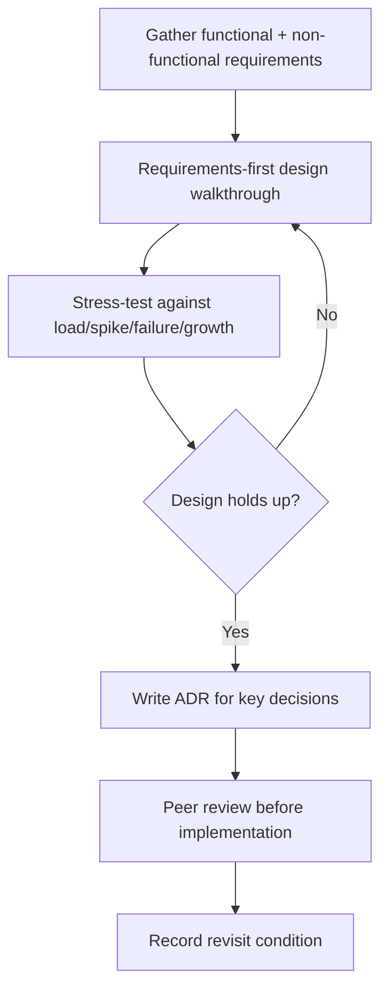

# Playbook: Building an Architecture

## Goal
Produce an architecture that's justified by real requirements and
stress-tested against growth/failure — recorded as a durable decision,
not a verbal agreement.

## Inputs
- The system to design and its functional requirements
- Scale/growth projections, latency/availability constraints
- Team/operational constraints

## Outputs
- A high-level design justified by requirements
- A stress-test of the design against growth and failure scenarios
- A written ADR capturing the decision and its revisit condition

## Steps
1. Gather functional and non-functional requirements explicitly — don't
   sketch components before this is nailed down.
2. Run a requirements-first design walkthrough (scale estimation, high
   level design, deep dive on the hardest sub-problem).
3. Stress-test the resulting design against 10x load, sudden spikes,
   single points of failure, and data growth.
4. For any significant choice with real tradeoffs (data store, service
   boundary, sync vs. async), write an ADR.
5. Circulate the ADR and design for review before implementation starts
   — catching a bad boundary on paper is cheap; catching it in
   production is not.
6. Record the revisit condition explicitly — the growth/change trigger
   that means this design needs to be reconsidered.

## Checklists
- [ ] Functional + non-functional requirements gathered before designing
- [ ] Scale estimated with real numbers, not vague language
- [ ] Design stress-tested against load, spike, failure, and growth
- [ ] ADR(s) written for significant tradeoff decisions
- [ ] Design reviewed by someone else before implementation
- [ ] Revisit condition recorded

## AI prompts
- `Systems/Prompt-Library/System-Design/system-design-interview-style.md`
- `Systems/Prompt-Library/Architecture/scalability-stress-test-review.md`
- `Systems/Prompt-Library/Architecture/architecture-decision-record.md`
- `Systems/Prompt-Library/Architecture/service-boundary-analysis.md`

## Expected artifacts
- A design doc under `Systems/` or the relevant `Projects/<name>/`
- One or more ADRs

## Mermaid workflow

