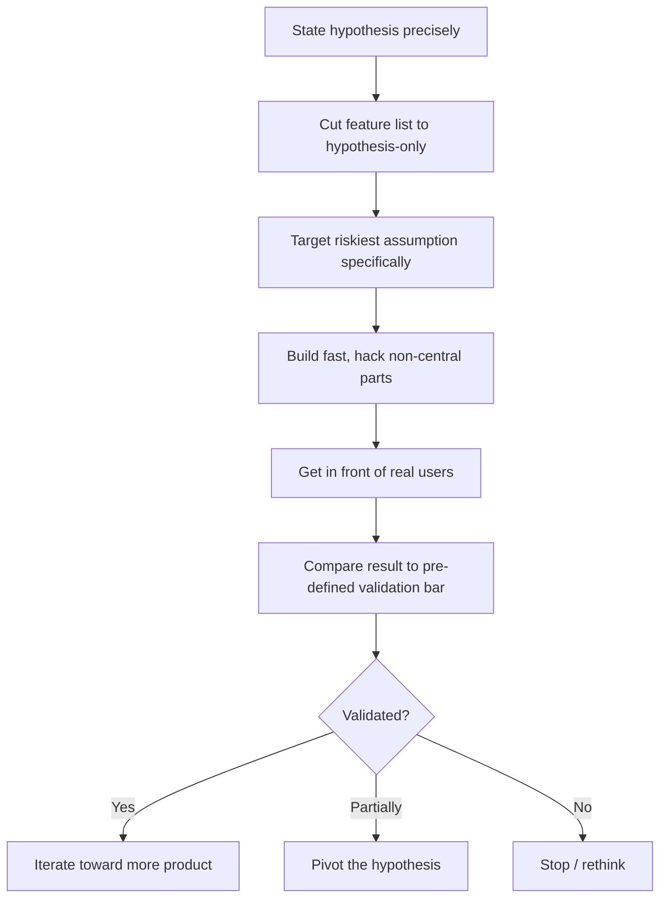

# Playbook: Building an MVP

## Goal
Ship the smallest version that tests the real hypothesis, without
gold-plating features nobody has validated wanting yet.

## Inputs
- The hypothesis you're testing (what you believe users need/want)
- Target users and how you'll get the MVP in front of them
- Time/resource budget

## Outputs
- A working MVP scoped to the hypothesis, not the full product vision
- Real usage/feedback data
- A clear next decision: iterate, pivot, or stop

## Steps
1. State the hypothesis explicitly: "we believe [users] will [behavior]
   because [reason]." If you can't state it this precisely, you're not
   ready to scope an MVP yet.
2. List every feature that would be needed for the FULL vision, then cut
   ruthlessly to only what's needed to test the hypothesis specifically
   — not what's needed to look like a complete product.
3. Identify the riskiest assumption in the hypothesis and make sure the
   MVP actually tests it (not just adjacent, easier-to-build things).
4. Build fast, favoring manual/hacky solutions for anything not central
   to the hypothesis (e.g. manual onboarding instead of a signup flow).
5. Get it in front of real target users as fast as possible — internal
   team feedback is not a substitute for real user signal.
6. Define in advance what result would validate, invalidate, or be
   inconclusive for the hypothesis — decide this before seeing the data,
   not after.
7. Review the result against that pre-defined bar and make the
   iterate/pivot/stop call explicitly.

## Checklists
- [ ] Hypothesis stated precisely before scoping
- [ ] Feature list cut to only what tests the hypothesis
- [ ] Riskiest assumption specifically targeted by the MVP
- [ ] Non-central parts solved with cheap/manual hacks, not built properly
- [ ] Real target users used it, not just the team
- [ ] Validation bar defined before seeing results
- [ ] Iterate/pivot/stop decision made explicitly against that bar

## AI prompts
- `Systems/Prompt-Library/Project-Planning/project-scope-cut-plan.md`
- `Systems/Prompt-Library/Decision-Making/decision-tradeoff-matrix.md` — for the iterate/pivot/stop call
- `Systems/Prompt-Library/AI/llm-feature-feasibility-check.md` — if the MVP involves an LLM feature

## Expected artifacts
- The MVP itself (running, however hacky)
- A one-page hypothesis + validation-bar doc, written before launch

## Mermaid workflow

