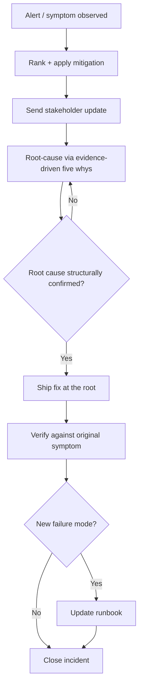

# Playbook: Debugging Production Issues

## Goal
Stop the damage first, then find the true root cause — in that order,
every time.

## Inputs
- The alert/symptom and its impact
- Recent changes (deploys, config, traffic shifts)
- System context (architecture, known fragile components)

## Outputs
- Mitigated incident (impact stopped or reduced)
- Identified root cause with evidence
- A fix at the root, plus a runbook update if this failure mode is new

## Steps
1. Triage immediately: rank mitigation options by speed and reversibility,
   pick one, act. Do not start root-causing yet.
2. Communicate status to stakeholders in one paragraph: what's known,
   what's being done, next update time.
3. Once mitigated, begin the five-whys root cause chain using actual
   evidence (logs, metrics) at every step — don't stop at the first
   plausible-sounding cause.
4. Identify the fix that makes the symptom structurally impossible, not
   just less likely, and the layer it belongs in.
5. Ship the fix, then verify it against the original symptom directly.
6. If this failure mode wasn't in the runbook, add it now while it's
   fresh — symptom, diagnostic, action, escalation trigger.

## Checklists
- [ ] Immediate mitigation chosen and applied before deep investigation
- [ ] Stakeholder update sent
- [ ] Root cause chain built on evidence, not guesses
- [ ] Fix addresses the root, not just the symptom
- [ ] Fix verified against the original symptom
- [ ] Runbook updated if this is a new failure mode

## AI prompts
- `Systems/Prompt-Library/Debugging/production-incident-triage.md`
- `Systems/Prompt-Library/Debugging/root-cause-five-whys.md`
- `Systems/Prompt-Library/Documentation/runbook-generator.md`

## Expected artifacts
- An incident timeline/postmortem note
- An updated runbook entry (if applicable)

## Mermaid workflow

