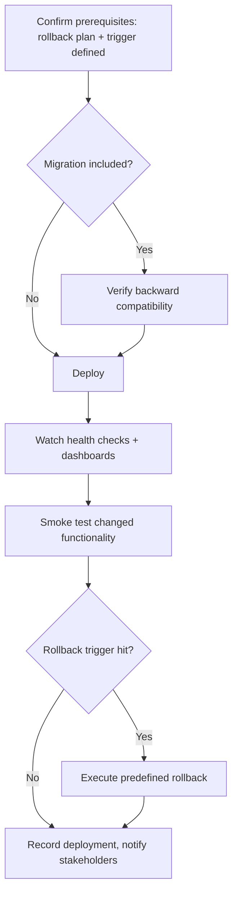

# Playbook: Deployment

## Goal
Ship a change to production safely and reversibly, with a rollback
decision made in advance rather than improvised under pressure.

## Prerequisites
- Change is reviewed, approved, and tests pass on the exact commit being
  deployed.
- You know the system's actual health check endpoint/dashboard and
  rollback command — not "figure it out if something goes wrong."

## Inputs
- The approved change (PR/commit)
- The target environment and its current state
- Any database migrations or config changes bundled with this deploy

## Outputs
- The change running in production, verified healthy
- A rollback executed, if the predefined trigger condition was hit
- An updated deployment log/changelog entry

## Checklist
Use `Systems/Templates/deployment-checklist.md` directly — this playbook
is the process that checklist supports.

- [ ] Rollback command identified and rollback trigger condition defined
      BEFORE deploying
- [ ] Database migrations checked for backward compatibility with the
      pre-deployment app version
- [ ] Health check / dashboard identified for post-deploy verification
- [ ] Stakeholders notified if this is user-visible

## Step-by-step workflow
1. Confirm prerequisites: review approved, tests green, rollback plan
   and trigger condition defined explicitly.
2. If this includes a database migration, verify it's additive/backward
   compatible — the previous app version must tolerate the new schema
   during rollout.
3. Deploy via the actual pipeline/mechanism for this system.
4. Watch health checks and error/latency dashboards for the defined
   window post-deploy.
5. Run a smoke test of the actual changed functionality in production —
   not just "the service is up."
6. If the rollback trigger condition is hit at any point, execute the
   predefined rollback immediately — don't re-debate the decision in the
   moment.
7. Record the deployment (changelog/log) and notify stakeholders of
   completion.

## AI prompts
- `Systems/Prompt-Library/Azure/azure-devops-pipeline-hardening.md` — if hardening the pipeline itself
- `Systems/Prompt-Library/Docker/dockerfile-review.md` — if this deploy ships a container image
- `Systems/Prompt-Library/Debugging/production-incident-triage.md` — if something goes wrong post-deploy

## Common mistakes
- Deciding whether to roll back in the moment instead of against a
  pre-defined trigger condition — this leads to inconsistent, often
  too-slow decisions under pressure.
- Shipping a non-backward-compatible database migration in the same
  deploy as the code that depends on it, making rollback impossible.
- Treating "the service responds" as sufficient verification instead of
  smoke-testing the actual changed behavior.

## Deliverables
- A completed `Systems/Templates/deployment-checklist.md` for this deploy
- A deployment log entry

## Mermaid workflow

