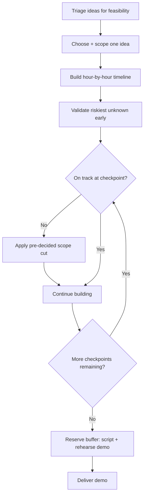

# Playbook: Hackathons

## Goal
Ship a working, demo-able project that survives the judges' Q&A, using
the full time available without a midnight scope crisis.

## Inputs
- Candidate ideas
- Time available, team size/skills
- Judging criteria (if known)

## Outputs
- A chosen, scoped idea
- An hour-by-hour execution timeline with pre-decided scope cuts
- A working demo with a rehearsed script and fallback plan

## Steps
1. Triage candidate ideas for feasibility, not just ambition — identify
   the riskiest technical unknown per idea before choosing.
2. Choose one idea and write its minimum viable demo scope explicitly.
3. Build the hour-by-hour timeline with checkpoints and pre-decided cut
   fallbacks — decide these now, not at 3am.
4. Validate the riskiest unknown in the first checkpoint window.
5. Build to the checkpoints, cutting scope per the plan the moment a
   checkpoint is missed — don't renegotiate under fatigue.
6. Reserve the final 10-15% of time purely for demo prep: script it,
   rehearse it, prepare a fallback for the riskiest live step.
7. Deliver the demo against the pain point, not a feature tour.

## Checklists
- [ ] Idea triaged for feasibility against real time/team constraints
- [ ] Riskiest technical unknown identified and validated early
- [ ] Hour-by-hour timeline with cut fallbacks written before coding starts
- [ ] Demo buffer reserved and protected
- [ ] Demo script written, tied to audience's pain point
- [ ] Fallback plan ready for the highest-risk live demo step

## AI prompts
- `Systems/Prompt-Library/Hackathons/hackathon-idea-triage.md`
- `Systems/Prompt-Library/Hackathons/hackathon-execution-timeline.md`
- `Systems/Prompt-Library/Presentations/demo-script-design.md`

## Expected artifacts
- A one-page timeline with checkpoints and cut fallbacks
- A demo script with the fallback noted at the risky step

## Mermaid workflow

