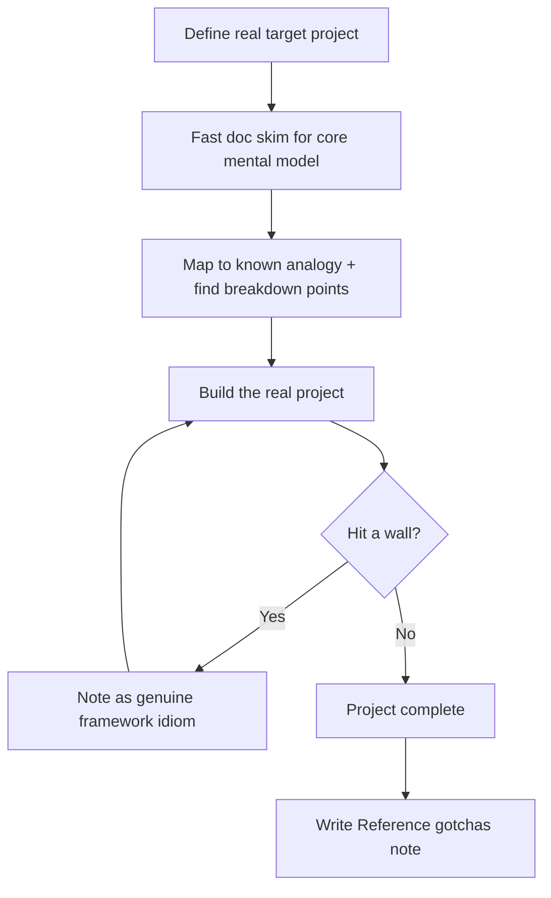

# Playbook: Learning a Framework

## Goal
Reach the point of building something real with a new framework as fast
as possible — skip passive tutorial-following in favor of a scoped build.

## Inputs
- The framework, and why you need it (a specific project/task)
- Your existing adjacent knowledge (similar frameworks you already know)

## Outputs
- A small real project built with the framework, not a tutorial clone
- A personal reference note on the 3-5 idioms/gotchas specific to this
  framework (in `Reference/`)

## Steps
1. State the real thing you'll build with it — not "learn X," but
   "build Y using X." A target project forces useful over exhaustive
   learning.
2. Skim official docs/quickstart once, fast, just to find the core
   mental model (what problem does this framework solve, what's its main
   abstraction) — don't deep-read yet.
3. Map the framework's core abstraction to the closest thing you already
   know, and note explicitly where the analogy breaks (this is usually
   where the framework's actual design decisions live).
4. Build the real project, looking up specifics only as needed —
   resist the urge to "finish the tutorial first."
5. When you hit a wall, that's signal: it's usually a genuine idiom of
   the framework, not a knowledge gap you can shortcut. Note it.
6. After the build, write a short `Reference/` entry: the 3-5 things that
   would have saved you time if known upfront.

## Checklists
- [ ] Real target project defined before starting
- [ ] Core mental model identified from a fast doc skim
- [ ] Analogy to known framework mapped, with breakdown points noted
- [ ] Real project built (not a tutorial clone)
- [ ] Reference note written with the framework's actual gotchas

## AI prompts
- `Systems/Prompt-Library/Software-Engineering/legacy-code-onboarding.md` — adapted for a framework's own codebase/examples
- `Systems/Prompt-Library/Writing/technical-explainer-for-non-experts.md` — to explain the framework's mental model back to yourself in plain terms as a comprehension check

## Expected artifacts
- The built project, committed
- `Reference/<framework>/gotchas.md`

## Mermaid workflow

