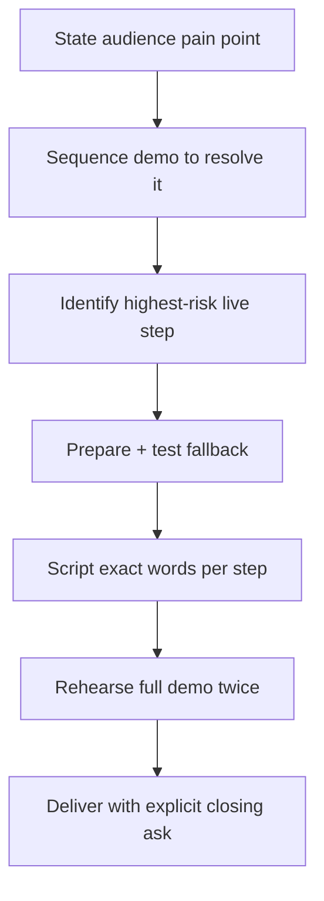

# Playbook: Preparing Demos

## Goal
Deliver a live demo that lands the audience's actual pain point and
survives something going wrong, without over-tour-ing features.

## Inputs
- What the product/feature does
- Who's watching and their pain point
- Environment risks (live systems, network dependencies, flaky components)

## Outputs
- A scripted demo flow tied to the audience's pain point
- A fallback plan for the highest-risk live step
- A rehearsed delivery within the time budget

## Steps
1. State the audience's pain point in one sentence before scripting
   anything.
2. Sequence the demo to resolve that pain point step by step — cut any
   step that's impressive but tangential.
3. Identify the single highest-risk live step (network call, live API,
   random/live data) and prepare a specific fallback (recording,
   screenshot, pre-run version) with a clear trigger for switching to it.
4. Script the actual words for each step, not just the actions — verbal
   pacing matters as much as the screen.
5. Rehearse the full demo at least twice, including deliberately
   triggering the fallback once to confirm it actually works.
6. Close with the explicit outcome/number and the next-step ask.

## Checklists
- [ ] Audience pain point stated before scripting
- [ ] Demo sequenced to resolve pain point, not tour features
- [ ] Highest-risk step identified with a working fallback
- [ ] Script includes actual words to say, not just actions
- [ ] Rehearsed at least twice, fallback tested
- [ ] Closing ask is explicit

## AI prompts
- `Systems/Prompt-Library/Presentations/demo-script-design.md`
- `Systems/Prompt-Library/Hackathons/hackathon-idea-triage.md` — for identifying the riskiest technical unknown pre-demo

## Expected artifacts
- A demo script (steps, lines, fallback trigger)
- A tested fallback asset (recording/screenshot)

## Mermaid workflow

