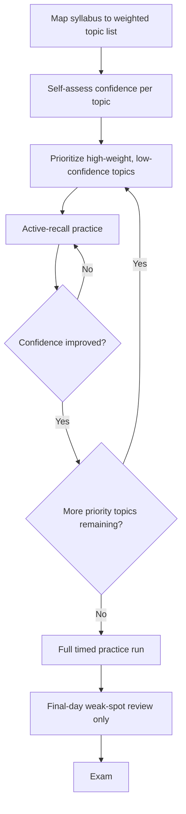

# Playbook: Preparing for Exams

## Goal
Convert study time into actual retrieval-tested competence, not passive
re-reading that feels like progress but isn't.

## Inputs
- Exam scope/syllabus
- Time available before the exam
- Past exams/problem sets, if available

## Outputs
- A prioritized topic list (weighted by exam coverage and your weakness)
- Active-recall practice completed on weak topics
- A realistic self-assessment of readiness before exam day

## Steps
1. Map the syllabus to a topic list, and weight each topic by how
   heavily it's likely to be tested (past exam patterns if available).
2. For each topic, do a fast honest self-assessment: can you solve a
   representative problem right now without looking anything up? This
   is the real signal — familiarity with material is not the same as
   ability to produce it under exam conditions.
3. Prioritize study time toward high-weight, low-confidence topics first
   — not toward topics that feel comfortable to review.
4. Study via active recall/practice problems, not re-reading notes —
   re-reading creates false confidence.
5. Do at least one full timed practice run (a past exam or a
   self-assembled equivalent) before the real exam, under real time
   pressure.
6. In the final day, review only your weak-spot notes and formula/fact
   sheets — don't attempt new material under time pressure.

## Checklists
- [ ] Syllabus mapped to a weighted topic list
- [ ] Honest self-assessment done per topic (can solve cold, or not)
- [ ] Study time prioritized to high-weight, low-confidence topics
- [ ] Practiced via active recall, not passive re-reading
- [ ] At least one full timed practice run completed
- [ ] Final day reserved for weak-spot review only, no new material

## AI prompts
- `Systems/Prompt-Library/Competitive-Programming/cp-problem-pattern-recognition.md` — adapt for pattern-recognition-heavy subjects (math, CS theory)
- `Systems/Prompt-Library/Research/paper-critical-reading.md` — adapt for dense reading-heavy exam material

## Expected artifacts
- A weighted topic list with confidence ratings
- Practice problem attempts with self-graded results

## Mermaid workflow

