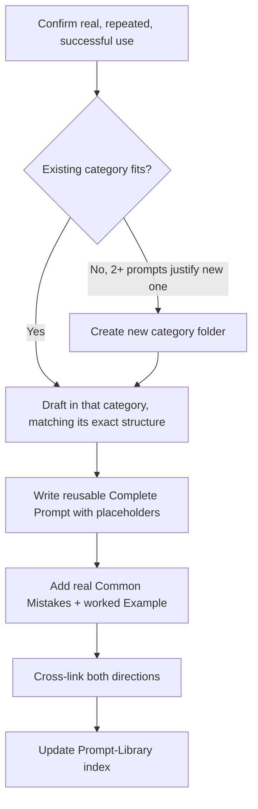

# Playbook: Prompt Creation

## Goal
Turn a prompt you've used successfully more than once into a real
`Systems/Prompt-Library/` entry — one that encodes actual expertise, not
a generic instruction — following the library's established structure.

## Prerequisites
- You've actually used this prompt (or a rough version of it)
  successfully at least twice — a one-off prompt isn't ready for the
  library yet, per `Systems/Prompt-Library/_index.md`'s admission rule.

## Inputs
- The rough prompt as you've been using it
- 1-2 real instances where it worked well, and ideally one where a
  naive version of it produced a weak result

## Outputs
- A new Markdown file in the correct `Systems/Prompt-Library/<category>/`
  folder, following the library's exact section structure
- Updated category index and any reciprocal cross-links from related
  prompts

## Checklist
- [ ] Confirmed this prompt has real, repeated use — not a first-time idea
- [ ] Correct category identified (or a genuine new category, only if
      2+ prompts justify it — see `Systems/_index.md`'s rule on new
      subfolders)
- [ ] All required sections present in the established format for this
      library (check an existing file in the same category for exact
      heading style)
- [ ] A concrete worked example included, not just an abstract description
- [ ] Related prompts cross-linked in both directions

## Step-by-step workflow
1. Confirm the prompt clears the admission bar: real, repeated,
   successful use — not a single good result.
2. Identify the category. If no existing category fits and you have or
   expect 2+ prompts in the new area, create the folder; otherwise, find
   the closest existing category.
3. Draft the prompt file matching the exact section structure used by
   existing files in that category (check one for the precise heading
   wording/casing — the library's whole value is a single consistent
   shape).
4. Write the "Complete Prompt" section as an actual reusable template
   with `{placeholders}` for context, not a one-off phrasing tied to the
   specific instance that inspired it.
5. Add "Common Mistakes" from real observed failure modes, not
   generic warnings.
6. Add a genuine worked example — a realistic input and the expected
   shape of output.
7. Cross-link to related existing prompts, and add a reciprocal link
   from those prompts back to the new one.
8. Update the category's entry in `Systems/Prompt-Library/_index.md` if
   this is a new category, or the category folder's own scannability if
   it's a large addition.

## AI prompts
- `Systems/Prompt-Library/Prompt-Engineering/prompt-failure-diagnosis.md` — to sharpen the prompt if early drafts produce inconsistent output
- `Systems/Prompt-Library/Prompt-Engineering/system-prompt-design-review.md` — if the new prompt is meant to configure an agent's persistent behavior rather than a single task

## Common mistakes
- Adding a prompt after a single successful use, before confirming it
  generalizes — the library's value depends on every entry being
  actually proven, not merely promising.
- Writing the "Complete Prompt" section tied to the specific instance
  that inspired it, instead of a genuinely reusable template with clear
  placeholders.
- Skipping cross-links — an unlinked prompt is much less likely to be
  found and reused later, undermining the whole point of curating it.

## Deliverables
- The new prompt file, correctly placed and structured
- Updated cross-links and category index

## Mermaid workflow

