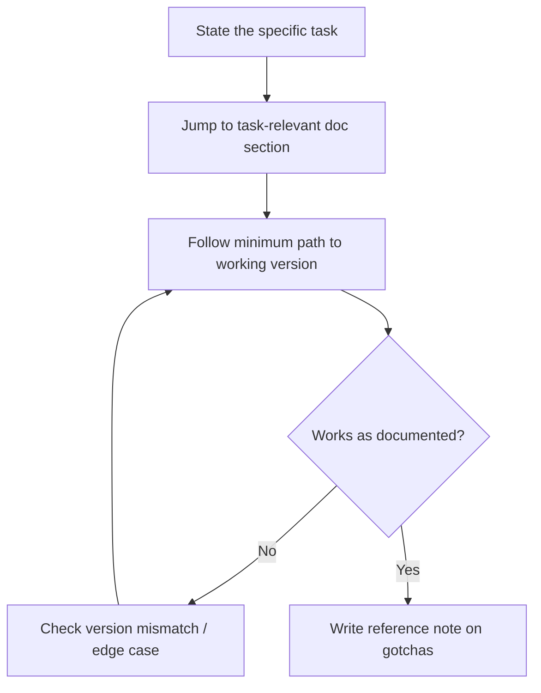

# Playbook: Reading Documentation

## Goal
Extract exactly what's needed to accomplish a real task from a doc set,
without reading it cover to cover.

## Inputs
- The documentation set (or link/location)
- The specific task you need to accomplish with it

## Outputs
- The task accomplished (code written, config set, integration working)
- A short reference note on anything non-obvious, for next time

## Steps
1. State the specific task before opening the docs — "integrate X's auth
   flow," not "learn X."
2. Search/scan for the task-specific section first (quickstart, the
   specific API/config reference) — don't start at page one.
3. Follow the minimum path to a working version, treating everything else
   as reference to return to only if needed.
4. When something doesn't work as documented, that's a signal to check
   for a version mismatch or an undocumented edge case before assuming
   you misread it.
5. Once working, write down the 1-3 things that were non-obvious or
   under-documented — future you (or a teammate) will hit the same gap.

## Checklists
- [ ] Specific task stated before reading
- [ ] Jumped to task-relevant section instead of reading linearly
- [ ] Working version achieved via the minimum path
- [ ] Non-obvious gotchas captured in a reference note

## AI prompts
- `Systems/Prompt-Library/Software-Engineering/legacy-code-onboarding.md` — adapt for a docs set instead of a codebase
- `Systems/Prompt-Library/Research/paper-critical-reading.md` — for docs that are more conceptual/design-oriented

## Expected artifacts
- Working code/config accomplishing the task
- A short `Reference/` entry noting the non-obvious parts

## Mermaid workflow

