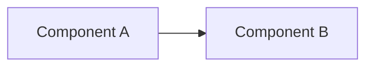

# Template: Project Notebook

*Guidance: this is the ONE file every new project starts from — copy it
into `Projects/<project-name>/notebook.md` on day one. It's a living
engineering notebook, not a form filled out once: most sections are meant
to be updated as the project progresses, not written perfectly upfront
and abandoned. Delete guidance italics as sections become real. Delete
any section that genuinely doesn't apply — but check `Overview` through
`Risks` before deciding a section is skippable; those five are rarely
optional.*

---

# {Project Name}

*One sentence: what this is and why it exists.*

**Status:** {Idea / Active / Paused / Shipped / Archived} · **Started:** {date}

---

## Overview

{2-4 sentences: the problem this solves, who it's for, and what "done"
looks like. If you can't write this precisely, the project isn't scoped
yet — see `Systems/Playbooks/starting-a-software-project.md`.}

## Requirements

### Must have
- {non-negotiable for v1}

### Should have
- {valuable, not blocking}

### Explicitly out of scope
- {deliberately excluded, so scope creep has something to point at}

## Architecture

{High-level design — diagram or description. For anything non-trivial,
link out to a full `Systems/Templates/architecture-document.md` rather
than duplicating it here; this section should stay a summary.}

## Timeline

| Milestone | Target date | Status |
|---|---|---|

*(Keep this current — a stale timeline is worse than none. See
`Systems/Templates/project-plan.md` for a fuller planning doc if this
project needs more structure than a milestone table.)*

## Tech stack

| Layer | Choice | Why |
|---|---|---|

*(The "why" column matters more than the list itself — a stack chosen
without a stated reason is a stack no one can evaluate later.)*

## Testing

{What's actually tested and how (unit, integration, manual smoke test),
and — just as important — what's deliberately NOT tested and why that's
an acceptable risk at this project's stage. A notebook that's silent on
testing usually means it didn't happen.}

## Documentation

{Where this project's real documentation lives (README, API docs, an
architecture doc) and its current state — Draft / Adequate / Stale. Link
out rather than duplicate; this section just tracks that documentation
exists and hasn't gone stale, using `Systems/Templates/readme.md` and
`Systems/Templates/api-documentation.md` as the underlying templates
where applicable.}

## Useful prompts

{Link the specific `Systems/Prompt-Library/` entries you've actually
used on this project — not a generic list, only ones that proved useful
here, so future-you doesn't have to rediscover them.}

- `Systems/Prompt-Library/{category}/{prompt}.md` — {why it was useful here}

## Useful links

{Docs, RFCs, Stack Overflow answers, or `Systems/Docs/` reference pages
that were actually load-bearing for this project — not a bookmark dump.}

- {link} — {one line on why this specific link mattered}

## Risks

{Pull from `Systems/Prompt-Library/Decision-Making/premortem-analysis.md`
if this project has real stakes. Update as risks are resolved or new
ones emerge — don't just write this once at kickoff.}

| Risk | Likelihood/impact | Mitigation | Status |
|---|---|---|---|

## Lessons learned

*(Append to this throughout the project — the moment you learn
something, not retroactively at the end when most of it is forgotten.)*

- {date}: {what happened, what you learned}

## Retrospective

*(Fill in once, at a natural end point — project done, or a major phase
complete.)*

- **What went well:**
- **What didn't:**
- **What I'd do differently:**

## Future improvements

{What you'd build next if you kept going — distinct from "lessons
learned," this is forward-looking scope, not retrospective judgment.}

## Deployment

{How this actually gets deployed/run in its real environment — commands,
config, gotchas. If deployment is non-trivial, this becomes the seed of
a real `Systems/Playbooks/`-style runbook.}

## Demo

{Link to a demo video/live instance. If you scripted a demo, link
`Systems/Prompt-Library/Presentations/demo-script-design.md` output here.}

## Presentation

{Link to slides/deck if this project was presented anywhere, plus a note
on the audience and what landed.}

## Portfolio entry

{Once the project reaches a state worth showcasing, use
`Systems/Templates/portfolio-project.md` to write it up, and link the
result here.}

## GitHub checklist

- [ ] README follows `Systems/Templates/readme.md`
- [ ] No secrets committed (checked, not assumed)
- [ ] License present if this will ever be public
- [ ] CI passing on default branch
- [ ] `.gitignore` covers real build artifacts / local config
- [ ] Repo description and topics set (for discoverability)

---

## Best practices for this notebook
- Update it as you go — Timeline, Risks, and Lessons Learned lose almost
  all their value if written retroactively.
- Keep Architecture and Tech Stack as summaries; link to fuller docs
  (`Systems/Templates/architecture-document.md`) instead of duplicating
  detail here — this notebook is the entry point, not the full record.
- Don't wait until the project ends to fill in Retrospective — if the
  project runs long, do an informal one at each major milestone too.
