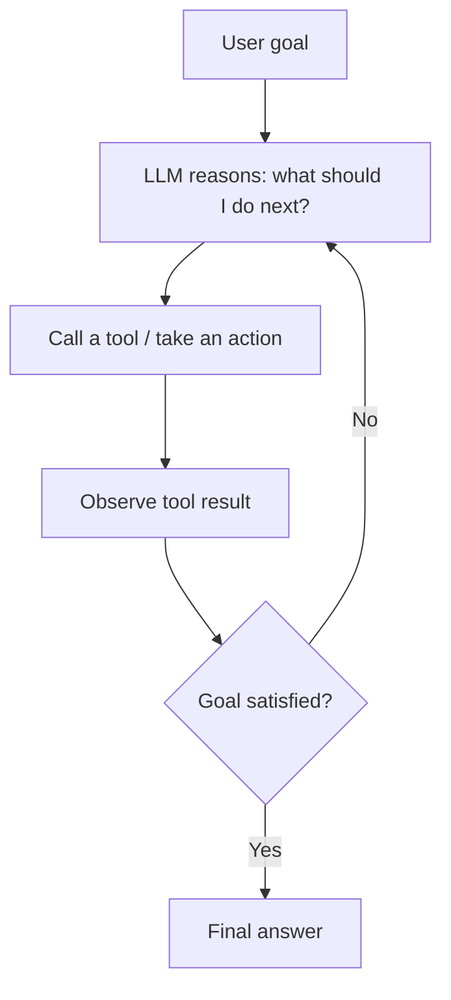
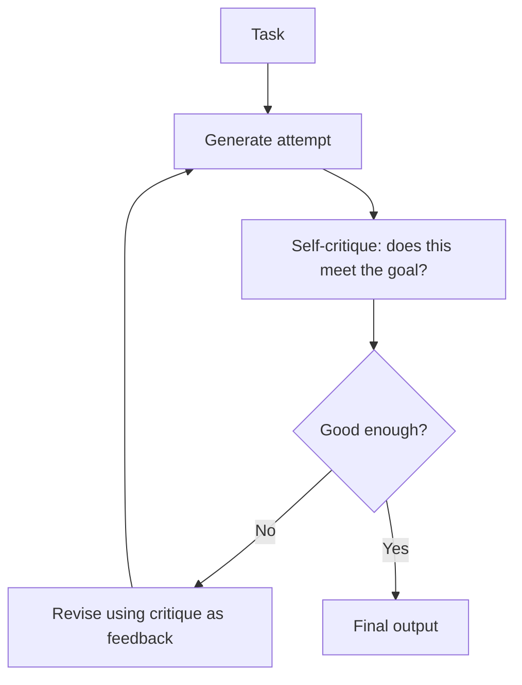
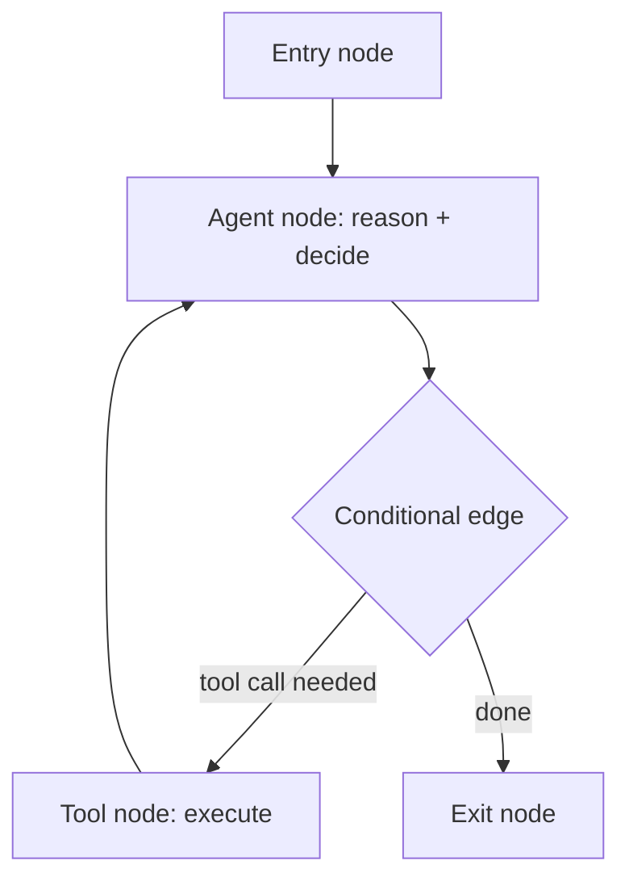
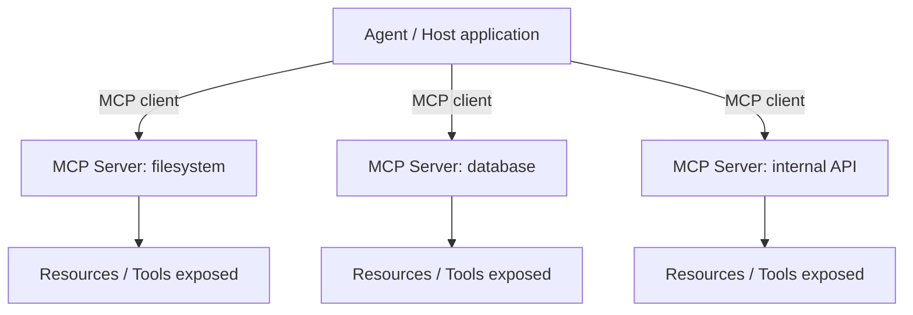

# AI Agents (Agentic AI)

*One authoritative reference. This is not a note collection — new
learnings get merged into the relevant section below, not appended as a
new file.*

## Overview

An AI agent is an LLM given the ability to take actions — call tools, query
data, invoke other models — and observe the results, in a loop, until it
decides the task is done. Where a plain LLM call is one-shot (prompt in,
text out), an agent is a control loop wrapped around the model: the model
decides *what to do next*, the runtime executes that decision, and the
result feeds back in as new context for the next decision. Agentic AI
covers everything from a single agent with a handful of tools to
multi-agent systems where several specialized agents coordinate on a task.

## Mental model

Every agent architecture is a variation on one loop: **observe → think →
act → observe again**. What differentiates architectures is what happens
inside "think" and how many agents share the loop:

- A **single ReAct agent** thinks once per action: reason about the next
  step, take it, observe the result, repeat.
- A **Reflection/Reflexion agent** adds a self-critique step: after
  producing an attempt, it evaluates its own output against the goal and
  revises before finalizing — trading latency for quality.
- A **multi-agent system** splits the loop across specialized agents
  (a researcher, a writer, a critic) that hand off work to each other,
  either in a fixed pipeline or via a coordinator that dynamically routes.

The single most important diagnostic question when an agent misbehaves:
**is this a reasoning failure (the model chose the wrong action) or a
tooling failure (the action was right but the tool call/response was
malformed or the tool itself is wrong)?** These have completely different
fixes — no amount of prompt tuning fixes a broken tool schema, and no
amount of tool debugging fixes an agent that keeps picking the wrong tool.

## Architecture

**Single ReAct agent loop:**


**Reflection / Reflexion loop:**

Reflexion differs from plain Reflection by persisting the critique as
episodic memory across attempts/episodes, rather than only within a single
generation cycle.

**LangGraph state machine (why graphs, not chains):**

A LangChain *chain* is a fixed, linear sequence of steps. A LangGraph
*graph* is a state machine: nodes can loop back, branch conditionally, and
carry mutable state between visits — which is what real agent behavior
(retry, reflect, ask for more tools) actually requires. Reach for
LangGraph the moment an agent needs to loop or branch based on its own
output, not just execute a fixed pipeline.

**Multi-agent coordination patterns:**
```mermaid
flowchart TD
    subgraph Pipeline (fixed handoff)
        A1[Agent 1] --> A2[Agent 2] --> A3[Agent 3]
    end
    subgraph Supervisor (dynamic routing)
        SUP[Supervisor agent] --> W1[Worker A]
        SUP --> W2[Worker B]
        W1 --> SUP
        W2 --> SUP
    end
```
CrewAI models the pipeline/role-based pattern well (crews of agents with
defined roles and a process — sequential or hierarchical). AutoGen/AG2
leans toward conversational multi-agent patterns where agents talk to each
other in a shared thread. BeeAI focuses on standardized, interoperable
agent definitions meant to run across different runtimes.

**MCP (Model Context Protocol) — the tool/context connection layer:**

MCP standardizes *how* an agent host discovers and calls tools/resources
across many servers, instead of every agent framework inventing its own
tool-calling convention per integration. Think of it as "one client
protocol, many interchangeable servers" — analogous to how a database
driver decouples an app from a specific database's wire protocol.

## Common workflows

**Basic ReAct agent (framework-agnostic shape)**
```python
tools = [search_tool, calculator_tool, db_query_tool]

while not done:
    thought, action, action_input = llm.reason(context, tools)
    if action == "final_answer":
        done = True
        answer = action_input
    else:
        result = execute_tool(action, action_input)
        context.append((thought, action, action_input, result))
```

**LangGraph agent with conditional looping**
```python
from langgraph.graph import StateGraph, END

graph = StateGraph(AgentState)
graph.add_node("agent", call_model)
graph.add_node("tools", call_tool)
graph.add_conditional_edges(
    "agent",
    lambda state: "tools" if state["tool_call"] else END,
)
graph.add_edge("tools", "agent")
graph.set_entry_point("agent")
app = graph.compile()
```

**Reflexion-style self-correction**
```python
attempt = generate(task)
critique = critique_model(task, attempt)
while not critique.is_sufficient and retries < max_retries:
    attempt = generate(task, prior_attempt=attempt, feedback=critique)
    critique = critique_model(task, attempt)
    retries += 1
```

**CrewAI-style role-based crew**
```python
researcher = Agent(role="Researcher", goal="Find accurate sources", tools=[search])
writer = Agent(role="Writer", goal="Draft from research", tools=[])
crew = Crew(agents=[researcher, writer], tasks=[research_task, write_task], process="sequential")
result = crew.kickoff()
```

**MCP client wiring (conceptual)**
```python
client = MCPClient(transport="stdio")  # or streamable HTTP
await client.connect(server_command=["python", "my_mcp_server.py"])
tools = await client.list_tools()
result = await client.call_tool("query_database", {"sql": "SELECT ..."})
```

## Common mistakes

- **Giving an agent too many tools with overlapping purposes**, causing it
  to pick the wrong one — narrow, well-documented tool schemas beat a
  large generic toolbelt.
- **No maximum iteration/retry cap**, so a confused agent loops
  indefinitely (and burns tokens) instead of failing fast and surfacing
  the failure.
- **Treating a chain problem as an agent problem** — if the sequence of
  steps is actually fixed and known in advance, a LangChain chain (or
  plain code) is simpler and more reliable than an agent that has to
  "discover" the same fixed sequence every time.
- **No observability into intermediate steps**, making it impossible to
  tell whether a bad final answer came from bad reasoning, a bad tool
  call, or a bad tool result.
- **Trusting tool output without validation**, letting a malformed or
  hallucinated tool response propagate into the next reasoning step
  unchecked.
- **Using a multi-agent system when a single agent with more tools would
  do** — coordination overhead (handoffs, shared state, supervisor
  routing) is real cost; only split into multiple agents when roles
  genuinely need different tools, prompts, or models.
- **Skipping permission/approval gates for high-stakes tool calls**
  (writes, deletions, payments, external API calls with side effects) —
  agentic systems should require explicit confirmation for irreversible
  actions.

## Best practices

- Give each tool a narrow, single-purpose schema with a clear description
  of when to use it — this is effectively prompt engineering for the
  model's tool-selection step.
- Cap iterations/retries explicitly and fail loudly with the last known
  state, rather than looping silently.
- Log every (thought, action, observation) tuple — this is your primary
  debugging surface for agent behavior, more useful than the final answer
  alone.
- Start with the simplest architecture that could work (single agent, one
  tool) and add complexity (reflection, multi-agent, more tools) only when
  the simple version demonstrably fails.
- Use LangGraph (or an equivalent state machine) the moment you need
  conditional branching or loops — don't force a chain to simulate agent
  behavior with brittle string parsing.
- Gate irreversible tool actions behind explicit approval steps,
  especially for anything MCP-exposed across systems you don't fully
  control.
- Version and test tool schemas the same way you'd test an API contract —
  a subtly broken schema causes silent agent misbehavior that's hard to
  trace back to the schema itself.

## Cheatsheet

| Concept | What it controls |
|---|---|
| ReAct | Single-agent reason → act → observe loop |
| Reflection | Self-critique added after generation, within one episode |
| Reflexion | Reflection + persisted feedback across multiple episodes/attempts |
| LangGraph node | A step in the agent's state machine (reasoning or tool execution) |
| LangGraph conditional edge | Decides next node based on current state (enables loops/branches) |
| CrewAI | Role-based multi-agent crews with sequential or hierarchical process |
| AutoGen / AG2 | Conversational multi-agent pattern, agents message each other |
| BeeAI | Standardized, framework-agnostic agent definitions |
| MCP server | Exposes tools/resources over a standard protocol |
| MCP client | Consumes tools/resources from one or more MCP servers |
| Supervisor pattern | Central agent dynamically routes tasks to worker agents |

## Interview questions

1. What's the difference between a LangChain chain and a LangGraph graph,
   and when do you need the latter? *(A chain is fixed and linear; a graph
   is a state machine with conditional edges and loops — needed the
   moment an agent must branch or retry based on its own output.)*
2. Explain the difference between Reflection and Reflexion. *(Reflection
   self-critiques within a single generation episode; Reflexion persists
   that critique as memory across multiple attempts/episodes.)*
3. When would you choose a multi-agent system over a single agent with
   more tools? *(When distinct roles genuinely need different prompts,
   tools, or models — otherwise the coordination overhead outweighs the
   benefit.)*
4. What problem does MCP solve that framework-specific tool calling
   doesn't? *(It standardizes the tool/resource discovery and invocation
   protocol so one agent host can talk to many independently-built
   servers, instead of every integration needing custom glue code.)*
5. An agent keeps failing a task — how do you determine if it's a
   reasoning failure or a tooling failure? *(Inspect the logged
   thought/action/observation trace: if the chosen action was reasonable
   but the tool call or response was malformed, it's tooling; if the
   action itself was the wrong choice given correct tool results, it's
   reasoning.)*
6. Why cap the number of agent iterations? *(Without a cap, a confused
   agent can loop indefinitely, burning tokens/cost and never surfacing
   the failure to the user or caller.)*

## Useful links

- [LangGraph conceptual guide](https://langchain-ai.github.io/langgraph/concepts/)
- [Model Context Protocol specification](https://modelcontextprotocol.io/)
- [CrewAI documentation](https://docs.crewai.com/)
- ReAct paper (Yao et al., 2022) — the original reason+act loop this
  pattern is named after.
- Reflexion paper (Shinn et al., 2023) — verbal reinforcement learning via
  self-reflection, the basis for the Reflexion pattern above.

## Further reading

- `../Docs/rag.md` — agentic RAG (an agent deciding when/what to retrieve,
  rather than a fixed retrieve-then-generate pipeline) sits at the
  intersection of both docs.
- `../Docs/langchain.md` — the underlying chain/tool primitives that
  LangGraph agents are built on top of.
- `../Docs/llms.md` — the model behavior (context limits, no persistent
  memory) that shapes why agent loops need explicit state management.
- `../Prompt-Library/RAG/rag-architecture-review.md` — diagnostic prompt
  for the retrieval side of agentic RAG systems.
