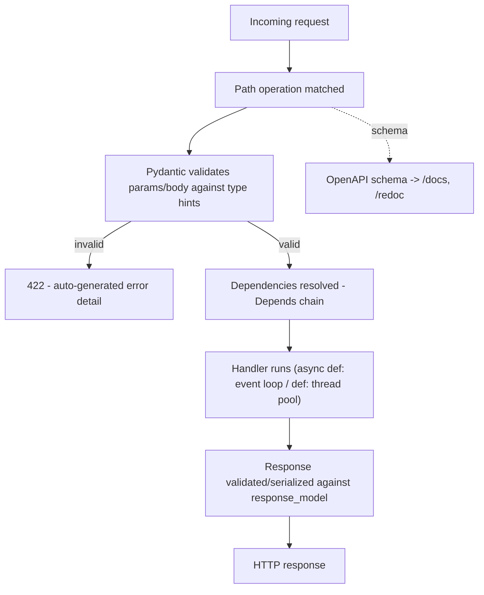

# FastAPI

*One authoritative reference. This is not a note collection — if you
learn something new about FastAPI worth keeping, it gets merged into
the relevant section below, not appended as a new file.*

## Overview

FastAPI is a Python web framework for building APIs, built on top of
**Starlette** (ASGI web toolkit) for the async HTTP layer and
**Pydantic** for data validation. Its defining feature is deriving
request validation, serialization, and OpenAPI documentation directly
from Python type hints — a function's parameter types *are* the
validation schema, not a separate declaration. This makes it a common
default for Python AI/agent backends (pairs naturally with typed tool
schemas) and for services that need auto-generated, always-accurate API
docs.

Core concepts: **path operations** (functions decorated with
`@app.get`/`@app.post`/etc. that handle a route), **Pydantic models**
(typed classes defining request/response shape, validated automatically),
**dependency injection** (`Depends()` — reusable, composable functions
for things like auth, DB sessions, shared config), and **async/sync
interop** (route handlers can be `def` or `async def`, and FastAPI
handles both correctly but differently under the hood).

## Mental model

Every path operation's type-annotated parameters double as its
validation layer: a parameter typed `item: ItemModel` means FastAPI
parses the request body against `ItemModel`'s Pydantic schema, and
returns a structured 422 error automatically if it doesn't match —
before your function body ever runs. This is the core discipline
FastAPI enforces: the type signature *is* the contract, so a wrong type
in production is a documentation bug, not just a runtime risk, because
the same annotations generate the OpenAPI schema clients rely on.

The second thing to internalize: **`def` vs `async def` route handlers
run on genuinely different execution paths.** An `async def` handler
runs directly on the event loop — if it does anything blocking
(synchronous file I/O, a blocking DB driver call, `time.sleep`) without
`await`, it blocks every other concurrent request on that worker,
exactly like blocking Node's event loop. A plain `def` handler is
automatically run in a thread pool by Starlette, so blocking code
inside it doesn't stall the event loop — but it also doesn't get the
concurrency benefit of async I/O. Mixing this up (writing `async def`
around a blocking call) is the most common FastAPI performance bug.

## Architecture



**Dependency injection graph:** `Depends()` functions form a resolvable
graph — a route can depend on `get_current_user`, which itself depends
on `get_db_session`, and FastAPI resolves the whole chain per-request,
caching each dependency's result within that request unless told
otherwise. This is the idiomatic way to share auth checks, DB sessions,
and config across many routes without decorator boilerplate per route.

**ASGI foundation:** FastAPI sits on Starlette, which implements the
ASGI spec (the async successor to WSGI) — this is what makes native
`async def` handlers, WebSockets, and background tasks first-class,
unlike WSGI-based frameworks (Flask, classic Django) where async support
is bolted on.

## Common workflows

**Minimal API with validation**
```python
from fastapi import FastAPI
from pydantic import BaseModel

app = FastAPI()

class VitalsIn(BaseModel):
    patient_id: str
    heart_rate: int
    spo2: float

@app.post("/vitals", status_code=202)
async def ingest_vitals(vitals: VitalsIn):
    await vitals_service.process(vitals)
    return {"status": "accepted"}
```

**Dependency injection for shared logic**
```python
from fastapi import Depends, HTTPException, Header

async def get_current_user(authorization: str = Header(...)):
    user = await verify_token(authorization)
    if not user:
        raise HTTPException(status_code=401, detail="invalid token")
    return user

@app.get("/me")
async def read_me(user: User = Depends(get_current_user)):
    return user
```

**Response model (controls what's actually serialized out)**
```python
class PatientOut(BaseModel):
    id: str
    name: str
    # sensitive fields like ssn deliberately excluded

@app.get("/patients/{patient_id}", response_model=PatientOut)
async def get_patient(patient_id: str):
    return await db.fetch_patient(patient_id)   # extra fields silently dropped
```

**Background tasks (fire-and-forget after responding)**
```python
from fastapi import BackgroundTasks

@app.post("/alerts")
async def create_alert(alert: AlertIn, background_tasks: BackgroundTasks):
    alert_id = await save_alert(alert)
    background_tasks.add_task(notify_hospital, alert_id)   # runs after response sent
    return {"alertId": alert_id}
```

**Running locally**
```bash
uvicorn main:app --reload --port 8000
# Interactive docs auto-generated at /docs (Swagger UI) and /redoc
```

## Common mistakes

- **Blocking the event loop inside `async def`.** A synchronous DB
  driver call, `requests.get()` (not `httpx.AsyncClient`), or
  `time.sleep()` inside an `async def` handler blocks every concurrent
  request on that worker — use an async-native library and `await` it,
  or define the route as plain `def` so FastAPI runs it in a thread
  pool instead.
- **Not using `response_model`**, accidentally leaking internal fields
  (password hashes, internal IDs) that happen to exist on the returned
  object but were never meant to be public API surface.
- **Putting expensive work directly on the request path instead of a
  background task or queue**, when the client doesn't need to wait for
  it (sending a notification, writing an audit log) — inflates response
  latency for no reason.
- **Over-broad `except Exception` in route handlers** that swallows the
  specific error FastAPI would otherwise turn into an accurate HTTP
  status code, replacing it with a generic 500 that loses diagnostic
  information.
- **Reusing a single global DB session/connection across requests**
  instead of a per-request session via `Depends`, causing state leakage
  or connection contention under concurrency.
- **Assuming `BackgroundTasks` survives process restarts or crashes.**
  It's in-process, fire-and-forget after the response — not a durable
  queue; a crash between task scheduling and execution loses the task.
  Use a real queue (Celery, RQ, or a Postgres/Redis-backed job table)
  for anything that must survive a crash.

## Best practices

- Default to `async def` and async-native clients (`httpx`,
  `asyncpg`/`databases`) for I/O-bound routes; use plain `def` only when
  a dependency forces a blocking call FastAPI should offload to its
  thread pool.
- Always set `response_model` on routes returning data with any field
  that shouldn't be public.
- Push cross-cutting concerns (auth, DB session, request-scoped config)
  into `Depends()` functions rather than repeating them in every route
  body.
- Use Pydantic's validators (`field_validator`, `model_validator`) for
  business-rule validation beyond basic type checking, keeping that
  logic declarative and testable in isolation from route handlers.
- Reach for a real task queue, not `BackgroundTasks`, for anything that
  must survive a process crash or needs retries.
- Let FastAPI's auto-generated `/docs` be the source of truth for API
  contract communication with frontend/client teams — keep type hints
  accurate rather than maintaining separate API documentation by hand.

## Cheatsheet

| Task | Code |
|---|---|
| Define route | `@app.get("/path")` / `@app.post("/path")` |
| Path parameter | `async def f(item_id: int):` — from `/path/{item_id}` |
| Query parameter | `async def f(q: str = None):` |
| Request body (Pydantic model) | `async def f(body: MyModel):` |
| Dependency injection | `async def f(x = Depends(dep_fn)):` |
| Response model | `@app.get("/x", response_model=OutModel)` |
| Background task | `background_tasks.add_task(fn, arg)` |
| Raise HTTP error | `raise HTTPException(status_code=404, detail="...")` |
| Run dev server | `uvicorn main:app --reload` |
| Auto docs | `/docs` (Swagger), `/redoc` |

## Interview questions

1. How does FastAPI derive request validation from a function
   signature, and what happens on a mismatch?
   *(Type-annotated parameters are parsed as Pydantic models; a request
   that doesn't match the annotated types returns a structured 422
   response automatically, before the handler body runs — the same
   annotations also generate the OpenAPI schema.)*
2. What's the practical difference between a `def` and `async def`
   route handler?
   *(`async def` runs directly on the event loop — any blocking call
   inside it stalls every other concurrent request on that worker.
   `def` handlers are automatically run in a thread pool by Starlette,
   so blocking code doesn't stall the loop, at the cost of not getting
   async I/O's concurrency benefit.)*
3. Why use `response_model` instead of just returning the ORM object or
   dict directly?
   *(It controls exactly what gets serialized to the client, dropping
   any field not declared on the response model — preventing accidental
   leakage of internal/sensitive fields that happen to exist on the
   returned object.)*
4. How does FastAPI's dependency injection (`Depends`) work, and why is
   it useful for auth?
   *(Dependencies form a resolvable graph evaluated per-request, with
   results cached within that request; a chain like
   `get_current_user → get_db_session` lets auth and shared setup logic
   be written once and reused declaratively across many routes instead
   of repeated per-route boilerplate.)*
5. Are `BackgroundTasks` a substitute for a real task queue? Why or why
   not?
   *(No — `BackgroundTasks` runs in-process after the response is sent,
   with no persistence or retry; a crash between scheduling and
   execution silently loses the task. A real queue (Celery, RQ, a
   durable job table) is needed for anything that must survive a
   crash or requires retries.)*

## Useful links

- [Official FastAPI documentation](https://fastapi.tiangolo.com/)
- [Pydantic documentation](https://docs.pydantic.dev/)
- [Starlette documentation](https://www.starlette.io/) (the ASGI layer
  FastAPI is built on)

## Further reading

- FastAPI docs' "Async" page — the clearest first-party explanation of
  the `def` vs `async def` distinction and when each is correct.
- "Building Data Science Applications with FastAPI" — leans into the
  ML/AI-service use case, relevant given FastAPI's common pairing with
  agent/RAG backends (see [`ai-agents.md`](ai-agents.md),
  [`rag.md`](rag.md)).
