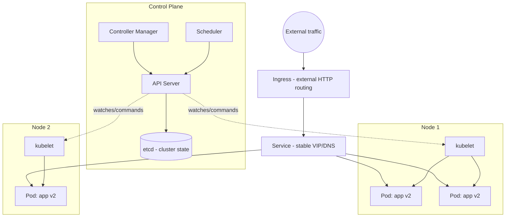

# Kubernetes

*One authoritative reference. This is not a note collection — if you
learn something new about Kubernetes worth keeping, it gets merged into
the relevant section below, not appended as a new file.*

## Overview

Kubernetes (k8s) is a container orchestrator: given a declarative
description of desired state ("run 3 replicas of this container image,
expose it on this port, restart it if it becomes unhealthy"), it
continuously reconciles the actual cluster state to match — scheduling
containers onto nodes, restarting failed ones, and routing traffic to
healthy instances. It solves the operational problem Docker alone
doesn't: running containers reliably across many machines, not just one.

Core objects: **Pods** (one or more co-located containers, the smallest
deployable unit), **Deployments** (declaratively manage a set of
replica Pods and roll out changes), **Services** (a stable network
identity/load balancer in front of a changing set of Pod IPs),
**ConfigMaps/Secrets** (external configuration and credentials injected
into Pods), and **Ingress** (HTTP routing into the cluster from outside).

## Mental model

Kubernetes is a **reconciliation loop**, not an imperative task runner.
You never tell it "start this container" — you declare "3 replicas of
this Pod spec should exist," and a **controller** continuously compares
that desired state against the actual cluster state, taking action
(schedule a Pod, restart a crashed one, terminate an excess one) to
close the gap. This is why `kubectl apply` is idempotent and why a Pod
that crashes gets automatically replaced without any external script
watching for it — the Deployment controller's reconciliation loop
notices the replica count is short and creates a new one.

The second thing to internalize: **Pods are disposable, identities are
not.** A Pod's IP address changes every time it's rescheduled (crash,
node failure, rolling update); a **Service** provides the stable DNS
name and virtual IP that other things depend on. Design as if any given
Pod could disappear at any moment — because it will — and never hold
state (sessions, uploaded files, database data) in a container's
writable layer.

## Architecture



**Reconciliation flow:** you `kubectl apply` a Deployment manifest → the
API server persists the desired state to etcd → the Deployment
controller notices the actual replica count doesn't match desired →
creates Pod objects → the Scheduler assigns each Pod to a node with
available resources → that node's `kubelet` pulls the image and starts
the container → the Service's endpoint list updates to include the new
Pod's IP once it passes its readiness probe.

**Health checks that matter operationally:** a **liveness probe**
failing gets the container restarted; a **readiness probe** failing
removes the Pod from the Service's routable endpoints without
restarting it — this is how a Pod can stay running but stop receiving
traffic while it's degraded (e.g. its dependencies are unhealthy),
which is exactly the pattern a service's own `/health` endpoint feeds.

## Common workflows

**Inspecting cluster state**
```bash
kubectl get pods -n mynamespace
kubectl describe pod mypod-abc123 -n mynamespace   # events, why it's pending/crashing
kubectl logs -f mypod-abc123 -n mynamespace
kubectl logs mypod-abc123 --previous               # logs from before last crash
```

**Deploying / rolling out a change**
```bash
kubectl apply -f deployment.yaml
kubectl rollout status deployment/myapp
kubectl rollout undo deployment/myapp               # roll back last rollout
```

**Scaling**
```bash
kubectl scale deployment/myapp --replicas=5
kubectl autoscale deployment/myapp --min=2 --max=10 --cpu-percent=70
```

**Debugging a crashing Pod**
```bash
kubectl exec -it mypod-abc123 -- sh
kubectl get events -n mynamespace --sort-by='.lastTimestamp'
kubectl top pod mypod-abc123    # requires metrics-server: live CPU/mem
```

**A minimal Deployment + Service manifest**
```yaml
apiVersion: apps/v1
kind: Deployment
metadata:
  name: myapp
spec:
  replicas: 3
  selector:
    matchLabels: { app: myapp }
  template:
    metadata:
      labels: { app: myapp }
    spec:
      containers:
      - name: myapp
        image: myregistry/myapp:1.2.0
        ports: [{ containerPort: 8080 }]
        readinessProbe:
          httpGet: { path: /health, port: 8080 }
          initialDelaySeconds: 5
        resources:
          requests: { cpu: "250m", memory: "256Mi" }
          limits: { cpu: "500m", memory: "512Mi" }
---
apiVersion: v1
kind: Service
metadata:
  name: myapp
spec:
  selector: { app: myapp }
  ports: [{ port: 80, targetPort: 8080 }]
```

## Common mistakes

- **No resource `requests`/`limits` set.** Without `requests`, the
  scheduler can't reason about node capacity and may overpack a node;
  without `limits`, one Pod can starve its neighbors of CPU/memory on
  the same node.
- **No readiness probe**, so the Service starts routing traffic to a
  Pod the instant its container process starts — before the app has
  actually finished initializing (DB connections, cache warm-up) —
  causing a burst of failed requests during every rollout.
- **Storing state in a Pod** (uploaded files, session data, a SQLite
  file) and expecting it to survive — Pods are rescheduled onto
  different nodes routinely; persistent state needs a PersistentVolume
  or, better, an external store (Postgres, S3, Redis).
- **Using `latest` image tags in a Deployment.** `kubectl rollout undo`
  can't roll back to a specific known-good image if every rollout
  pulled the same mutable tag — pin explicit version tags.
- **Not setting `terminationGracePeriodSeconds` or handling SIGTERM** in
  the application — Kubernetes sends SIGTERM on Pod termination and
  force-kills after the grace period; an app that doesn't drain
  in-flight requests on SIGTERM drops traffic during every rollout and
  scale-down.
- **One giant namespace for everything** with no `NetworkPolicy` —
  every Pod can reach every other Pod by default, which is fine for a
  demo cluster and a real problem in a multi-tenant or compliance-
  sensitive production one.

## Best practices

- Always set both `requests` and `limits` on every container.
- Add both liveness and readiness probes — they answer different
  questions ("is this broken enough to restart" vs. "is this ready for
  traffic right now") and shouldn't be the same check.
- Pin explicit image tags (ideally by digest for full immutability), not
  `latest`.
- Handle SIGTERM in the application to drain in-flight work before
  exiting, and set `terminationGracePeriodSeconds` to give it room.
- Use namespaces to isolate environments/teams, and `NetworkPolicy` to
  restrict which Pods can talk to which by default.
- Externalize configuration via ConfigMaps and Secrets rather than
  baking environment-specific values into the image.
- Use a `PodDisruptionBudget` for anything that must maintain minimum
  availability during voluntary disruptions (node drains, cluster
  upgrades).

## Cheatsheet

| Task | Command |
|---|---|
| List pods | `kubectl get pods -n ns` |
| Describe (events, why pending/crashing) | `kubectl describe pod name -n ns` |
| Logs (live / previous crash) | `kubectl logs -f pod` / `kubectl logs pod --previous` |
| Shell into container | `kubectl exec -it pod -- sh` |
| Apply manifest | `kubectl apply -f file.yaml` |
| Rollout status / undo | `kubectl rollout status deploy/name` / `rollout undo` |
| Scale | `kubectl scale deploy/name --replicas=N` |
| Port-forward for local debug | `kubectl port-forward pod 8080:8080` |
| Current resource usage | `kubectl top pod` / `kubectl top node` |
| List all resources in namespace | `kubectl get all -n ns` |

## Interview questions

1. What does it mean that Kubernetes is "declarative" and why does that
   matter operationally?
   *(You declare desired state; a controller's reconciliation loop
   continuously drives actual state toward it. This is why applying the
   same manifest twice is safe (idempotent) and why crashed Pods
   self-heal without an external watchdog script.)*
2. What's the difference between a liveness probe and a readiness
   probe?
   *(Liveness failing restarts the container; readiness failing removes
   the Pod from the Service's routable endpoints without restarting it —
   letting a Pod stay alive-but-not-serving-traffic while degraded.)*
3. Why shouldn't you store application state inside a Pod's filesystem?
   *(Pods are rescheduled onto different nodes routinely — on crash,
   node failure, or rolling update — and their filesystem doesn't
   persist across that. Durable state belongs in a PersistentVolume or
   an external store.)*
4. How does a rolling update avoid downtime, and what could still cause
   dropped requests during one?
   *(The Deployment controller brings up new-version Pods and waits for
   their readiness probe to pass before terminating old ones, keeping
   some capacity serving throughout. Requests still drop if the app
   doesn't handle SIGTERM gracefully — old Pods get killed before
   draining in-flight requests.)*
5. What's the practical consequence of not setting resource `requests`
   and `limits`?
   *(Without requests, the scheduler can't reason about node capacity
   and may overpack a node; without limits, one Pod can consume enough
   CPU/memory to starve its neighbors on the same node — a classic
   "noisy neighbor" failure mode.)*

## Useful links

- [Official Kubernetes documentation](https://kubernetes.io/docs/)
- [kubectl cheat sheet](https://kubernetes.io/docs/reference/kubectl/cheatsheet/)
- [Production best practices](https://kubernetes.io/docs/setup/best-practices/)

## Further reading

- "Kubernetes Patterns" (Ibryam & Huß) — the canonical patterns for
  structuring Pods, sidecars, and controllers correctly.
- Official docs' "Pod Lifecycle" page — covers the SIGTERM/grace-period
  mechanics above in full detail, worth reading once graceful shutdown
  actually matters for a production rollout.
