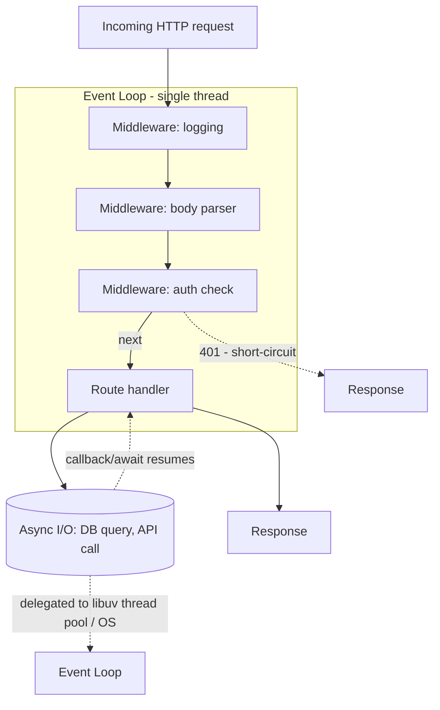

# Node.js & Express

*One authoritative reference. This is not a note collection — if you
learn something new about Node.js or Express worth keeping, it gets
merged into the relevant section below, not appended as a new file.*

## Overview

Node.js is a JavaScript runtime built on Chrome's V8 engine that runs
JS outside the browser, with a standard library oriented around
non-blocking I/O. Express is the dominant minimal web framework on top
of it — routing, middleware, and request/response handling, with almost
everything else (validation, auth, ORM) left to explicit choices rather
than baked in, in contrast to a batteries-included framework like
Django or Rails.

Core concepts: the **event loop** (single JS thread; I/O is delegated to
the OS/libuv and resumes via callback/Promise when ready), **middleware**
(Express's core abstraction — functions that run in sequence on each
request, each able to modify the request/response or short-circuit the
chain), and **the module system** (CommonJS `require`/`module.exports`
or ES modules `import`/`export`, still a real fork in the ecosystem).

## Mental model

Node.js runs your JavaScript on a **single thread** — there is no
thread pool for your application code, ever. What makes it handle many
concurrent connections anyway is that I/O operations (network calls,
file reads, database queries) are handed off to the OS or libuv's
worker pool and don't block that single thread; your code registers a
callback (or awaits a Promise) and the event loop moves on to other work
until the I/O completes. This is why Node is excellent at I/O-bound
workloads (APIs, proxies, real-time servers) and poor at CPU-bound ones
(image processing, heavy computation) — a synchronous CPU-bound
operation blocks the *entire* server, not just the request that
triggered it, because there's only one thread to block.

Express's mental model is a **pipeline of middleware functions**, each
with the signature `(req, res, next)`. Every function in the chain
either calls `next()` to pass control to the next middleware, or ends
the response (`res.send()`, `res.json()`, etc.) to short-circuit the
chain. Auth middleware, logging, body parsing, and route handlers are
all the same kind of thing — functions inserted into this pipeline —
which is why Express auth is usually "a middleware that checks a header
and calls `next()` or returns 401," not a special framework feature.

## Architecture



**Event loop phases (simplified):** timers (`setTimeout`/`setInterval`
callbacks due) → pending I/O callbacks → poll (new I/O events, most
callback execution happens here) → check (`setImmediate`) → close
callbacks. `process.nextTick()` and resolved Promise callbacks
(microtasks) run between every phase transition, before the loop
continues — this ordering is why `process.nextTick` callbacks can
starve I/O if called recursively without bound.

**Error handling in Express:** synchronous throws inside a route handler
are caught automatically; errors inside `async` route handlers are
**not** caught automatically in Express 4 (must be passed to `next(err)`
explicitly or wrapped) — Express 5 fixes this. An uncaught error in an
async handler on Express 4 hangs the request instead of returning an
error response.

## Common workflows

**Minimal Express server**
```javascript
const express = require('express');
const app = express();
app.use(express.json());

app.get('/health', (req, res) => res.json({ status: 'ok' }));

app.post('/vitals', async (req, res, next) => {
  try {
    const result = await vitalsService.ingest(req.body);
    res.status(202).json(result);
  } catch (err) {
    next(err);   // Express 4: async errors must be forwarded explicitly
  }
});

app.use((err, req, res, next) => {   // 4-arg signature = error handler
  console.error(err);
  res.status(err.status || 500).json({ error: err.message });
});

app.listen(3000);
```

**Auth middleware pattern**
```javascript
function requireAuth(req, res, next) {
  const token = req.headers.authorization?.split(' ')[1];
  if (!token) return res.status(401).json({ error: 'missing token' });
  try {
    req.user = jwt.verify(token, process.env.JWT_SECRET);
    next();
  } catch {
    res.status(401).json({ error: 'invalid token' });
  }
}
app.get('/protected', requireAuth, (req, res) => res.json({ user: req.user }));
```

**Graceful shutdown (important under Kubernetes/orchestrators)**
```javascript
const server = app.listen(3000);
process.on('SIGTERM', () => {
  server.close(() => process.exit(0));   // stop accepting new conns, finish in-flight
});
```

**Debugging the event loop**
```bash
node --inspect server.js       # attach Chrome DevTools debugger
node -e "console.log(process.memoryUsage())"
```

## Common mistakes

- **Not forwarding errors from async route handlers to `next()`** in
  Express 4 — an unhandled rejection inside an `async (req, res)`
  handler leaves the request hanging with no response instead of
  returning a 500.
- **Blocking the event loop with synchronous CPU work** (a big
  `JSON.parse`, synchronous crypto, an unbounded loop) — it stalls every
  other in-flight request on the process, not just the one that
  triggered it.
- **Not setting a body size limit** on `express.json()`, allowing a
  large payload to consume memory or CPU disproportionately (a basic
  DoS vector).
- **Creating a new database connection per request** instead of reusing
  a pool — exhausts the database's connection limit under load and adds
  connection-setup latency to every request.
- **Ignoring unhandled promise rejections** — by default these used to
  just log a warning; recent Node versions crash the process on an
  unhandled rejection, which is correct but means any missed `.catch()`
  in a fire-and-forget async call can take down the whole server.
- **Mixing CommonJS and ES module syntax** inconsistently across a
  codebase, leading to confusing `require`-of-ESM or interop errors —
  pick one module system per project and stay consistent.

## Best practices

- Always forward async errors to Express's error-handling middleware
  (`next(err)`, or a wrapper like `express-async-handler`) until on
  Express 5, where it's automatic.
- Set request body size limits (`express.json({ limit: '1mb' })`)
  appropriate to the endpoint.
- Reuse a single connection pool (pg Pool, mongoose connection) across
  the process lifetime, not per-request.
- Offload genuinely CPU-bound work to a worker thread (`worker_threads`)
  or a separate process/service — never run it inline on the request
  path.
- Handle `SIGTERM` for graceful shutdown, especially under Kubernetes,
  which sends SIGTERM before force-killing on a grace period.
- Validate request bodies at the edge (Zod, Joi, or a schema validator)
  before they reach business logic.
- Structure middleware so auth/validation runs before any expensive
  work — fail fast on bad requests.

## Cheatsheet

| Task | Code |
|---|---|
| Start server | `app.listen(port)` |
| JSON body parsing | `app.use(express.json())` |
| Route with params | `app.get('/users/:id', (req, res) => ...)` — `req.params.id` |
| Query string | `req.query.foo` |
| Route-specific middleware | `app.get('/x', middlewareFn, handler)` |
| Error handler (4-arg signature) | `app.use((err, req, res, next) => ...)` |
| Router (modular routes) | `const r = express.Router(); app.use('/api', r);` |
| Environment config | `process.env.VAR_NAME` |
| Async error forwarding | `catch (e) { next(e); }` |
| Graceful shutdown | `process.on('SIGTERM', () => server.close(cb))` |

## Interview questions

1. Why is Node.js good for I/O-bound workloads and bad for CPU-bound
   ones?
   *(Single JS thread; I/O is delegated to the OS/libuv and resumes via
   callback without blocking that thread, so many concurrent I/O-bound
   requests are cheap. A synchronous CPU-bound operation blocks the one
   thread everything runs on, stalling every other in-flight request.)*
2. What's the actual bug in an Express 4 route handler that does
   `async (req, res) => { await something(); }` with no try/catch?
   *(An unhandled rejection isn't automatically caught by Express 4's
   error handling — the request hangs with no response instead of
   erroring. It must be wrapped in try/catch and forwarded to
   `next(err)`, or use a wrapper library, or upgrade to Express 5.)*
3. What is middleware in Express, mechanically?
   *(A function `(req, res, next)` — or `(err, req, res, next)` for
   error handlers — that Express calls in registration order for a
   matching request; each either calls `next()` to continue the chain
   or ends the response to short-circuit it.)*
4. What happens to in-flight requests if the event loop is blocked by a
   synchronous operation?
   *(They all stall — Node has one thread for JS execution, so a
   blocking synchronous call (a huge loop, synchronous crypto) prevents
   any other request's callback from running until it finishes.)*
5. Why does graceful shutdown (`SIGTERM` handling) matter specifically
   under an orchestrator like Kubernetes?
   *(Kubernetes sends SIGTERM before force-killing a Pod after a grace
   period during scale-downs and rolling updates; without a handler
   that stops accepting new connections and finishes in-flight ones,
   requests get dropped mid-flight on every deploy.)*

## Useful links

- [Node.js official documentation](https://nodejs.org/en/docs)
- [Express official documentation](https://expressjs.com/)
- [Node.js Event Loop explained (official guide)](https://nodejs.org/en/learn/asynchronous-work/event-loop-timers-and-nexttick)

## Further reading

- "Node.js Design Patterns" (Casciaro & Mammino) — the deepest common
  reference for the event loop, streams, and architectural patterns
  beyond basic Express usage.
- Express's own migration guide from v4 to v5 — the async-error-handling
  change above is one of the biggest practical differences.
