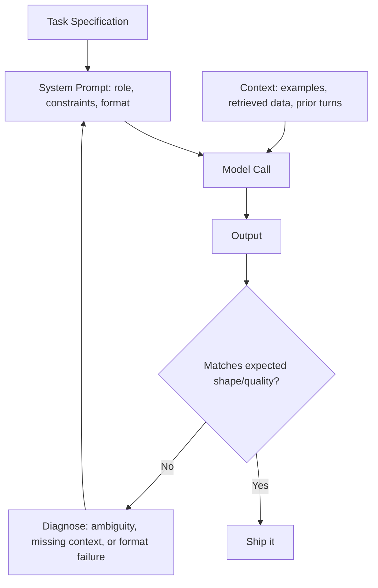

# Prompt Engineering

*One authoritative reference. This is not a note collection — new
learnings get merged into the relevant section below, not appended as a
new file.*

## Overview

Prompt engineering is the practice of structuring input to an LLM so its
output is reliably useful for a specific task — treating the prompt as
an interface contract you design and test, not a one-off sentence you
happen to type. It matters because the same underlying model can produce
dramatically different quality output depending on how the task,
context, and expected format are specified.

## Mental model

A prompt is a specification, and the model is (imperfectly)
implementing it. Every ambiguity you leave in the prompt is a decision
you're delegating to the model — sometimes that's fine, often it isn't.
The core discipline is the same as writing a good spec for a human
contractor: state the task, the constraints, the format, and the
examples of what "good" looks like, precisely enough that a reasonable
implementer (human or model) couldn't reasonably produce something you'd
reject.

The second half of the mental model: the model has no persistent
memory (see `../Docs/llms.md`) — everything it needs for THIS call
must be in THIS prompt. A prompt that relies on unstated shared context
is a prompt that will underperform.

## Architecture



## Core concepts

- **Zero-shot vs. few-shot**: giving no examples vs. 1+ examples of
  input→output in the prompt itself — few-shot is the single highest-
  leverage fix for a model producing the wrong FORMAT or STYLE
  consistently.
- **Chain-of-thought**: prompting the model to reason step-by-step
  before answering, which measurably improves accuracy on multi-step
  reasoning tasks at the cost of more output tokens/latency.
- **Role/persona prompting**: framing the model as a specific expert —
  useful for tone/framing, not a substitute for giving it the actual
  information/constraints it needs to be correct.
- **Structured output**: constraining the model to a schema (JSON,
  a specific format) so downstream code can parse it reliably, rather
  than string-matching free text.
- **Temperature/sampling**: see `../Docs/llms.md` — a prompt-
  engineering lever, not just a model property, since the right setting
  depends on the task's need for consistency vs. variation.

## Typical workflows

**Diagnosing a failing prompt** — use
`../Prompt-Library/Prompt-Engineering/prompt-failure-diagnosis.md`
to classify the failure (ambiguous instructions, missing context, format
failure, or genuine task difficulty) before rewriting anything.

**Adding few-shot examples**
```
Task: classify the sentiment of a review.

Example 1: "This exceeded every expectation" -> positive
Example 2: "Broke after two days" -> negative
Example 3: "It's fine, does the job" -> neutral

Now classify: "{input}"
```

**Structured output via schema**
```python
response = client.messages.create(
    model="model-name",
    messages=[...],
    tools=[{"name": "extract", "input_schema": {
        "type": "object",
        "properties": {"name": {"type": "string"}, "amount": {"type": "number"}},
        "required": ["name", "amount"],
    }}],
    tool_choice={"type": "tool", "name": "extract"},
)
```

**Evaluating a prompt change** — see
`../Prompt-Library/AI/prompt-eval-harness-design.md` for building a
real test set before shipping a prompt change to production.

## Best practices

- State the output format explicitly and, for anything structured,
  enforce it programmatically (schema/tool-call) rather than trusting
  free-text parsing.
- Add few-shot examples the moment zero-shot output is inconsistent in
  format or style — this is usually a faster fix than more instructional
  prose.
- Version-control prompts like code; review changes, and test them
  against a real eval set before shipping (see
  `../Prompt-Library/AI/prompt-eval-harness-design.md`).
- Keep a single prompt focused on one task; a prompt trying to handle
  many unrelated responsibilities is harder to debug and more prone to
  internal instruction conflicts (see
  `../Prompt-Library/Prompt-Engineering/system-prompt-design-review.md`).
- Explicitly instruct uncertainty handling ("say you don't know if...")
  rather than assuming the model will refuse gracefully by default.

## Common mistakes

- Rewriting the whole prompt after one bad output instead of diagnosing
  which specific failure category it is first (see
  `prompt-failure-diagnosis.md`).
- Relying on role/persona framing ("You are an expert...") as a
  substitute for giving the model the actual facts/constraints it needs.
- Assuming the model will infer unstated context from "our earlier
  conversation" in a separate, independent API call.
- Skipping evaluation entirely and shipping prompt changes based on a
  handful of manually eyeballed examples.
- Cramming multiple unrelated instructions into one system prompt
  instead of splitting into focused prompts/calls.

## Cheatsheet

| Technique | When to use |
|---|---|
| Few-shot examples | Output format/style is inconsistent |
| Chain-of-thought | Multi-step reasoning tasks, accuracy over latency |
| Structured output (schema/tool call) | Downstream code needs to parse the result reliably |
| Explicit uncertainty instruction | Task where a wrong confident answer is costly |
| Lower temperature | Task needs consistency (extraction, classification) |
| Splitting into multiple calls | One prompt is trying to do too much at once |

## Interview questions

1. What's the difference between zero-shot and few-shot prompting, and
   when does few-shot help most? *(Few-shot adds example input/output
   pairs directly in the prompt; it helps most when the model's zero-shot
   output has the right idea but the wrong format or style — examples
   anchor the exact shape expected.)*
2. Why does chain-of-thought prompting improve accuracy on some tasks?
   *(It gives the model "space" to work through intermediate reasoning
   steps as generated tokens, rather than needing to produce a correct
   final answer in a single forward pass — at the cost of more tokens
   and latency.)*
3. How would you make an LLM's output reliably parseable by downstream
   code? *(Use a structured output mechanism — a JSON schema or tool-call
   interface — and validate the result programmatically, rather than
   relying on prompt instructions alone to produce well-formed text.)*
4. If a prompt starts producing bad output after a small change, how do
   you diagnose it? *(Classify the failure — ambiguous instructions,
   missing context, format issue, or genuine task difficulty — using
   concrete bad-output examples, rather than guessing and rewriting
   broadly; see `prompt-failure-diagnosis.md`.)*
5. Why is "you are an expert in X" framing often insufficient on its
   own? *(It shapes tone and framing but doesn't supply the actual facts,
   constraints, or context the model needs to be correct — persona
   framing is not a substitute for informational content in the prompt.)*

## Useful links

- [Anthropic's prompt engineering documentation](https://docs.claude.com/en/docs/build-with-claude/prompt-engineering/overview)
- [OpenAI's prompt engineering guide](https://platform.openai.com/docs/guides/prompt-engineering)

## Further reading

- `../Docs/llms.md` for the underlying model behavior this practice
  is built on.
- `../Prompt-Library/Prompt-Engineering/` for the operational
  prompts (failure diagnosis, system prompt review, injection hardening)
  that apply these concepts directly.
