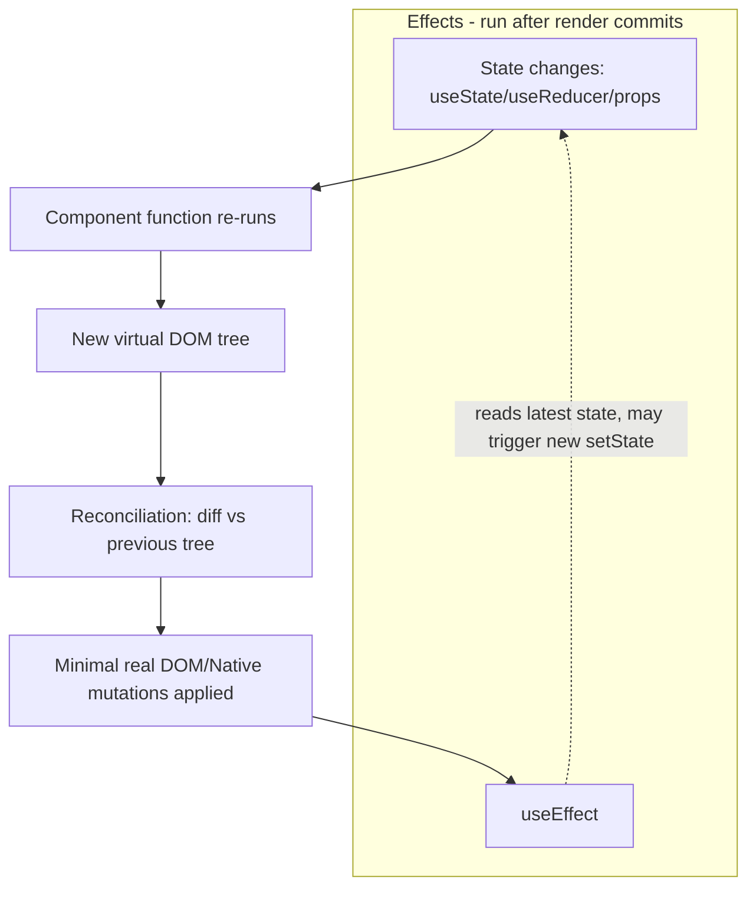

# React

*One authoritative reference. This is not a note collection — if you
learn something new about React worth keeping, it gets merged into the
relevant section below, not appended as a new file.*

## Overview

React is a UI library for building component-based interfaces where the
UI is a function of state: you describe what the UI should look like
for a given state, and React figures out how to update the actual DOM
(or, via React Native, the native view tree) to match when that state
changes. It doesn't prescribe routing, data fetching, or state
management at the framework level — those are separate ecosystem
choices (React Router, TanStack Query, Zustand/Redux) layered on top.

Core concepts: **components** (functions returning JSX that describe
UI), **props** (data passed down from parent to child, read-only from
the child's perspective), **state** (data owned by a component that
triggers a re-render when changed via `useState`/`useReducer`), and
**hooks** (functions like `useState`, `useEffect`, `useMemo` that let
function components use state and lifecycle behavior without classes).

## Mental model

React re-renders a component whenever its state (or a parent's state
that changes its props) changes — "re-render" means React calls the
component function again to get a new description of the desired UI,
then **diffs** that against the previous description (the virtual DOM)
to compute the minimal set of real DOM mutations needed. You never
imperatively mutate the DOM yourself; you change state, and React
reconciles the difference. This is the core discipline React enforces:
state is the single source of truth, and the rendered output is always
a pure function of current props and state.

The second thing to internalize: **`useEffect` is for synchronizing with
something outside React** (a subscription, a DOM API, fetching data,
setting a timer) — not a general "run this after render" hook. Its
dependency array tells React when the effect needs to re-run to stay in
sync with changed values; getting the dependency array wrong (omitting
a value the effect actually uses) is the single most common source of
stale-closure bugs, where the effect keeps referencing an old value from
the render it was created in.

## Architecture



**Render vs. commit:** React separates the "render" phase (calling
component functions to compute the new virtual tree — can be paused,
aborted, or redone by React, so must be pure/side-effect-free) from the
"commit" phase (actually applying DOM mutations — synchronous, and where
`useLayoutEffect` runs before the browser paints). `useEffect` runs
*after* the browser has painted, which is why it's the default for most
side effects but wrong for anything that must happen before the user
sees a visual flash (measuring layout, synchronously adjusting scroll).

**Data flow is one-directional:** props flow down, and the only way a
child communicates back up is by calling a function passed down as a
prop (a callback). There's no built-in two-way binding — this is
deliberate, so state changes are always traceable to one place that
called `setState`.

## Common workflows

**Component with state and an effect**
```jsx
function VitalsPanel({ patientId }) {
  const [vitals, setVitals] = useState(null);
  const [loading, setLoading] = useState(true);

  useEffect(() => {
    let cancelled = false;
    setLoading(true);
    fetchVitals(patientId).then(data => {
      if (!cancelled) { setVitals(data); setLoading(false); }
    });
    return () => { cancelled = true; };   // cleanup: avoid setState after unmount
  }, [patientId]);   // re-fetch whenever patientId changes

  if (loading) return <Spinner />;
  return <VitalsChart data={vitals} />;
}
```

**Lifting state up (shared state between siblings)**
```jsx
function Parent() {
  const [selectedId, setSelectedId] = useState(null);
  return (
    <>
      <PatientList onSelect={setSelectedId} />
      <PatientDetail id={selectedId} />
    </>
  );
}
```

**Memoizing expensive computation**
```jsx
const sortedPatients = useMemo(
  () => patients.slice().sort((a, b) => b.severity - a.severity),
  [patients]
);
```

**Avoiding unnecessary re-renders of a callback prop**
```jsx
const handleSelect = useCallback((id) => setSelectedId(id), []);
```

**Custom hook (extracting reusable stateful logic)**
```jsx
function usePolling(fetchFn, intervalMs) {
  const [data, setData] = useState(null);
  useEffect(() => {
    const id = setInterval(() => fetchFn().then(setData), intervalMs);
    return () => clearInterval(id);
  }, [fetchFn, intervalMs]);
  return data;
}
```

## Common mistakes

- **Missing or incorrect `useEffect` dependencies.** Omitting a value
  the effect closure actually reads means the effect keeps using the
  value from whichever render it was last created in (a "stale
  closure") instead of the current one — the ESLint `react-hooks`
  plugin catches most of these; don't disable the rule without
  understanding why.
- **Mutating state directly** (`state.push(x)` then `setState(state)`)
  instead of creating a new reference (`setState([...state, x])`) —
  React compares by reference to decide whether to re-render, so a
  mutated-in-place object with the same reference doesn't trigger one.
- **Calling hooks conditionally** (`if (x) { useState() }`) — hooks must
  run in the same order on every render since React tracks them by call
  order, not name; conditional hook calls corrupt that ordering.
- **Using array index as a list `key`** when the list can reorder,
  insert, or delete — React uses `key` to match elements across
  renders, and index-based keys cause it to misattribute state to the
  wrong item after a reorder.
- **Not cleaning up subscriptions/timers/async work in `useEffect`'s
  return function** — leads to "setState on an unmounted component"
  warnings and real memory/listener leaks.
- **Overusing `useEffect` for derived state** — if a value can be
  computed directly from existing props/state during render, compute it
  during render (or with `useMemo`), don't `useState` + `useEffect` to
  sync it, which adds an extra render and a source of bugs.

## Best practices

- Let the `react-hooks/exhaustive-deps` ESLint rule guide dependency
  arrays; when you're tempted to omit a dependency, ask whether the
  logic should actually live outside the effect instead.
- Prefer deriving state during render over syncing it with an effect.
- Give list items stable, unique keys (a real ID, not the array index)
  whenever the list can reorder or its items can be added/removed.
- Keep components focused — split when a component's state and effects
  serve genuinely separate concerns, not by an arbitrary line count.
- Use `useMemo`/`useCallback` deliberately for measured performance
  problems (expensive computation, or preventing child re-renders that
  matter), not by default on every value — they have their own
  comparison overhead.
- Co-locate state as close as possible to where it's used; lift it up
  only as far as the nearest common ancestor that actually needs it.

## Cheatsheet

| Task | Code |
|---|---|
| State | `const [x, setX] = useState(initial)` |
| Effect (runs after commit) | `useEffect(() => { ... return cleanup }, [deps])` |
| Memoized value | `useMemo(() => compute(x), [x])` |
| Memoized callback | `useCallback((x) => fn(x), [deps])` |
| Ref (mutable, no re-render) | `const ref = useRef(initial)` |
| Reducer for complex state | `const [state, dispatch] = useReducer(reducer, initial)` |
| Context (avoid prop drilling) | `const value = useContext(MyContext)` |
| Conditional render | `{condition && <Component />}` |
| List rendering with keys | `items.map(i => <Item key={i.id} {...i} />)` |

## Interview questions

1. Why does React re-render, and what triggers it?
   *(A component re-renders when its own state changes, its props
   change (because a parent re-rendered with new values), or a consumed
   context value changes — the component function is called again to
   produce a new virtual DOM, which is diffed against the previous one.)*
2. What's the difference between `useEffect` and `useLayoutEffect`?
   *(`useEffect` runs after the browser has painted (asynchronous,
   doesn't block visual update); `useLayoutEffect` runs synchronously
   after DOM mutations but before paint — needed when you must measure
   or adjust layout before the user sees a flash.)*
3. Why do hooks need to be called in the same order on every render?
   *(React tracks hook state by call order/index internally, not by
   variable name — calling hooks conditionally would shift that
   indexing between renders and corrupt which stored state each hook
   call reads.)*
4. Why is using array index as a `key` risky?
   *(React uses `key` to match rendered elements across renders and
   preserve their state; if the list reorders, index-based keys cause
   React to associate the wrong item's previous state/DOM with a
   different item after the reorder.)*
5. What's a stale closure bug in the context of `useEffect`, and how do
   you avoid it?
   *(The effect's callback closes over the values from the render it
   was created in; if a used value is missing from the dependency
   array, the effect keeps re-running with that old value instead of
   picking up the current one. Fix: include it in the dependency array,
   or restructure so the effect doesn't need to read stale values —
   e.g. a functional state updater `setX(prev => ...)`.)*

## Useful links

- [Official React documentation](https://react.dev/)
- [react.dev — "You Might Not Need an Effect"](https://react.dev/learn/you-might-not-need-an-effect)
- [React Native documentation](https://reactnative.dev/docs/getting-started) (for mobile contexts)

## Further reading

- react.dev's "Thinking in React" — the canonical walkthrough of
  decomposing a UI into components and state correctly from scratch.
- "A Complete Guide to useEffect" (Dan Abramov) — the deepest treatment
  of the dependency-array and stale-closure issues summarized above.
