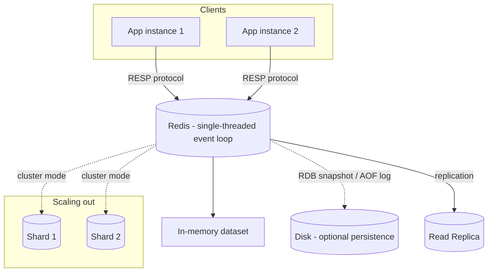

# Redis

*One authoritative reference. This is not a note collection — if you
learn something new about Redis worth keeping, it gets merged into the
relevant section below, not appended as a new file.*

## Overview

Redis is an in-memory data structure store used as a cache, message
broker, and lightweight database. Because data lives in memory (with
optional disk persistence), operations are single-digit-millisecond fast
— the tradeoff is a dataset bounded by available RAM and, in its default
single-threaded command execution model, throughput bounded by one core
per instance.

Core data types go well beyond a plain key-value cache: **strings**
(also used as counters via `INCR`), **hashes** (objects), **lists**
(queues/stacks), **sets** and **sorted sets** (leaderboards, dedup,
range queries by score), **streams** (append-only log with consumer
groups, closer to a lightweight Kafka), and **pub/sub** (fire-and-forget
broadcast channels).

## Mental model

Redis is a single-threaded event loop processing one command at a time
against data that lives entirely in RAM — this is *why* it's fast
(no lock contention on the core data operations) and *why* one slow
command (an unbounded `KEYS *`, a huge `SORT`, a large `DEL` on a giant
collection) blocks every other client until it finishes. Treat every
command's big-O cost as a shared-resource cost across all clients, not
just your own request's latency.

The second thing to internalize: Redis gives you two very different
reliability profiles depending on which feature you reach for.
**Pub/sub** is fire-and-forget — a message published while a subscriber
is disconnected is gone forever, no replay. **Streams** are a durable,
replayable log with consumer groups and acknowledgment (a Pending
Entries List tracks what's been delivered but not yet ack'd, so a
crashed consumer's in-flight messages can be reclaimed). Picking pub/sub
where you actually need at-least-once delivery is a common and costly
mistake — see Common Mistakes.

## Architecture



**Persistence models:** RDB (point-in-time snapshot, fast restart, can
lose data since last snapshot) and AOF (append-only log of every write,
replayed on restart, tunable durability via `fsync` policy) — many
production setups run both, or accept Redis as a cache where data loss
on crash is acceptable because the source of truth lives elsewhere
(e.g. Postgres).

**Scaling:** vertical (more RAM/CPU on one instance) covers most use
cases given single-core throughput is rarely the bottleneck; Redis
Cluster shards data across nodes by hashing keys into 16384 hash slots
when a single instance's memory or connection count becomes the limit.

## Common workflows

**Basic caching with TTL**
```bash
SET user:123:profile '{"name":"..."}' EX 300   # expires in 300s
GET user:123:profile
```

**Deduplication with a short-lived key (idempotency guard)**
```bash
# Returns 0 if key already exists — use as a lock/dedup check
SET dedup:vitals:p1:hash123 1 NX EX 300
```

**Rate limiting (fixed window)**
```bash
INCR ratelimit:user:123
EXPIRE ratelimit:user:123 60   # only on first INCR, else resets window early
```

**Pub/sub (fire-and-forget broadcast)**
```bash
# Subscriber
SUBSCRIBE alerts
# Publisher
PUBLISH alerts '{"alertId": "a-1", "severity": "CRITICAL"}'
```

**Streams (durable, replayable, consumer groups)**
```bash
XADD vitals-raw '*' patient_id p1 hr 125
XGROUP CREATE vitals-raw processors '$' MKSTREAM
XREADGROUP GROUP processors consumer-1 COUNT 10 STREAMS vitals-raw '>'
XACK vitals-raw processors <message-id>
```

**Sorted sets for a leaderboard / priority queue**
```bash
ZADD dispatch_queue 0.85 ambulance:42     # score = priority/ETA
ZRANGE dispatch_queue 0 4 WITHSCORES      # top 5
```

**Distributed lock (simple case)**
```bash
SET lock:resource-1 owner-id NX EX 30
# ... critical section ...
# Release only if still owner (Lua script for atomicity in production)
```

## Common mistakes

- **Using pub/sub where you need delivery guarantees.** A subscriber
  that's disconnected (deploy, crash, restart) misses every message
  published in that window with no way to recover it — use Streams with
  consumer groups when a dropped message is unacceptable.
- **Unbounded `KEYS *` in production.** Scans the entire keyspace and
  blocks the single-threaded event loop for every other client while it
  runs; use `SCAN` (cursor-based, non-blocking) instead.
- **No TTL on cache keys**, letting a cache grow unbounded until Redis
  hits its memory limit and starts evicting under whatever eviction
  policy is configured (which may not be the policy you expect —
  check `maxmemory-policy`).
- **Treating Redis as the system of record for data that must survive
  a crash without loss**, without persistence tuned for that (or
  accepting that Redis is a cache and the real data lives in a durable
  store like Postgres).
- **Non-atomic check-then-act patterns** (`GET` then `SET` based on the
  result) under concurrent access — use `SET ... NX`, `INCR`, or a Lua
  script (`EVAL`) for atomicity instead of two round trips.
- **Ignoring the difference between `EXPIRE` semantics on re-`INCR`** —
  incrementing an existing counter does not reset its TTL; a naive rate
  limiter can end up with a key that never expires if `EXPIRE` is only
  set conditionally and that branch is missed.

## Best practices

- Always set a TTL on cache keys unless a key is explicitly meant to be
  permanent.
- Use `SCAN` (and its typed variants `HSCAN`/`SSCAN`/`ZSCAN`) instead of
  `KEYS` in any code path that runs against production.
- Pick pub/sub vs. Streams deliberately based on whether message loss on
  disconnect is acceptable — don't default to pub/sub out of familiarity.
- Namespace keys with a consistent `service:entity:id:field` convention
  — makes debugging with `SCAN`/`MONITOR` tractable at scale.
- Use Lua scripts (`EVAL`) for multi-step operations that must be atomic
  (check-and-set, conditional lock release) rather than multiple round
  trips that race under concurrency.
- Monitor `maxmemory` and eviction policy explicitly — the default
  policy may silently evict keys you expected to persist.
- For durable job queues, prefer a library built on Streams (e.g.
  BullMQ) over hand-rolled pub/sub-based queuing.

## Cheatsheet

| Task | Command |
|---|---|
| Set with TTL | `SET key value EX 300` |
| Set if not exists | `SET key value NX` |
| Get | `GET key` |
| Increment | `INCR key` |
| Delete | `DEL key` |
| Set expiry on existing key | `EXPIRE key 300` |
| Publish / Subscribe | `PUBLISH channel msg` / `SUBSCRIBE channel` |
| Add to stream | `XADD stream '*' field value` |
| Read as consumer group | `XREADGROUP GROUP g consumer STREAMS stream '>'` |
| Sorted set add / range | `ZADD key score member` / `ZRANGE key 0 -1` |
| Non-blocking key scan | `SCAN 0 MATCH pattern:* COUNT 100` |
| Check memory usage | `INFO memory` |

## Interview questions

1. Why is Redis fast, and what's the direct consequence of that design
   for how you write commands?
   *(Single-threaded in-memory event loop — no lock contention on core
   ops, but any single slow command (unbounded `KEYS`, huge `SORT`)
   blocks every other client until it completes.)*
2. Pub/sub vs. Streams — when does the choice actually matter?
   *(Pub/sub is fire-and-forget with no replay for disconnected
   subscribers; Streams are durable and replayable with consumer-group
   acknowledgment. Matters whenever a dropped message during a
   subscriber outage/deploy is unacceptable.)*
3. How would you implement a distributed lock safely in Redis?
   *(`SET key owner NX EX ttl` to acquire; release only if the value
   still matches the owner, done atomically via a Lua script to avoid a
   race between the check and the delete.)*
4. What's the difference between RDB and AOF persistence?
   *(RDB: periodic point-in-time snapshot, fast restart, can lose data
   since the last snapshot. AOF: append-only log of every write,
   replayed on restart, tunable fsync durability but larger and slower
   to restart from. Production often runs both, or neither if Redis is
   purely a cache backed by a durable store.)*
5. How does Redis Cluster shard data, and what's a consequence for
   multi-key operations?
   *(Keys are hashed into 16384 fixed hash slots distributed across
   nodes; multi-key operations (transactions, Lua scripts) only work
   atomically if all keys involved hash to the same slot — hence "hash
   tags" `{...}` to force co-location when needed.)*

## Useful links

- [Official Redis documentation](https://redis.io/docs/)
- [Redis commands reference](https://redis.io/commands/)
- [Redis Streams introduction](https://redis.io/docs/latest/develop/data-types/streams/)

## Further reading

- "Redis in Action" (Josiah Carlson) — practical patterns beyond basic
  caching: leaderboards, rate limiting, distributed locking.
- Official docs' persistence deep dive — the RDB vs. AOF tradeoffs
  above are necessarily condensed; the fsync-policy tuning knobs matter
  a lot in practice.
