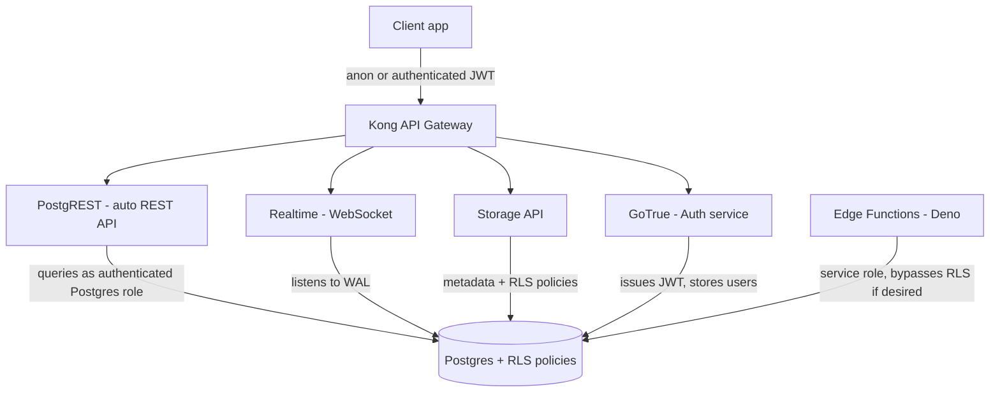

# Supabase

*One authoritative reference. This is not a note collection — if you
learn something new about Supabase worth keeping, it gets merged into
the relevant section below, not appended as a new file.*

## Overview

Supabase is a managed backend platform built around a real
[PostgreSQL](postgresql.md) database, packaging it with the pieces most
apps need on top: auto-generated REST and realtime APIs, authentication,
file storage, and edge functions. Unlike Firebase (its usual comparison
point), the underlying database is a standard Postgres instance — you
can connect with any Postgres client, run raw SQL, and are never locked
into a proprietary query language.

Core services: **Database** (Postgres, with the full SQL surface
available), **Auth** (user management, JWT issuance, social/email
login), **Storage** (S3-compatible file storage with Postgres-backed
access-control policies), **Realtime** (subscribe to database changes
over WebSocket), and **Edge Functions** (Deno-based serverless
functions for logic that shouldn't live in the client).

## Mental model

Supabase's defining idea is **Row Level Security (RLS) as the API
authorization layer**, not application code. The auto-generated REST
API (PostgREST) talks to Postgres as the authenticated user's role
directly — so instead of writing `if (user.id !== resource.owner_id)
throw 403` in a server handler, you write a Postgres policy once
(`CREATE POLICY ... USING (auth.uid() = owner_id)`) and it's enforced
for every access path: the REST API, Realtime subscriptions, and direct
SQL alike. This means the database itself is the authorization boundary,
not a layer in front of it — a mental shift from typical backend
architectures where the API server is trusted and the database is not
directly exposed.

The corollary: **RLS is off by default is dangerous, RLS is on by
default is restrictive.** A new table with RLS enabled and no policies
denies all access — including to the table owner accessing it through
the API — until a policy explicitly grants it. Forgetting to enable RLS
on a new table, conversely, leaves it fully open to anyone with the
anon key (effectively the public), a common and serious mistake covered
below.

## Architecture



**Realtime mechanism:** Supabase Realtime listens to Postgres's
write-ahead log (logical replication) for row changes and pushes them
to subscribed clients over WebSocket — this is why enabling realtime on
a table is a first-class Postgres-level operation (adding it to a
publication), not an application-level polling mechanism.

**Client key model:** the **anon key** is safe to ship in a public
client — it identifies the request as the `anon` Postgres role, and RLS
policies are what actually restrict what that role can see or modify.
The **service role key** bypasses RLS entirely and must never reach a
client — it's for trusted server-side/edge-function contexts only.

## Common workflows

**Client query (JS)**
```javascript
const { data, error } = await supabase
  .from('patients')
  .select('id, name, status')
  .eq('status', 'active');
```

**Row Level Security policy**
```sql
ALTER TABLE patients ENABLE ROW LEVEL SECURITY;

CREATE POLICY "Users can view their own patient record"
ON patients FOR SELECT
USING (auth.uid() = owner_id);

CREATE POLICY "Users can update their own patient record"
ON patients FOR UPDATE
USING (auth.uid() = owner_id);
```

**Auth (email/password)**
```javascript
const { data, error } = await supabase.auth.signUp({ email, password });
const { data: session } = await supabase.auth.getSession();
```

**Realtime subscription**
```javascript
supabase
  .channel('vitals-changes')
  .on('postgres_changes', { event: 'INSERT', schema: 'public', table: 'vitals' },
      (payload) => console.log('New vital:', payload.new))
  .subscribe();
```

**File storage with access control**
```javascript
const { data, error } = await supabase.storage
  .from('reports')
  .upload(`${userId}/report.pdf`, file);
```

**Local development**
```bash
supabase start                 # local Postgres + full stack via Docker
supabase db diff -f migration_name
supabase db push                # apply migrations to remote
```

## Common mistakes

- **Enabling a table without RLS policies, or forgetting RLS
  entirely.** A table with RLS disabled is fully readable/writable by
  anyone holding the anon key — effectively public. A table with RLS
  *enabled* but no policies denies everyone, including legitimate users,
  until a policy is added — both are easy to get backwards.
- **Shipping the service role key to a client.** It bypasses every RLS
  policy; if it leaks (bundled into frontend JS, committed to a repo),
  it's a full database compromise, not a scoped one.
- **Writing RLS policies that reference the row being modified
  incorrectly** — e.g. an `UPDATE` policy's `USING` clause checks the
  *existing* row, while `WITH CHECK` validates the *new* row; using only
  `USING` lets a user update a row into a state their own policy
  wouldn't have allowed them to create.
- **Treating PostgREST's auto-generated API as a replacement for actual
  data modeling** — deeply nested joins or complex business logic
  belongs in a Postgres function (`rpc`) or Edge Function, not chained
  client-side query calls.
- **Not indexing columns used in RLS policy predicates.** A policy like
  `USING (auth.uid() = owner_id)` runs on every row for every query
  against that table — an unindexed `owner_id` makes every query a
  sequential scan.
- **Assuming Realtime is enabled by default.** A table must be
  explicitly added to the `supabase_realtime` publication before
  `postgres_changes` subscriptions receive its events.

## Best practices

- Enable RLS on every table by default, and write policies before
  shipping any client code that depends on the table.
- Use `WITH CHECK` alongside `USING` on `UPDATE`/`INSERT` policies to
  validate the *resulting* row, not just the existing one.
- Index every column referenced in an RLS policy predicate — treat
  policy predicates as query predicates, because that's what they are.
- Keep the service role key server-side/edge-function only; never bundle
  it into any client artifact.
- Use Postgres functions (`SECURITY DEFINER` where appropriate) for
  logic that needs to run with elevated privileges in a controlled way,
  rather than reaching for the service role key from application code.
- Version-control migrations (`supabase db diff`) rather than making
  schema changes directly against the dashboard in a team setting.

## Cheatsheet

| Task | Code / Command |
|---|---|
| Query with filter | `.from('t').select('*').eq('col', val)` |
| Insert | `.from('t').insert({ col: val })` |
| Enable RLS | `ALTER TABLE t ENABLE ROW LEVEL SECURITY;` |
| Basic RLS policy | `CREATE POLICY name ON t FOR SELECT USING (auth.uid() = owner_id);` |
| Sign up / sign in | `supabase.auth.signUp(...)` / `signInWithPassword(...)` |
| Get current session | `supabase.auth.getSession()` |
| Realtime subscribe | `.channel(x).on('postgres_changes', {...}, cb).subscribe()` |
| File upload | `supabase.storage.from(bucket).upload(path, file)` |
| Local dev stack | `supabase start` |
| Push migration | `supabase db push` |
| Call a Postgres function | `supabase.rpc('fn_name', { arg: val })` |

## Interview questions

1. How does Supabase enforce authorization, and how is that different
   from a typical REST API backend?
   *(Via Postgres Row Level Security policies evaluated by the database
   itself for every access path — REST, Realtime, and direct SQL alike
   — rather than an application-layer authorization check in front of a
   trusted database.)*
2. What's the difference between the anon key and the service role key,
   and where does each belong?
   *(Anon key identifies requests as the `anon` Postgres role, safe to
   ship to clients because RLS policies still apply; service role key
   bypasses RLS entirely and must stay server-side/edge-function only —
   leaking it is a full database compromise.)*
3. A table has RLS enabled but users report they can't see any rows
   they should have access to. What's the likely cause?
   *(RLS enabled with no matching policy denies all access by default —
   including to legitimate users — until an explicit policy grants the
   relevant operation.)*
4. Why does an `UPDATE` RLS policy need both `USING` and `WITH CHECK`?
   *(`USING` gates which existing rows the operation can target;
   `WITH CHECK` validates the *resulting* row after the update. Only
   `USING` would let a user update a row into a state their own policy
   would never have allowed them to create in the first place.)*
5. How does Supabase Realtime know when to push an update to a
   subscribed client?
   *(It listens to Postgres's write-ahead log via logical replication
   for changes on tables added to the `supabase_realtime` publication,
   then pushes matching row events to subscribed clients over
   WebSocket — not client-side polling.)*

## Useful links

- [Official Supabase documentation](https://supabase.com/docs)
- [Row Level Security guide](https://supabase.com/docs/guides/database/postgres/row-level-security)
- [Supabase CLI reference](https://supabase.com/docs/reference/cli)

## Further reading

- Official docs' RLS guide in full — the `USING`/`WITH CHECK`
  distinction and policy performance implications above only scratch
  the surface once policies get more complex (multi-table checks,
  role-based access).
- PostgREST's own documentation, since Supabase's REST API is a thin
  layer over it — useful when the auto-generated API's query syntax
  (filters, embedding/joins) needs deeper understanding.

## See also

- [PostgreSQL](postgresql.md) — Supabase's database is a real Postgres
  instance; anything true of Postgres generally (indexing, MVCC,
  connection pooling) applies here too.
