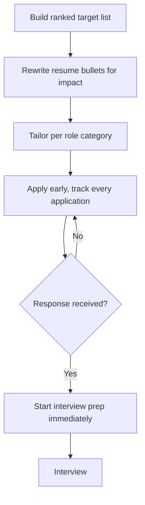

# Playbook: Internship Applications

## Goal
Maximize real interview conversion by targeting well-fitted roles with a
tailored application, instead of mass-applying with a generic resume.

## Inputs
- Your background, skills, and target domain/companies
- Application deadlines

## Outputs
- A tightly targeted list of applications (quality over volume)
- A resume with impact-stated bullets, tailored per role category
- Interview readiness for the roles most likely to respond

## Steps
1. Build a target list ranked by genuine fit (skills match, domain
   interest), not just brand recognition — a focused list beats a mass
   blast.
2. Rewrite resume bullets for impact (outcome + number), not just listed
   responsibilities, before applying anywhere.
3. Tailor the resume/cover note per role category (not per company) —
   e.g. one version emphasizing systems work, one emphasizing data work.
4. Apply early relative to the deadline — many programs review on a
   rolling basis and early applications get more attention.
5. Track every application (company, role, date, status) so follow-up
   and interview prep timing don't get lost.
6. As responses come in, immediately start interview prep for that
   specific company/role rather than waiting for a scheduled date.

## Checklists
- [ ] Target list built and ranked by genuine fit
- [ ] Resume bullets rewritten for impact
- [ ] Resume/cover note tailored per role category
- [ ] Applications submitted early relative to deadlines
- [ ] Application tracker maintained and up to date
- [ ] Interview prep started immediately on first response

## AI prompts
- `../Prompt-Library/Career/resume-bullet-impact-rewrite.md`
- `../Prompt-Library/Interview/interview-story-structuring.md`
- `../Prompt-Library/Interview/technical-interview-mock-session.md`

## Expected artifacts
- A tailored resume (per role category)
- An application tracker (use the Internship Tracker template in `../Templates/`)

## Mermaid workflow

