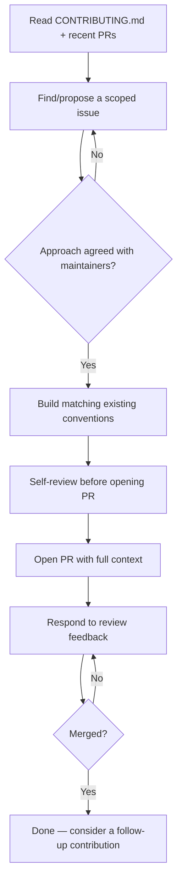

# Playbook: Open-Source Contributions

## Goal
Land a merged, useful contribution without wasted effort on a PR that
gets rejected for not matching the project's actual expectations.

## Inputs
- The target project
- Your motivation (fix a bug you hit, add a feature you need, build a
  portfolio piece)

## Outputs
- A merged (or actively-reviewed) pull request
- A relationship with the maintainers that makes future contributions
  easier

## Steps
1. Read `CONTRIBUTING.md` and recent merged PRs before writing any code
   — this reveals the project's actual review bar and conventions faster
   than the docs do.
2. For anything non-trivial, open an issue or comment on an existing one
   proposing your approach BEFORE building it — avoids wasted work on an
   approach maintainers would reject.
3. Start with a small, real contribution (a genuine bug you hit, not an
   invented one) to build credibility before attempting something large.
4. Match the project's existing code style and test conventions exactly
   — consistency matters more than your personal preference here.
5. Write a PR description that states the problem, the fix, and how you
   tested it — assume the reviewer has zero context beyond the diff.
6. Respond to review feedback promptly and without defensiveness; treat
   it as free calibration on the project's standards.

## Checklists
- [ ] CONTRIBUTING.md and recent merged PRs read
- [ ] Approach proposed/discussed before building anything non-trivial
- [ ] First contribution scoped small and genuinely useful
- [ ] Code matches existing style/conventions exactly
- [ ] PR description gives full context assuming zero prior knowledge
- [ ] Review feedback addressed promptly

## AI prompts
- `../Prompt-Library/Software-Engineering/legacy-code-onboarding.md` — for fast orientation in the target project
- `../Prompt-Library/Software-Engineering/pr-review-senior-engineer.md` — self-review your PR before submitting

## Expected artifacts
- The pull request itself
- A `Reference/` note on the project's conventions if you plan to contribute again

## Mermaid workflow

