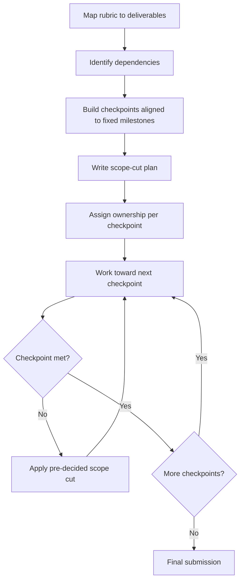

# Playbook: Planning a Semester Project

## Goal
Turn a semester-long project into a plan with real checkpoints, so scope
and risk are visible in week 3, not discovered in week 14.

## Inputs
- The project brief/requirements
- The timeline (semester length, fixed milestones like proposal/midterm/final)
- Team (if group project) and their availability

## Outputs
- A dependency-aware plan with checkpoints tied to the fixed milestones
- A scope-cut plan agreed before the crunch
- Deliverables that match grading criteria explicitly

## Steps
1. Map the actual grading criteria/rubric to specific deliverables — a
   project can be "done" and still miss what's graded if this isn't
   explicit upfront.
2. Identify dependencies: what must be decided/built before other parts
   can start (e.g. data collection before analysis, architecture before
   implementation).
3. Build a checkpoint plan aligned to the semester's fixed milestones,
   each checkpoint stating a concrete, checkable deliverable.
4. Write the scope-cut plan now: which parts are MUST (graded, core to
   the brief) vs. SHOULD/COULD (stretch goals) — decided before deadline
   pressure hits.
5. If it's a group project, assign clear ownership per checkpoint, not
   just per "area" — ambiguous ownership is the most common cause of
   dropped work.
6. Review progress against checkpoints honestly at each milestone; apply
   the pre-decided scope cut the moment a checkpoint slips.

## Checklists
- [ ] Grading rubric mapped to specific deliverables
- [ ] Dependencies identified before planning parallel work
- [ ] Checkpoints aligned to fixed semester milestones
- [ ] Scope-cut plan (MUST/SHOULD/COULD) written before crunch
- [ ] Clear per-checkpoint ownership assigned (if group project)
- [ ] Checkpoints reviewed honestly, cuts applied promptly when needed

## AI prompts
- `../Prompt-Library/Project-Planning/dependency-risk-mapping.md`
- `../Prompt-Library/Project-Planning/project-scope-cut-plan.md`

## Expected artifacts
- A project plan doc mapping rubric → deliverables → checkpoints
- A scope-cut plan

## Mermaid workflow

