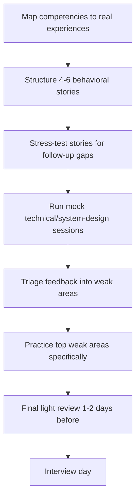

# Playbook: Preparing for Interviews

## Goal
Walk into the interview with rehearsed, follow-up-proof answers and a
realistic calibration of where you actually stand — not just "studied a
lot."

## Inputs
- Interview type(s) (behavioral, technical, system design)
- Target role/level
- Time available before the interview

## Outputs
- A set of behavioral stories structured and stress-tested for follow-ups
- Mock interview session(s) completed with honest, calibrated feedback
- A prioritized list of weak areas with a plan to address the top ones

## Steps
1. List the competencies likely to be probed (from the role, from the
   company's known interview style if known).
2. For behavioral prep: pick 4-6 real experiences covering the
   competencies, structure each into a tight story, and flag any part
   that's too vague to survive a follow-up — fill in the real detail.
3. For technical prep: run at least one full mock session per interview
   type, under real time constraints, and take the feedback at face
   value even if it's uncomfortable.
4. After each mock session, prioritize the top 1-2 weak areas surfaced —
   don't try to fix everything; fix what's most likely to matter.
5. Do a final pass 1-2 days before: re-read your stories once, don't
   over-rehearse to the point of sounding scripted.
6. On interview day: treat every answer as the start of a conversation,
   not a monologue to deliver and stop.

## Checklists
- [ ] Competencies mapped to real experiences
- [ ] 4-6 stories structured and follow-up-tested
- [ ] At least one full mock session per interview type completed
- [ ] Feedback triaged into a prioritized weak-area list
- [ ] Top weak areas specifically practiced again before the real interview

## AI prompts
- `../Prompt-Library/Interview/interview-story-structuring.md`
- `../Prompt-Library/Interview/technical-interview-mock-session.md`
- `../Prompt-Library/System-Design/system-design-interview-style.md`

## Expected artifacts
- A stories doc (in the relevant `Projects/` or a personal prep folder)
- Mock session notes with feedback and follow-up items

## Mermaid workflow

