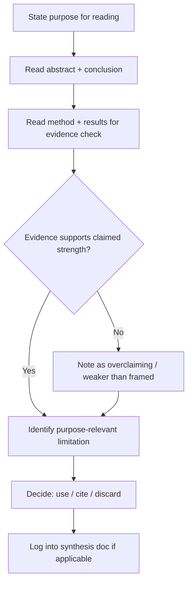

# Playbook: Reading Research Papers

## Goal
Extract a paper's real, usable contribution for your purpose quickly,
without a passive linear read that produces no actionable takeaway.

## Inputs
- The paper
- Why you're reading it (deciding whether to use a method, writing a
  related-work section, general orientation to a field)

## Outputs
- The paper's actual contribution and evidence strength, stated plainly
- The specific limitation relevant to your purpose
- A decision (use it / cite it / discard it) for your actual task

## Steps
1. State your purpose before reading — it determines which sections
   matter and which limitations are relevant.
2. Read abstract + conclusion first to get the claimed contribution.
3. Read the method + results section specifically to check whether the
   evidence actually supports the claimed strength — don't take the
   abstract at face value.
4. Identify the limitation most relevant to your purpose, not just the
   paper's self-reported "future work" list.
5. Decide: does this paper change what you'll build/write/believe? If
   not, you're done — don't force a deeper read out of completionism.
6. If it's going in a literature review, log its claim/method/limitation
   in your synthesis doc immediately, while it's fresh.

## Checklists
- [ ] Purpose for reading stated upfront
- [ ] Real contribution separated from background/motivation
- [ ] Evidence strength checked against the claim, not accepted at face value
- [ ] Purpose-relevant limitation identified
- [ ] Decision made: use / cite / discard
- [ ] Logged into synthesis doc if part of a literature review

## AI prompts
- `../Prompt-Library/Research/paper-critical-reading.md`
- `../Prompt-Library/Research/literature-review-synthesis.md`

## Expected artifacts
- A one-paragraph note per paper (contribution, evidence, limitation, decision)
- An updated literature synthesis doc, if applicable

## Mermaid workflow

