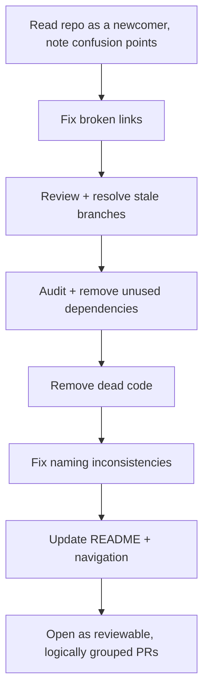

# Playbook: Repository Cleanup

## Goal
Bring an aging or neglected repository back to a state where navigation,
onboarding, and contribution are fast again — without a disruptive
big-bang rewrite.

## Prerequisites
- Write access to the repo, and a moment where a larger-than-usual PR
  won't collide with active in-flight work.

## Inputs
- The repository as it currently stands
- Recent contributor pain points, if known (slow onboarding, "where does
  X live," stale docs someone hit recently)

## Outputs
- A repository with accurate navigation (README, folder structure),
  reduced dead weight (stale branches, unused dependencies, dead code),
  and consistent naming
- A short list of what changed, for anyone who had the old structure
  memorized

## Checklist
- [ ] README reflects the actual current structure and setup steps
      (tested, not assumed)
- [ ] No broken internal links (relative links, wikilinks if using
      Obsidian conventions)
- [ ] Stale branches identified and either merged, revived, or deleted
- [ ] Dead code / commented-out blocks removed, not just ignored
- [ ] Dependency list matches what's actually imported/used
- [ ] Naming conventions consistent across files/folders added at
      different times by different contributors

## Step-by-step workflow
1. Read the repo as a newcomer would — start from the README, and note
   every point of confusion or inaccuracy as you go.
2. Run a link-integrity check across all Markdown docs (relative links
   and wikilinks) and fix what's broken.
3. Review branches: merge or close anything stale, following the
   destructive-action safety practices in
   `../Prompt-Library/Software-Engineering/pr-review-senior-engineer.md`'s
   spirit — verify before deleting, don't assume.
4. Audit dependencies against actual usage; remove what's unused.
5. Sweep for dead code (commented-out blocks, unreachable branches,
   unused files) and remove it — Git history preserves it if ever needed.
6. Fix naming inconsistencies introduced over time, updating references
   as you rename.
7. Update the README and any navigation/index files to reflect the
   cleaned-up state.
8. Open this as a reviewable PR (or a small number of them, grouped
   logically) rather than one enormous diff — see
   `../Prompt-Library/Git/commit-history-cleanup.md` for keeping the
   changes reviewable.

## AI prompts
- `../Prompt-Library/Software-Engineering/code-simplification-pass.md` — for simplifying code found along the way
- `../Prompt-Library/Git/commit-history-cleanup.md`
- `../Prompt-Library/Documentation/technical-doc-outline-from-code.md` — if the README/docs need real restructuring, not just fixes

## Common mistakes
- Doing this as one giant, unreviewable PR instead of logically grouped,
  reviewable changes.
- Deleting branches or "unused" code without verifying first — what
  looks dead may be someone's in-progress work or referenced somewhere
  non-obvious.
- Fixing the symptoms (broken links) without updating the root cause
  (a stale navigation file that will drift again).

## Deliverables
- One or more reviewable cleanup PRs
- An updated README/navigation reflecting the real current state

## Mermaid workflow

