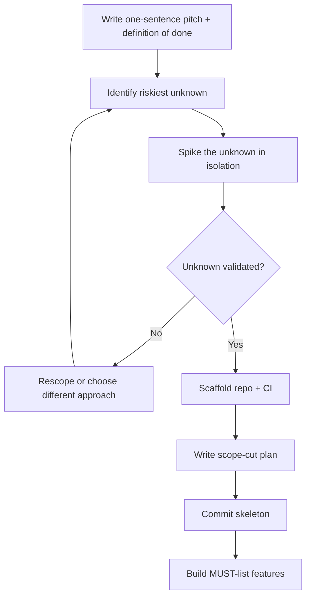

# Playbook: Starting a Software Project

## Goal
Go from idea to a running, committed skeleton with the riskiest technical
unknown already validated — in hours, not days.

## Inputs
- The problem statement / one-sentence pitch
- Hard constraints (deadline, team size, required stack)
- The single riskiest technical assumption (an API, an integration, a
  performance requirement)

## Outputs
- A running repo with README, one working end-to-end path (even with fake
  data), and CI green
- A validated (or invalidated, early) riskiest assumption
- A scope-cut plan for the deadline

## Steps
1. Copy `Technologies/Project-System/project-notebook.md` into
   `Projects/<name>/notebook.md` — this is the one file the project lives
   in from here on. Write the one-sentence pitch and the definition of
   done in its Overview section. If you can't state either in one
   sentence, the project isn't scoped yet — stop and fix that first.
2. Identify the riskiest technical unknown and spike it in isolation
   (a throwaway script, not production code) before building anything
   else.
3. Scaffold the repo: README, minimal CI, one deploy/run path working
   end-to-end with fake/stub data.
4. Build the scope-cut plan (see `../Prompt-Library/Project-Planning/project-scope-cut-plan.md`)
   before writing feature code — decide now what gets cut if time runs
   short.
5. Commit the skeleton. This is your first real checkpoint — a working
   nothing beats a half-built something.
6. Begin feature work against the MUST list only.

## Checklists
- [ ] One-sentence pitch and definition of done written down
- [ ] Riskiest technical unknown identified and spiked
- [ ] Repo scaffolded with working CI
- [ ] End-to-end path runs, even with fake data
- [ ] Scope-cut plan written (MUST / SHOULD / COULD)
- [ ] First commit pushed

## AI prompts
- `../Prompt-Library/Architecture/architecture-decision-record.md` — for any early irreversible technical choice
- `../Prompt-Library/Project-Planning/project-scope-cut-plan.md` — for the scope plan in step 4
- `../Prompt-Library/System-Design/system-design-interview-style.md` — for structuring the initial architecture

## Expected artifacts
- `README.md` with the pitch, definition of done, and how to run it
- A CI config that passes on the skeleton
- `scope-cut-plan.md` in the project folder

## Mermaid workflow

