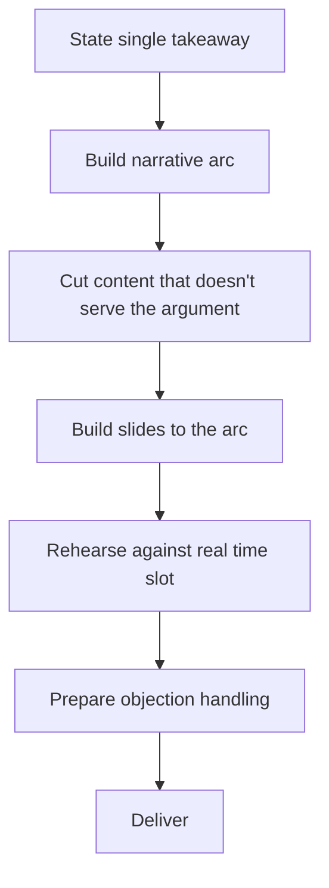

# Playbook: Writing Presentations

## Goal
Produce a presentation structured around a single argument the audience
should walk away believing, built in the right order (argument first,
slides second).

## Inputs
- The content/data to cover
- The audience and what they already know/care about
- The single takeaway you want them to believe or act on

## Outputs
- A slide-by-slide narrative arc
- Slides built to that arc (not a content dump)
- A rehearsed delivery, with the objection-handling beat included

## Steps
1. State the single takeaway before touching slides.
2. Build the narrative arc: hook, build (evidence for the takeaway,
   ordered persuasively not chronologically), objection-handling, close
   with the explicit ask.
3. Cut any content that doesn't advance the argument — relegate to
   appendix rather than deleting if it might come up in Q&A.
4. Build slides to the arc, one purpose per slide, titled with what it
   proves not what it contains.
5. Rehearse out loud at least once, timing it against the actual slot.
6. Prepare for the one objection you know is coming.

## Checklists
- [ ] Single takeaway stated before building slides
- [ ] Narrative arc built (hook, build, objection, close)
- [ ] Off-argument content cut or moved to appendix
- [ ] Slides titled by what they prove, not what they contain
- [ ] Rehearsed out loud against the real time slot
- [ ] Objection-handling prepared

## AI prompts
- `../Prompt-Library/Presentations/presentation-narrative-arc.md`
- `../Prompt-Library/Writing/dense-prose-tightening.md` — for slide text itself
- `../Prompt-Library/Writing/technical-explainer-for-non-experts.md` — if audience is non-technical

## Expected artifacts
- A slide outline doc (title + one-sentence purpose per slide)
- The final slide deck

## Mermaid workflow

