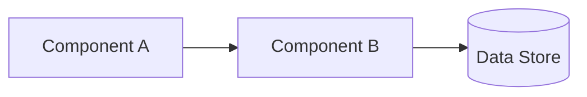

# Template: Architecture Document

*Guidance: an architecture document justifies the design against real
requirements — it is not a diagram with labels. Every major component
should trace back to a stated requirement or constraint. If you can't
justify a component's existence this way, question whether it should
exist.*

---

# Architecture: {System Name}

*Status: {Draft / Reviewed / Approved / Superseded by {link}}*
*Last updated: {date}*

## Context

{The problem this system solves and why it exists. 1-2 paragraphs, no
implementation detail yet.}

## Requirements

### Functional
- {What the system must do — the 3-8 core capabilities}

### Non-functional
- **Scale:** {current and 12-month projected — users, QPS, data volume}
- **Latency:** {SLA/target, p50 and p99 if relevant}
- **Availability:** {target, e.g. 99.9%}
- **Consistency:** {strong/eventual, and where each applies}
- **Security/compliance:** {relevant constraints}

## Constraints

{Team size, budget, existing infra that must be reused, deadline,
anything that shapes the design beyond pure technical preference.}

## High-level design

{Diagram or description of the core components and data flow. Every
component listed should map to a requirement above — if it doesn't,
either the requirement is missing or the component isn't justified.}

## Component deep dives

### {Component name}
- **Responsibility:** {what it owns, single sentence}
- **Interface:** {API/contract it exposes}
- **Key design decision:** {the one non-obvious choice here, and why}

*(Repeat per component that has genuine complexity — skip trivial ones.)*

## Data model

{Schema or entity-relationship summary, if relevant. Link to full schema
docs rather than duplicating.}

## Failure modes & mitigations

| Failure scenario | Impact | Mitigation |
|---|---|---|
| {e.g. dependency X unavailable} | {what breaks} | {graceful degradation / retry / fallback} |

## Tradeoffs and alternatives considered

{What else was considered and why it lost — link to the relevant ADR(s)
in `../Prompt-Library` or `Technologies/` decision records rather than
re-arguing here.}

## Open questions

- {Anything unresolved that implementation will need to answer}

## Revisit conditions

{The specific growth/change trigger under which this architecture should
be reconsidered — not "never," name the actual condition.}

---

## Best practices for this template
- Write requirements BEFORE the high-level design section — a design
  section written first tends to rationalize an existing preference
  instead of deriving from real needs.
- Use real numbers for scale/latency, not "high traffic" — vague
  non-functional requirements produce unjustifiable design choices.
- Keep component deep dives to genuinely complex components only; a
  deep dive on a trivial CRUD service just adds noise.
